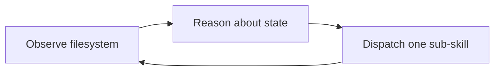

# my-skills

Personal Claude Code skills repository. An **orchestrator-driven**, **stateless** requirement workflow — the orchestrator observes the real filesystem every round, reasons about what is still missing, and dispatches exactly one sub-skill at a time. There is no fixed pipeline.

[中文版](./README_CN.md) · [Evolution History](./docs/evolution.md)

## Installation

Add this repository as a git submodule to your project's `.claude/skills` directory:

```bash
git submodule add git@github.com:GOODDAYDAY/my-skills.git .claude/skills
```

To clone a project that already includes this submodule:

```bash
git clone --recurse-submodules <your-project-repo>
```

To update the skills to the latest version:

```bash
git submodule update --remote .claude/skills
```

## How It Works

Once installed, all skills are auto-discovered by Claude Code as slash commands.

The core workflow is `/req`, which orchestrates a complete development cycle:



**The orchestrator loop:** observe → reason → dispatch → observe

Instead of a hardcoded stage sequence, the orchestrator reads `requirements/`, checks what's missing, and calls exactly the right sub-skill to fill the gap. Each sub-skill declares its own `applicable_when` conditions — the orchestrator just follows the contract.

The sub-skills available for dispatch:

| Sub-skill | Trigger Condition |
|:---|:---|
| `req-analyze` | No `requirement.md` exists yet |
| `req-tech` | `requirement.md` exists but no `technical.md` |
| `req-code` | Design approved but code not written |
| `req-security` | Code exists but no security review done |
| `req-cleanup` | Security issues fixed, code needs structural cleanup |
| `req-review` | Implementation done, needs requirement compliance check |
| `req-verify` | All previous stages complete, needs build/test verification |
| `req-done` | Everything verified, ready for archival |

This design makes the workflow **resilient to interruption** — if you stop mid-stage and come back, `/req REQ-xxx` resumes exactly where you left off.

## Skills

| Command | Description |
|:---|:---|
| `/req [description]` | Full-cycle orchestrator — observes state and dispatches sub-skills |
| `/req-analyze [description]` | Requirement analysis — expand brief input into detailed requirement doc |
| `/req-tech [REQ-xxx]` | Technical design — architecture, modules, API, diagrams |
| `/req-code [REQ-xxx]` | Coding — acceptance tests first, parallel modules, per-module commits |
| `/req-security [REQ-xxx]` | Security review — vulnerability scan, fix critical/high issues |
| `/req-cleanup [REQ-xxx]` | Code cleanup — remove unused code, merge duplicates (no behavior changes) |
| `/req-review [REQ-xxx]` | Requirement review — compare implementation against requirements |
| `/req-verify [REQ-xxx]` | Verification — build, run, and test |
| `/req-done [REQ-xxx]` | Archive — consistency check + mark as completed |
| `/req-archive` | Batch archive completed requirements + generate milestone summary |
| `/req-status [REQ-xxx\|archived]` | Status check — active requirements by default, pass `archived` for history |
| `/req-amend [REQ-xxx]` | Formal change process — safely amend finalized documents |
| `/puml2svg <file.puml>` | Convert PlantUML diagrams to SVG |
| `/create-skill [name]` | Guide for creating new skills |

## Document Structure

All requirement documents are managed under `requirements/` in your project root:

```
requirements/
├── index.md                        # Active requirements (English); archive-threshold config
├── REQ-001-user-login/             # Active requirement folders
│   ├── requirement.md
│   ├── technical.md
│   ├── *.puml / *.svg
│   └── ...
└── archive/
    ├── milestone-2026-03-31.md     # Milestone summary (what shipped, shared modules, decisions)
    └── REQ-001-user-login/         # Archived requirement folders (moved by /req-archive)
```

`index.md` is split into **Active** and **Archived** sections. An `archive-threshold` comment (default: 5) controls when `/req-done` prompts you to run `/req-archive`.

## Repository Structure

```
my-skills/
├── _shared/
│   ├── changelog.md                # Change log format and mismod detection rules
│   ├── diverge-converge.md         # Multi-agent analysis pattern
│   ├── git-commit.md               # Commit message conventions
│   ├── markdown.md                 # Markdown format specification
│   ├── plantuml.md                 # PlantUML conventions + env detection
│   ├── recovery.md                 # Breakpoint recovery pattern
│   ├── scripts.md                  # Automation script standards
│   ├── scripts/
│   │   ├── install-puml2svg.bat    # PlantUML SVG converter installer (Windows)
│   │   └── install-puml2svg.sh     # PlantUML SVG converter installer (Unix)
│   └── status.md                   # Status enum and index.md format
├── create-skill/SKILL.md
├── puml2svg/SKILL.md               # PlantUML → SVG conversion
├── req/SKILL.md                    # Orchestrator (observe-reason-dispatch)
├── req-analyze/SKILL.md            # Requirement analysis
├── req-tech/SKILL.md               # Technical design
├── req-code/                       # Coding
│   ├── SKILL.md
│   ├── python.md                   # Python conventions
│   └── java.md                     # Java conventions
├── req-security/SKILL.md           # Security review
├── req-cleanup/SKILL.md            # Code cleanup (no behavior changes)
├── req-review/SKILL.md             # Requirement review
├── req-verify/SKILL.md             # Verification & testing
├── req-done/SKILL.md               # Archive + consistency check
├── req-archive/SKILL.md            # Batch archive + milestone summary
├── req-status/SKILL.md             # Status query (active by default)
├── req-amend/SKILL.md              # Formal change process
├── task/SKILL.md                   # Generic orchestrator
└── write-doc/SKILL.md              # Document generation skill
```
