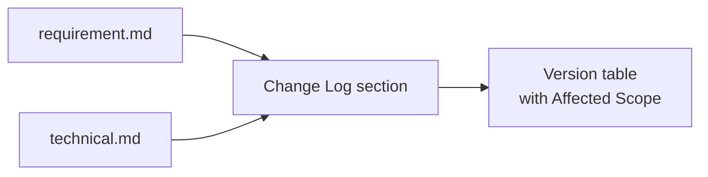
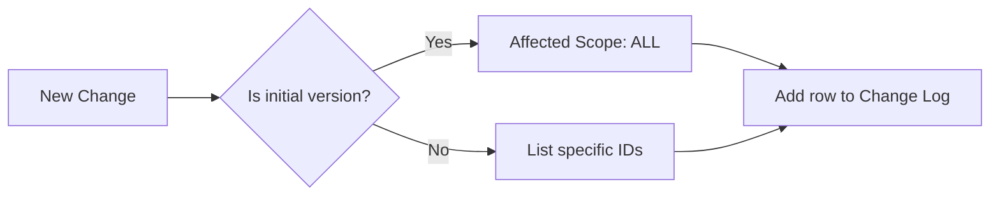
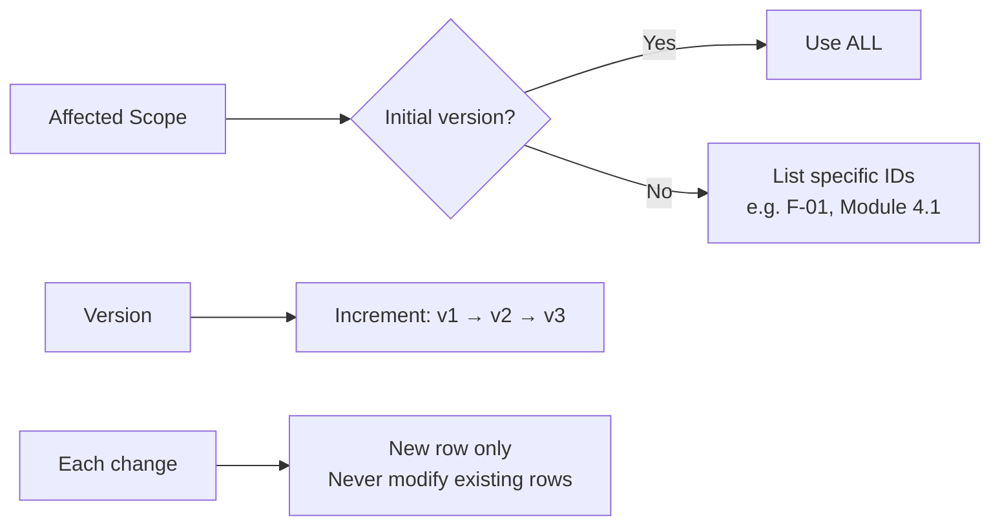
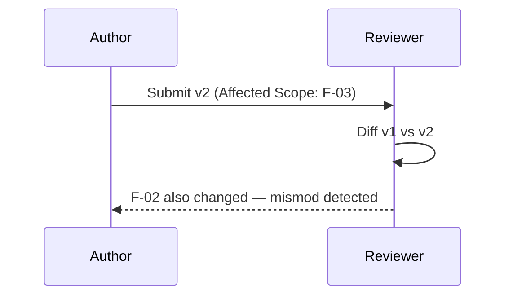

# Change Log Format
> Version: v1 | Date: 2026-04-02 | Author: system

## 1. Overview

Every `requirement.md` and `technical.md` file must include a Change Log section using the exact format defined in this document.


**Figure 1.1 — Change Log is mandatory in both document types**

## 2. Template

```markdown
## Change Log

| Version | Date | Changes | Affected Scope | Reason |
|:---|:---|:---|:---|:---|
| v1 | <date> | Initial version | ALL | - |
```


**Figure 2.1 — Change log entry decision flow**

## 3. Column Rules


**Figure 3.1 — Column rule summary**

### 3.1 Affected Scope Column

**This column is mandatory and must be filled accurately.** It is the basis for automated mismod detection in the review stage (`req-review`).
- For `requirement.md`: fill in affected feature IDs, e.g. `F-01, F-03`
- For `technical.md`: fill in affected section/module IDs, e.g. `Module 4.1, API 6.2`
- Use `ALL` only for initial version or full rewrites
- **Never leave this column empty**

### 3.2 Version Numbering

- Increment sequentially: v1, v2, v3...
- Each change must add a new row — never modify existing rows

## 4. Mismod Detection

### 4.1 Principle

A version's changes must **only affect the scope declared in Affected Scope**. If undeclared content changes between versions, it is classified as a mismod (undeclared change) and must be reported during review.

### 4.2 Example

```markdown
| v1 | 2024-01-01 | Initial version | ALL | - |
| v2 | 2024-01-15 | Add feature C | F-03 | New requirement |
```

If v2 also changed F-02 content but `Affected Scope` only says `F-03` → **mismod detected**.


**Figure 4.1 — Mismod detection during review**
