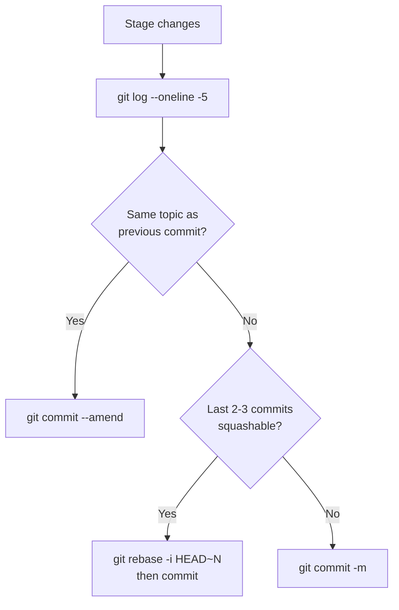

# Git Commit Convention
> Version: v1 | Date: 2026-04-02 | Author: Claude Code

## 1. Commit Frequency

### 1.1 One Logical Unit Per Commit
Commit after each self-contained logical unit — a completed module, a single feature addition, a focused bug fix. Do not commit every file save; do not batch unrelated changes into one large commit.

### 1.2 Size Check Rules
- **Too big**: if you cannot summarize the commit in one line, split it first
- **Too small**: a single typo fix or whitespace change should be held and folded into the next logical unit

## 2. Pre-Commit Review

### 2.1 Required Step Before Every Commit
Before staging a new commit, always run:
```bash
git log --oneline -5
```
Then answer two questions in order.

### 2.2 Question 1 — Amend?
**Can the staged changes be merged with the previous commit?**
Same topic, a forgotten file, a trivial addition to what was just committed.
- Yes → `git commit --amend` instead of a new commit
- No → proceed to Question 2

### 2.3 Question 2 — Squash?
**Can the last 2–3 commits be squashed into one?**
Same feature being built incrementally, "WIP" commits, fix-of-a-fix chains.
- Yes → `git rebase -i HEAD~N` to squash before committing
- No → create a new commit normally

### 2.4 Pre-Commit Decision Flowchart

**Figure 2.1 — Pre-commit decision process**

## 3. Squash Decision Rules

### 3.1 Squash These
- Commits that implement the same feature or fix the same module
- A commit immediately followed by "fix previous" or "oops" corrections
- Sequential "WIP / WIP / done" chains on a single task

### 3.2 Keep Separate
- Commits that belong to different logical units or different modules
- Commits from different authors
- Commits that have already been pushed to a shared remote

## 4. Commit Identity

### 4.1 Use Repo-Configured Identity
Always commit with the identity configured in the repo (`git config user.name` / `user.email`). Never override or inject additional author lines.

### 4.2 No Co-Authored-By Tags
Do **not** append `Co-Authored-By:` trailers. This repo's commits are attributed solely to the configured user.

```bash
# Check before committing
git config user.name   # → GOODDAYDAY
git config user.email  # → 865700600@qq.com
```

## 5. Commit Message Format

### 5.1 Structure
```
type(scope): short description
```

### 5.2 Rules
- Imperative mood, lowercase, no period at end
- Maximum 72 characters for the subject line
- Scope is optional but recommended for multi-module projects

### 5.3 Allowed Types
| Type | Use For |
|:---|:---|
| `feat` | New feature or capability |
| `fix` | Bug fix |
| `refactor` | Code restructure, no behavior change |
| `test` | Adding or updating tests |
| `docs` | Documentation only |
| `chore` | Build, config, dependency updates |

### 5.4 Examples
```
feat(dispatcher): add command registry lookup
fix(db): handle null result in fetch_user
refactor(bridge): extract connection pool to db layer
docs(requirements): update REQ-003 status to done
chore: upgrade psycopg2 to 2.9.9
```
