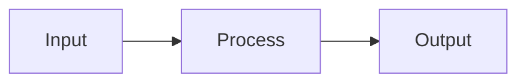

# Markdown Document Format Specification

## 1. Heading Structure

### 1.1 Numbering Rules

Every heading must carry a numeric prefix reflecting its depth. The document title is unnumbered (`#`); all body headings start at level `##` with prefix `1.`.

```
# Document Title           ← no number
## 1. Top Section
### 1.1 Sub-Section
#### 1.1.1 Sub-Sub-Section
##### 1.1.1.1 Deep Section
```

Numbering is strictly sequential within each level and must not skip or repeat.

### 1.2 Density Requirement

Use as many headings as possible. Every logical unit — even a single concept, a single rule, a single scenario — gets its own heading. Prefer splitting one large section into five small ones over keeping a long unbroken block.

### 1.3 Heading Language

Section titles must be concise noun phrases or gerund phrases, not questions or full sentences. Chinese is acceptable for content headings.

## 2. Blank Lines

### 2.1 Between Sections

One blank line before each `##`, `###`, `####` heading. No blank line after a heading before its first content.

### 2.2 Within Sections

No blank lines between consecutive paragraphs, list items, or code blocks unless a new sub-heading separates them. Lists: no blank lines between items unless each item is multi-paragraph.

### 2.3 Prohibited Patterns

- Two or more consecutive blank lines: **prohibited**
- Blank line after a heading before the first content line: **prohibited**

## 3. Dividers

Horizontal rules (`---`, `***`, `___`) are **prohibited** anywhere in the document. Section separation is achieved through headings and single blank lines only.

## 4. Diagrams

### 4.1 Preferred Format

Use **Mermaid** for all inline diagrams. Mermaid renders natively in GitHub, GitLab, VS Code, and most modern markdown viewers.

```

```

### 4.2 Diagram Types and When to Use

| Type | Mermaid Declaration | Use For |
|:---|:---|:---|
| Flowchart | `flowchart LR` / `flowchart TD` | Process flow, decision trees, pipelines |
| Sequence | `sequenceDiagram` | Inter-component communication, API calls |
| Class | `classDiagram` | Data models, object relationships |
| State | `stateDiagram-v2` | State machines, lifecycle |
| ER | `erDiagram` | Database schemas |
| Gantt | `gantt` | Timelines, project planning |
| Mindmap | `mindmap` | Concept hierarchies |

### 4.3 PlantUML Fallback

Use PlantUML only when Mermaid cannot express the required diagram. Follow `${CLAUDE_SKILL_DIR}/../_shared/plantuml.md` for PlantUML conventions.

### 4.4 Diagram Placement

Place each diagram immediately after the heading or paragraph that introduces it. Every diagram must have a caption as a bold line directly below the code fence:

```
**Figure 1.1 — Agent execution loop**
```

### 4.5 Diagram Content Language

All text inside diagrams (node labels, arrows, participant names) must be in English.

## 5. Tables

Use tables for comparisons, option lists, and structured data with 3+ attributes. Every table needs a header row with left-aligned columns (`:---`). Avoid tables for simple two-item comparisons — use a list instead.

## 6. Code Blocks

Always specify the language identifier on the opening fence. Use `text` for plain output and `bash` for shell commands.

## 7. Emphasis

Bold (`**text**`) for key terms on first introduction and critical warnings. Italics (`*text*`) for foreign terms and light emphasis. Avoid bold for entire sentences.

## 8. Lists

### 8.1 Bullets vs. Prose

**Prefer bullet lists over dense paragraphs.** When a section contains 2+ distinct facts, properties, steps, or constraints, break them into bullets — do not pack them into a single paragraph.

Bad (dense paragraph):
```
Dispatcher 是用户的唯一入口，负责接收消息、调用 Claude、解析回复、任务入队、路由 Executor、通知用户。进程由 asyncio.run 驱动，阻塞于 feishu_client.start()。
```

Good (bullets):
```
- Dispatcher 是用户的唯一入口，负责：
  - 接收 Feishu 消息 → 调用 Claude → 解析回复 → 发送卡片或文本 → 任务入队 → 路由到 Executor → 通知用户
- 进程由 `asyncio.run(app.run())` 驱动，阻塞于 `feishu_client.start()`。
```

Use a paragraph only when the content is a single continuous thought that cannot be cleanly separated — such as a one-sentence summary or a flowing explanation.

### 8.2 Sub-lists

Use a sub-list (2-space indent) when a bullet has a detail, exception, or elaboration that belongs to it rather than being a peer point. Do not repeat the parent concept in the sub-bullet; it should add new information only.

### 8.3 Ordered vs. Unordered

Ordered lists for sequential steps where order matters. Unordered lists for all other cases. Maximum nesting depth: 2 levels — deeper structure belongs in headings.

## 9. Document Header

Every document starts with a single `# Title` (no frontmatter), followed immediately by a metadata blockquote:

```markdown
# Document Title
> Version: v1 | Date: YYYY-MM-DD | Author: <source>
```

No table of contents unless the document exceeds 20 sections.
