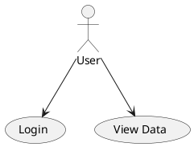
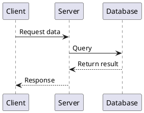
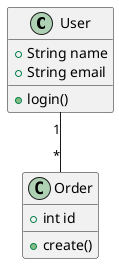
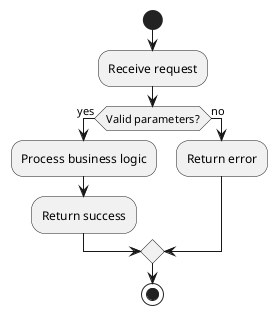
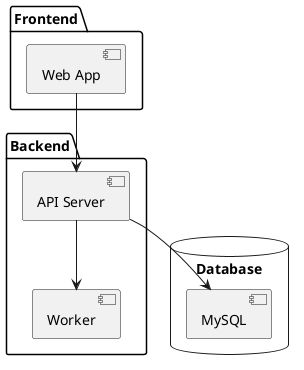

# PlantUML Diagram Conventions

## Language Requirement

**All text content in diagrams must be in English**, including actor names, participant names, class names, method names, labels, and notes. Chinese is prohibited in `.puml` files.

## Environment Detection

**PlantUML environment must be checked before generating any diagrams.** Try in order:

```bash
# Method 1: direct command
plantuml -version 2>/dev/null

# Method 2: via Java
java -jar plantuml.jar -version 2>/dev/null

# Method 3: Windows
where plantuml 2>nul || java -jar plantuml.jar -version 2>nul
```

If all fail, **stop the diagram workflow** and provide installation instructions:

```
PlantUML not installed. Please install first:

1. Install Java (JDK 8+): https://adoptium.net/
2. Install PlantUML:
   - Windows: choco install plantuml
   - macOS:   brew install plantuml
   - Linux:   apt install plantuml
3. Verify: plantuml -version
```

## Workflow

1. Create `.puml` files in the same directory as the requirement/technical document
2. Write using standard PlantUML syntax (all English)
3. Convert to SVG
4. **Must verify conversion succeeded** — fix syntax and retry on failure

## Conversion & Validation

```bash
# Convert single file
plantuml -tsvg <file>.puml

# Convert all puml files in directory
plantuml -tsvg *.puml
```

Validation rules:
- Exit code must be 0
- Corresponding `.svg` file must be generated
- SVG file size must be > 0
- SVG content must not contain `Syntax Error` (PlantUML generates an error image on syntax errors)

Validation script:

```bash
plantuml -tsvg "$FILE" 2>&1
EXIT_CODE=$?
SVG_FILE="${FILE%.puml}.svg"
if [ $EXIT_CODE -ne 0 ] || [ ! -s "$SVG_FILE" ] || grep -q "Syntax Error" "$SVG_FILE"; then
  echo "FAILED: $FILE"
  # Fix syntax and retry
else
  echo "OK: $SVG_FILE"
fi
```

## Syntax Guidelines

### General Rules
- Files must start with `@startuml` and end with `@enduml`
- Use UTF-8 encoding
- **All text content in English**
- Avoid non-standard extension syntax

### Common Diagram Types

**Use Case Diagram:**


**Sequence Diagram:**


**Class Diagram:**


**Activity Diagram (Flowchart):**


**Component Diagram:**


## File Naming

- Requirement diagrams: `req-usecase.puml`, `req-flow.puml`
- Technical diagrams: `tech-architecture.puml`, `tech-sequence.puml`, `tech-class.puml`
