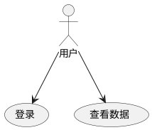
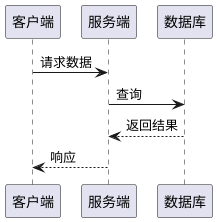
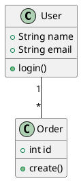
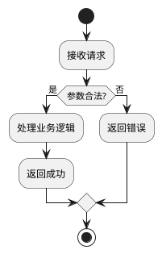
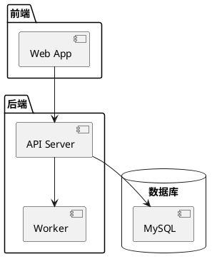

# PlantUML 画图规范

## 使用流程

1. 在需求/技术文档同目录下创建 `.puml` 文件
2. 使用标准 PlantUML 语法编写
3. 执行转换命令生成 SVG
4. **必须验证转换成功**，失败则修复语法后重试

## 转换与校验

```bash
# 转换单个文件
plantuml -tsvg <file>.puml

# 转换目录下所有 puml 文件
plantuml -tsvg *.puml
```

校验规则：
- 转换命令退出码必须为 0
- 必须生成对应的 `.svg` 文件
- SVG 文件大小必须 > 0
- SVG 内容中不能包含 `Syntax Error`（PlantUML 语法错误时会生成带错误信息的图片）

校验脚本：

```bash
# 校验单个文件
plantuml -tsvg "$FILE" 2>&1
EXIT_CODE=$?
SVG_FILE="${FILE%.puml}.svg"
if [ $EXIT_CODE -ne 0 ] || [ ! -s "$SVG_FILE" ] || grep -q "Syntax Error" "$SVG_FILE"; then
  echo "FAILED: $FILE"
  # 需要修复语法后重试
else
  echo "OK: $SVG_FILE"
fi
```

## 语法要点

### 通用规则
- 文件必须以 `@startuml` 开头，`@enduml` 结尾
- 使用 UTF-8 编码，中文直接写即可
- 避免使用非标准扩展语法

### 常用图类型

**用例图：**


**时序图：**


**类图：**


**流程图（Activity）：**


**组件图：**


## 文件命名

- 需求文档配图：`req-用例图.puml`、`req-流程图.puml`
- 技术文档配图：`tech-架构图.puml`、`tech-时序图.puml`、`tech-类图.puml`
