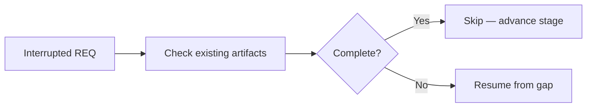
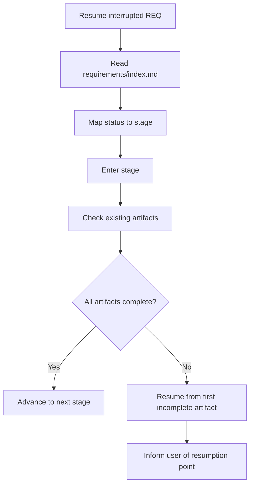
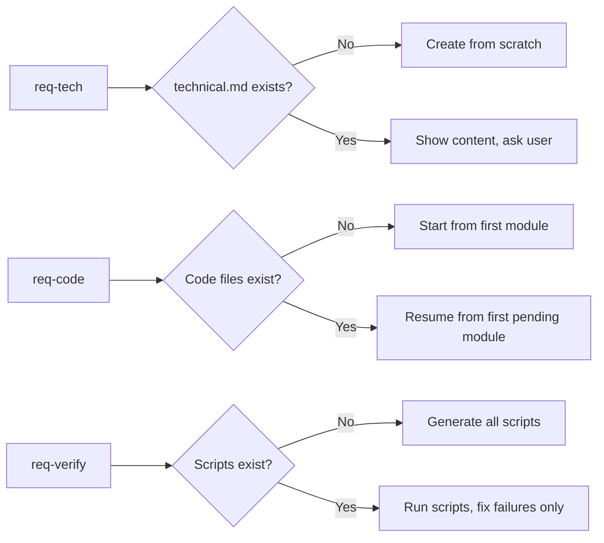
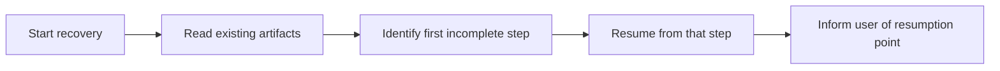

# Breakpoint Recovery Pattern
> Version: v1 | Date: 2026-04-02 | Author: system

## 1. Purpose

When resuming a previously interrupted requirement, follow this pattern to avoid redoing completed work.

**Figure 1.1 — Core recovery principle: check before redoing**

## 2. General Flow

**Figure 2.1 — Breakpoint recovery general flow**

1. Read `requirements/index.md` to get the current status of the REQ
2. Map status to the corresponding stage (see `_shared/status.md` for mapping)
3. Enter the stage and **check existing artifacts before starting work**
4. Resume from the first incomplete artifact, not from scratch
5. Inform user: "Detected REQ-xxx was interrupted at [Stage X - specific step]. Resuming from there."

## 3. Per-Stage Artifact Checks

### 3.1 req-tech (Technical Design)

- Check if `technical.md` exists
- If exists and status is `Technical Design` (not finalized): show existing content, ask user to continue or restart

### 3.2 req-code (Coding)

- Read module list from `technical.md`
- Check which modules have corresponding code files
- List completed vs pending modules
- Resume from the first pending module

### 3.3 req-verify (Verification)

- Check if `scripts/` directory and scripts exist
- Check if test files exist
- If scripts exist: run them to see current pass/fail status
- Only fix failing items, don't regenerate passing ones

**Figure 3.1 — Per-stage artifact check logic**

## 4. Key Principle

**Never redo completed work.** Always check first, then fill in the gaps.

**Figure 4.1 — Recovery execution principle**
