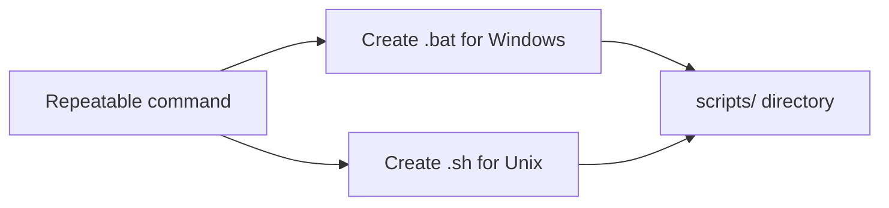
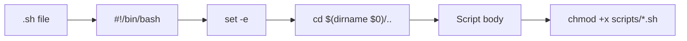
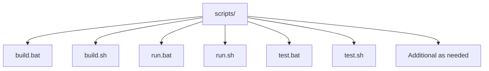
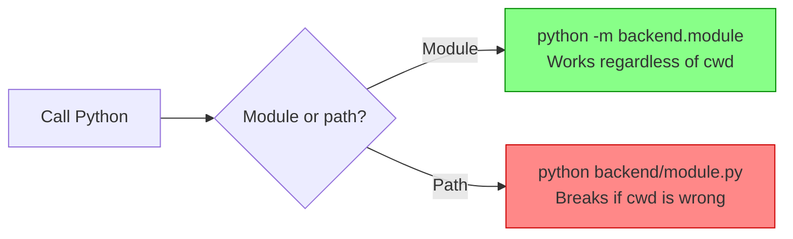
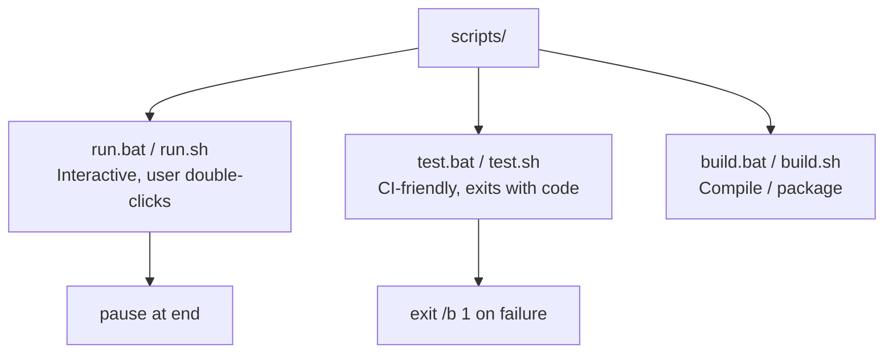

# Automation Script Conventions
> Version: v1 | Date: 2026-04-02 | Author: system

## 1. General Rules

All commands that need to be executed repeatedly (build, test, start, deploy, etc.) **must be generated as script files under `scripts/`**, providing both `.bat` (Windows) and `.sh` (Unix) versions.
Each script must include comments explaining its purpose and prerequisites.
`scripts/` directory should only contain `.bat` and `.sh` files. No `.py` or other source files — those belong in the project's source directories (e.g. `backend/tests/`).


**Figure 1.1 — Script generation overview**

## 2. .bat File Conventions (Windows)

```mermaid
flowchart LR
    A[.bat file] --> B[@echo off]
    B --> C[chcp 65001 >nul 2>nul]
    C --> D[cd /d %~dp0\\..]
    D --> E[Script body]
```
**Figure 2.1 — Mandatory .bat header sequence**

### 2.1 Header Template

```bat
@echo off
chcp 65001 >nul 2>nul
cd /d "%~dp0\.."
```

**All three lines are mandatory:**
1. `@echo off` — suppress command echoing
2. `chcp 65001 >nul 2>nul` — set UTF-8 encoding for Chinese text support. **Must use `>nul 2>nul`** (not `>/dev/null` which is Unix-only, not `>nul` alone which may show stderr)
3. `cd /d "%~dp0\.."` — change to project root directory. **Critical for double-click execution** — without this, relative paths (config files, Python modules) will fail because the working directory defaults to wherever the user double-clicked from

### 2.2 Encoding Pitfalls

- **BOM (Byte Order Mark)**: `.bat` files must NOT have UTF-8 BOM. BOM causes the first command (`@echo off`) to be silently corrupted — CMD will interpret the BOM bytes as part of the command, leading to mysterious errors like `'cho' is not recognized`. **Always verify .bat files are saved without BOM.**
- When writing `.bat` files from a Unix-like shell (bash, git bash), the shell may auto-transform Windows-specific redirections. Specifically `>nul` may become `>/dev/null`. **Always verify the output file** after writing.
- **Do not use the `Write` tool to create `.bat` files** if encoding issues occur. Fall back to the `Edit` tool on existing files, or use `Bash` with `printf` to write byte-exact content.

### 2.3 Interactive .bat Scripts

For scripts meant to be double-clicked (not called from CI):

```bat
REM End with pause so the window doesn't close immediately
pause
```

For error handling with exit codes:

```bat
if %errorlevel% neq 0 (
    echo FAILED.
    pause
    exit /b 1
)
```

## 3. .sh File Conventions (Unix)


**Figure 3.1 — Mandatory .sh header sequence and permissions**

### 3.1 Header Template

```bash
#!/bin/bash
set -e
cd "$(dirname "$0")/.."
```

**All three lines are mandatory:**
1. `#!/bin/bash` — shebang line
2. `set -e` — exit immediately on any command failure
3. `cd "$(dirname "$0")/.."` — change to project root directory (equivalent to the `.bat` `cd /d` pattern)

### 3.2 Permissions

After creation, set executable permission: `chmod +x scripts/*.sh`

## 4. Standard Script Inventory


**Figure 4.1 — Standard script inventory**

| Filename | Purpose |
|:---|:---|
| `build.bat` + `build.sh` | Build/compile |
| `run.bat` + `run.sh` | Start/run |
| `test.bat` + `test.sh` | Run all tests |
| Additional as needed | |

## 5. Calling Python Code from Scripts


**Figure 5.1 — Always use module invocation**

Scripts should call Python modules using `python -m module.path`, not `python path/to/file.py`:

```bat
REM Good — uses module system, works regardless of cwd
python -m backend.tests.test_spy_game

REM Bad — breaks if cwd is wrong
python backend/tests/test_spy_game.py
```

## 6. Examples


**Figure 6.1 — Example scripts overview**

### 6.1 run.bat (Interactive, with Game Selection)

```bat
@echo off
chcp 65001 >nul 2>nul
cd /d "%~dp0\.."

echo ========================================
echo   Masquerade - AI Board Game Arena
echo ========================================
echo.

python -m backend.main --list
echo.

set /p GAME="Select game type: "

if "%GAME%"=="" (
    echo No game selected, exiting.
    pause
    exit /b 1
)

echo.
python -m backend.main %GAME%

echo.
echo Game finished.
pause
```

### 6.2 test.bat (CI-Friendly)

```bat
@echo off
chcp 65001 >nul 2>nul
cd /d "%~dp0\.."

echo Running tests...
python -m backend.tests.test_spy_game
if %errorlevel% neq 0 (
    echo Tests FAILED.
    exit /b 1
)
echo Tests completed.
```

### 6.3 test.sh

```bash
#!/bin/bash
set -e
cd "$(dirname "$0")/.."

echo "Running tests..."
python -m backend.tests.test_spy_game
echo "Tests completed."
```
