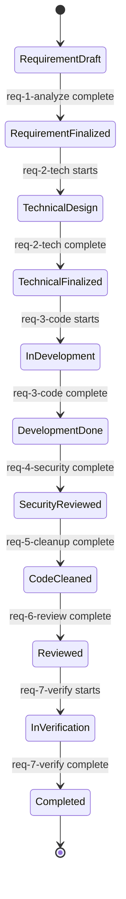
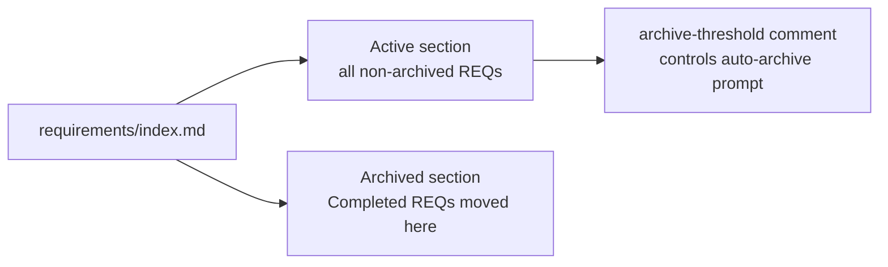
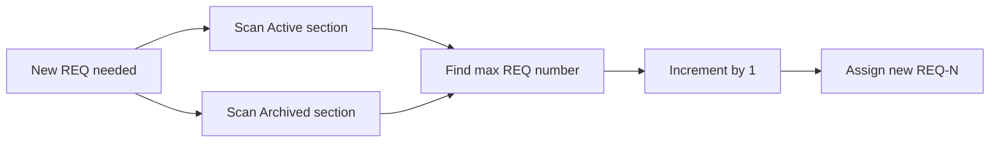

# Requirement Status Enum
> Version: v1 | Date: 2026-04-02 | Author: system

## 1. Status Definitions

All statuses used in `requirements/index.md`, `requirement.md`, and `technical.md`.


**Figure 1.1 — Requirement lifecycle state machine**

| Status | Meaning | Next Stage |
|:---|:---|:---|
| `Requirement Draft` | Requirement analysis in progress | → req-1-analyze |
| `Requirement Finalized` | Requirement approved | → req-2-tech |
| `Technical Design` | Technical design in progress | → req-2-tech |
| `Technical Finalized` | Technical design approved | → req-3-code |
| `In Development` | Coding in progress | → req-3-code |
| `Development Done` | Coding completed | → req-4-security |
| `Security Reviewed` | Security review passed | → req-5-cleanup |
| `Code Cleaned` | Code cleanup completed | → req-6-review |
| `Reviewed` | Requirement review passed | → req-7-verify |
| `In Verification` | Verification in progress | → req-7-verify |
| `Completed` | All done | - |

## 2. index.md Format


**Figure 2.1 — index.md two-section structure**

### 2.1 Language Requirement

`index.md` **must be written entirely in English**, including requirement names and descriptions.

### 2.2 Template

```markdown
# Requirement Index

<!-- archive-threshold: 5 -->

## Active

| ID | Name | Status | Updated | Description |
|:---|:---|:---|:---|:---|

## Archived

| ID | Name | Completed | Description |
|:---|:---|:---|:---|
```

- New requirements go into the **Active** section
- The `archive-threshold` comment controls how many Completed entries in Active trigger the `/req-archive` prompt — adjust per project (default: 5)

## 3. Updating index.md

### 3.1 Status Update Rule

When updating `index.md`, only change the `Status` and `Updated` columns for the target REQ in the **Active** section. Do not touch other rows or the Archived section.

### 3.2 Determining Next REQ Number

Scan **both** Active and Archived sections to find the highest existing REQ number. Increment by 1.


**Figure 3.1 — REQ number assignment flow**
