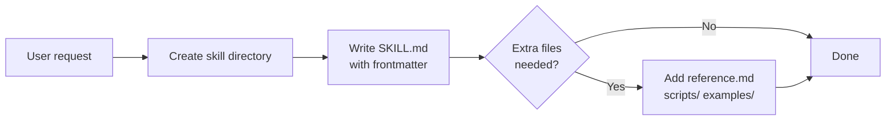
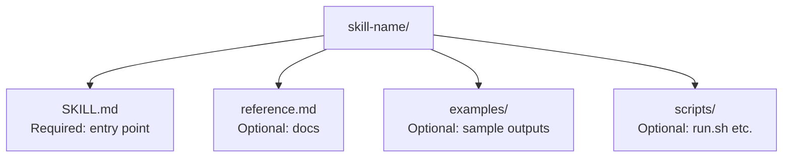
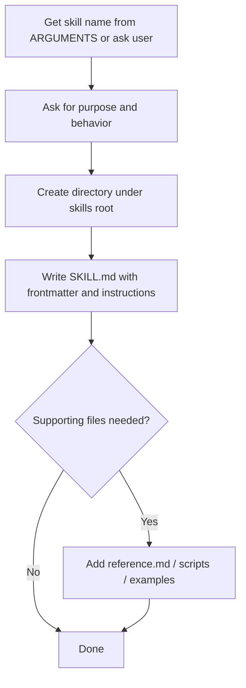
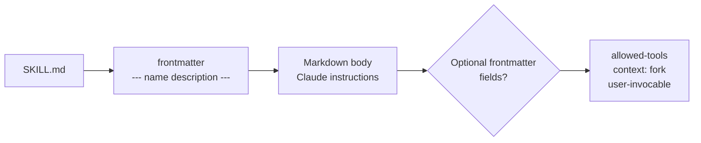
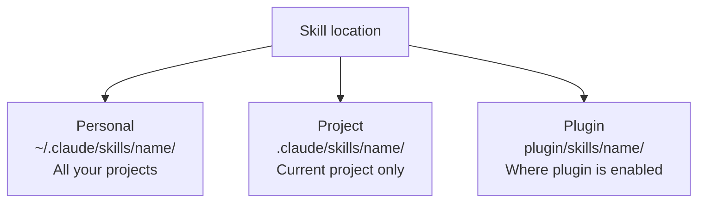
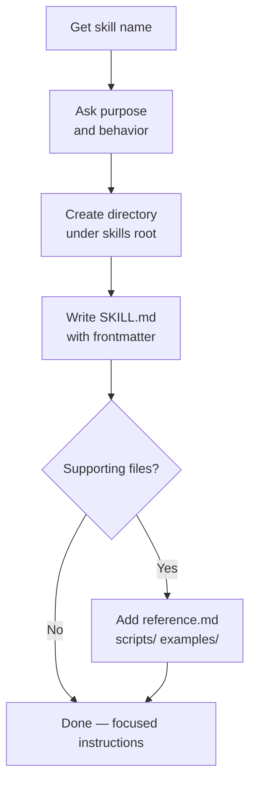

# create-skill
> Version: v1 | Date: 2026-04-02 | Author: system

## 1. Overview
Create a new skill based on the user's request, strictly following the structure and conventions below.


**Figure 1.1 — Skill creation overview**

## 2. Skill Directory Structure


**Figure 2.1 — Skill directory layout**

```text
<skill-name>/
├── SKILL.md           # Required - entry point with frontmatter + instructions
├── reference.md       # Optional - supporting documentation
├── examples/          # Optional - example outputs
│   └── sample.md
└── scripts/           # Optional - executable scripts
    └── run.sh
```

## 3. Creation Flow


**Figure 3.1 — New skill creation steps**

## 4. SKILL.md Format Specification


**Figure 4.1 — SKILL.md structure**

### 4.1 Frontmatter Fields

```yaml
---
name: <skill-name>                # Optional, defaults to directory name
description: <one-line summary>   # Recommended, used for auto-discovery
argument-hint: "[args]"           # Optional, autocomplete hint
disable-model-invocation: true    # Optional, manual invocation only
user-invocable: false             # Optional, Claude auto-invocation only
allowed-tools: [Read, Grep]       # Optional, restrict available tools
context: fork                     # Optional, run in isolated subagent
---

Markdown instructions for Claude to follow.
```

### 4.2 Naming Conventions
- Directory name: lowercase letters, digits, and hyphens only (max 64 characters)
- Directory name becomes the slash command: `my-skill/` → `/my-skill`
- Plugin skills use namespacing: `plugin-name:skill-name`

## 5. Available Variables

```mermaid
flowchart LR
    A[Skill invoked] --> B[$ARGUMENTS\nAll passed arguments]
    A --> C[$ARGUMENTS[0] / $0\nFirst argument]
    A --> D[${CLAUDE_SKILL_DIR}\nSkill directory path]
    A --> E[${CLAUDE_SESSION_ID}\nCurrent session ID]
```
**Figure 5.1 — Available runtime variables**

| Variable | Description |
|:---|:---|
| `$ARGUMENTS` | All arguments passed to the skill |
| `$ARGUMENTS[0]`, `$0` | First argument |
| `${CLAUDE_SESSION_ID}` | Current session ID |
| `${CLAUDE_SKILL_DIR}` | Skill's own directory path (stable even if cwd changes) |

## 6. Skill Locations


**Figure 6.1 — Skill location scopes**

| Location | Path | Scope |
|:---|:---|:---|
| Personal | `~/.claude/skills/<name>/` | All your projects |
| Project | `.claude/skills/<name>/` | Current project only |
| Plugin | `<plugin>/skills/<name>/` | Where plugin is enabled |

## 7. Execution Steps


**Figure 7.1 — Execution steps**

1. Use the skill name from `$ARGUMENTS` if provided; otherwise ask the user
2. Ask the user for the skill's purpose and behavior
3. Create the directory under the current skills root
4. Write `SKILL.md` with appropriate frontmatter and clear, concise instructions
5. Add supporting files (reference docs, scripts, examples) only when needed
6. Keep instructions focused — avoid over-engineering
