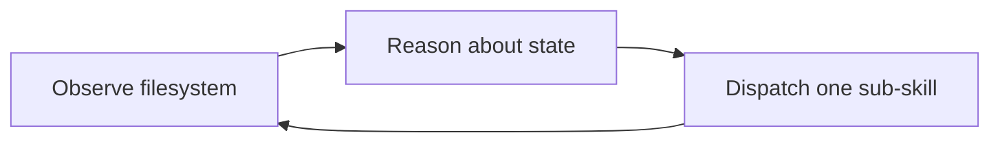

# Project Evolution

> This document chronicles the development journey of my-skills — how a personal coding-standards collection evolved into a full-featured orchestrator-driven skills framework.

---

## Phase 1 — Foundation (2026-03-09 ~ 2026-03-20)

**Theme:** Bootstrap content and establish coding conventions.

### What happened

The project began as a straightforward collection of coding standards and documentation templates:

| Date | Commits | Focus |
|:---|:---:|:---|
| Mar 9 | 3 | Repository init, README |
| Mar 10 | 2 | i18n support, Python coding examples |
| Mar 14 | 1 | Script conventions (`.bat` / `.sh`) |
| Mar 18 | 1 | Java Web Service coding standard |
| Mar 19–20 | 6 | Documentation philosophy, method-level JavaDocs, numbered step comments, stage naming |

### Key outcomes

- **Java coding standard** — class/method JavaDocs, logging conventions, numbered step comments
- **Python coding examples** — reference implementations
- **Script conventions** — dual `.bat` + `.sh` automation standard
- **Documentation philosophy** — "methods as documentation", clear stage naming

### Stats

- 13 commits over 11 days
- 1 author
- Single-directory flat structure

---

## Phase 2 — Skills Framework (2026-03-30 ~ 2026-04-02)

**Theme:** Build the complete skills pipeline with structured documentation and sub-skills.

### What happened

Over 3 intensive days, the repository was transformed from a static reference into an executable skills framework. The 8-stage requirement-driven development pipeline took shape, along with supporting tools and shared conventions.

| Date | Commits | Focus |
|:---|:---:|:---|
| Mar 30 | 1 | PlantUML diagram support |
| Mar 31 | 1 | Workflow: git tags, TDD, parallel agents, archive system |
| Apr 2 | 15 | Full skills buildout (see below) |

The Apr 2 burst included:

- **`req`** — 8-stage workflow orchestrator (analyze → tech → code → security → cleanup → review → verify → done)
- **`write-doc`** — document generation with internal write-review-simplify loop
- **`task`** — generic orchestrator for non-req workflows
- **`create-skill`** — standardised skill creation guide
- **`_shared/`** — shared conventions:
  - `plantuml.md` — PlantUML environment detection and syntax
  - `status.md` — status enum and index.md format
  - `changelog.md` — change log format and mismod detection
  - `recovery.md` — breakpoint recovery pattern
  - `scripts.md` — automation script standards
  - `markdown.md` — markdown format specification (headings, diagrams, tables)
  - `git-commit.md` — commit message conventions
  - `diverge-converge.md` — multi-agent analysis pattern
- **Structured documentation** — every SKILL.md got metadata headers, Mermaid flowcharts, numbered sections
- **i18n** — all SKILL.md files translated to English
- **Style** — consistent markdown style guide, bullet lists over dense prose

### Architecture (at the time)

```
req orchestrator → 8-stage linear pipeline
  Stage 1: req-1-analyze
  Stage 2: req-2-tech
  Stage 3: req-3-code
  Stage 4: req-4-security
  Stage 5: req-5-cleanup
  Stage 6: req-6-review
  Stage 7: req-7-verify
  Stage 8: req-8-done
```

Stages were numbered, sequential, and each knew about the next. The orchestrator was a hardcoded pipeline.

### Stats

- 17 commits in 3 days (peak throughput)
- 15 skills introduced
- 8 `_shared/` convention documents
- 10 Mermaid diagrams across the codebase

---

## Phase 3 — Architecture Upgrade (2026-04-08 ~ 2026-04-25)

**Theme:** Stateless orchestrator, clean naming, and repository hygiene.

### What happened

The pipeline was replaced with a **stateless orchestrator pattern** — instead of a hardcoded stage sequence, the orchestrator reads the filesystem, observes real state, reasons about what is missing, and dispatches exactly one sub-skill at a time.

| Date | Change | Impact |
|:---|:---|:---|
| Apr 8 | Stateless orchestrator architecture | observe-reason-dispatch loop replaces linear pipeline |
| Apr 8 | Directory rename | `req-1-analyze` → `req-analyze` (and all stages): sub-skills no longer know ordering |
| Apr 25 | Sync from anker/skills | Full port of the latest architecture |
| Apr 25 | `.gitignore` whitelist fix | `/*/` + explicit `!` entries for each skill |
| Apr 25 | History cleanup | Unified author name, removed Co-Authored-By |

### What changed

**Directory structure**

```
req-1-analyze/    →  req-analyze/
req-2-tech/       →  req-tech/
req-3-code/       →  req-code/
req-4-security/   →  req-security/
req-5-cleanup/    →  req-cleanup/
req-6-review/     →  req-review/
req-7-verify/     →  req-verify/
req-8-done/       →  req-done/
```

**New skill**

- `puml2svg/` — standalone PlantUML-to-SVG conversion skill, independent from the req pipeline

**Orchestrator redesign**

The `req/SKILL.md` orchestrator was rewritten:



**Figure 3.1 — Stateless orchestrator observe-reason-dispatch loop**

Instead of "run stage 1, wait, run stage 2, wait...", the orchestrator now:
1. **Observes** — reads `requirements/` directory and index.md
2. **Reasons** — determines what is missing (requirement doc? technical design? code?)
3. **Dispatches** — invokes exactly one sub-skill to fill the gap

This makes the system resilient to interruption, tolerant of out-of-order execution, and easy to extend.

**Sub-skill contract**

Every sub-skill got `applicable_when` frontmatter declaring the conditions under which it should be invoked. The orchestrator uses this to decide which sub-skill to dispatch — no hardcoded pipeline logic.

### Stats

- 3 structural changesets (Apr 8 + Apr 25)
- 10 directories renamed
- 1 new skill added
- 1 orchestrator fully rewritten
- Repository history cleaned and unified

---

## Evolution Summary

| Phase | Period | Commits | Theme |
|:---|:---|:---:|:---|
| 1 — Foundation | Mar 9 – Mar 20 | 13 | Coding standards and docs |
| 2 — Skills Framework | Mar 30 – Apr 2 | 17 | Skills pipeline and conventions |
| 3 — Architecture Upgrade | Apr 8 – Apr 25 | 3 | Stateless orchestrator, clean naming |

```
Coding Standards → Skills Pipeline → Stateless Orchestrator
     Phase 1           Phase 2            Phase 3
```

**Total:** 31 commits (2026-03-09 ~ 2026-04-25)
