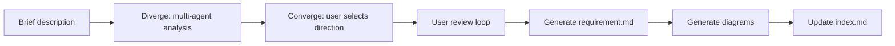
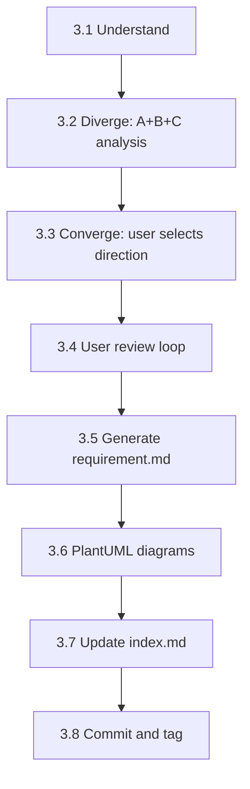

# req-1-analyze — 需求分析
> Version: v2 | Date: 2026-04-02 | Author: system

## 1. 角色定义
你负责需求分析阶段，将用户的简短描述扩展为完整的需求文档。


**Figure 1.1 — req-1-analyze stage overview**

## 2. 总体流程


**Figure 2.1 — Requirement analysis cycle: diverge → converge → generate**

## 3. 步骤详解


**Figure 3.1 — Step sequence overview**

### 3.1 理解需求

若 `$ARGUMENTS` 为空或不明确，**主动引导用户**：
- "What feature do you want to build?"
- "What problem does it solve?"
- "Who are the target users?"
- "Any reference products or interfaces?"
- "Do you have any mockups, screenshots, or UI references? Drag them into the chat."

若用户提供图片或截图，直接从中提取需求 — 当视觉参考与文字描述同时存在时，视觉参考优先。
持续提问直到获得足够信息方可开始分析。
若 `$ARGUMENTS` 已提供描述，直接进入扩展。

### 3.2 发散分析（Diverge）

读取 `${CLAUDE_SKILL_DIR}/../_shared/diverge-converge.md` 获取完整模式规范（角色定义、Round 3 消息传递模型、实现约束）。

通过 `Agent` tool 启动三轮 subagent 分析：

**Round 1（并行）**：同时启动 Agent A 和 Agent B：
- **Agent A（核心路径）**：最多 5 条 F-xx，严格排除非核心，输出 MVP 最快可交付的需求集
- **Agent B（完整视野）**：覆盖所有合理场景含边界情况，输出完整可演进的需求集

**Round 2（顺序）**：启动 Agent C，读取 A+B 完整输出：
- **Agent C（核心矛盾）**：指出"A 和 B 对问题的理解有何本质不同"，提出"用户真正想解决的是什么"的判断，必须具体命名矛盾点，不可输出模糊结论

**Round 3（并行）**：同时启动 Agent A v2 和 Agent B v2（新实例），各自 prompt 按 `diverge-converge.md` 规范包含 Round 1 双方方案 + C 的质疑全文 + 回应任务。

### 3.3 汇总与用户选择（Converge）

主 agent 整理三轮输出，按 `diverge-converge.md` Synthesis 格式呈现：

1. **三方立场速览**（各一句话）
2. **核心矛盾点**（C 指出的具体分歧）
3. **对比表**

| 维度 | Agent A（核心路径）| Agent B（完整视野）|
|:---|:---|:---|
| 功能覆盖 | | |
| 复杂度 | | |
| 交付速度 | | |
| 安全敏感点 | | |
| 可测试性 | | |

4. **推荐方向**（基于上下文判断）

**等待用户选择**：选 A / 选 B / 描述融合方式。用户选定后，以所选方向作为后续分析基础。

### 3.4 用户审查
展示扩展内容后，**等待用户反馈**：
- 用户可修改、添加或删除条目
- 根据反馈调整并重新提交审查
- 循环直到用户明确表示"looks good"或"approved"

### 3.5 生成需求文档
用户批准后：

1. 确定 REQ 编号：读取 `requirements/index.md`，扫描 Active 和 Archived **两个**部分以找到最高现有 REQ 编号，加 1 递增
2. 创建目录：`requirements/REQ-xxx-<short-name>/`（目录名使用英文）
3. 通过 `Skill` tool 调用 `write-doc`，传入以下信息：
   - 使用下方嵌入模板作为文档结构
   - 将 diverge/converge 阶段确认的完整需求内容填入各章节
   - 保存路径：`requirements/REQ-xxx-<short-name>/requirement.md`

   模板：

```markdown
# REQ-xxx <Requirement Name>

> Status: Requirement Finalized
> Created: <date>
> Updated: <date>

## 1. Background

## 2. Target Users & Scenarios

## 3. Functional Requirements

### F-01 <Feature Name>
- Main flow:
- Error handling:
- Edge cases:

### F-02 <Feature Name>
...

## 4. Non-functional Requirements

## 5. Out of Scope

## 6. Acceptance Criteria

| ID | Feature | Condition | Expected Result |
|:---|:---|:---|:---|

## 7. Change Log

| Version | Date | Changes | Affected Scope | Reason |
|:---|:---|:---|:---|:---|
| v1 | <date> | Initial version | ALL | - |
```

**注意：章节标题和结构性字段必须使用英文。描述性内容可使用中文。**

变更日志格式与规则见 `${CLAUDE_SKILL_DIR}/../_shared/changelog.md`。`Affected Scope` 列必须准确填写。

4. 生成图表（按 PlantUML 规范）：
  - 至少一张用例图
  - 复杂流程配流程图
  - 多角色交互配时序图

### 3.6 PlantUML 图表
读取 `${CLAUDE_SKILL_DIR}/../_shared/plantuml.md` 获取完整 PlantUML 规范（环境检测、语法、SVG 转换）。严格遵循该流程。

### 3.7 更新索引


**Figure 3.7 — Index update decision flow**

读取 `${CLAUDE_SKILL_DIR}/../_shared/status.md` 获取 index.md 格式与状态枚举。
将需求记录添加到 `requirements/index.md`，状态设为 `Requirement Finalized`。若 `index.md` 不存在，按共享规范创建。

### 3.8 提交与标签

```bash
git add -A && git commit -m "docs(REQ-xxx): requirement analysis complete"
git tag REQ-xxx-analyzed
```
