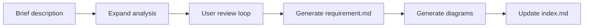
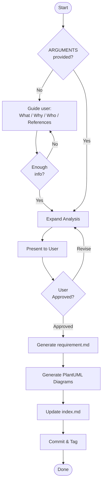
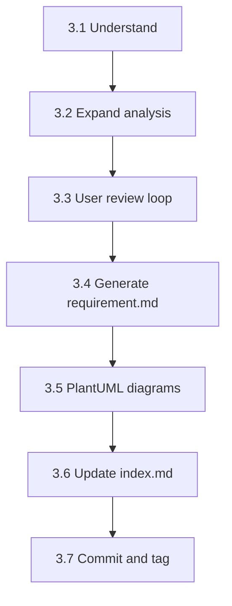
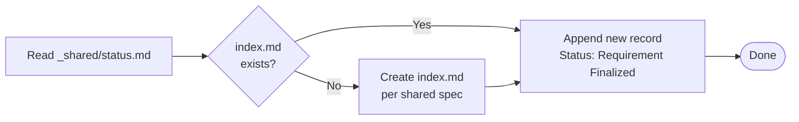

# req-1-analyze — 需求分析
> Version: v1 | Date: 2026-04-02 | Author: system

## 1. 角色定义
你负责需求分析阶段，将用户的简短描述扩展为完整的需求文档。


**Figure 1.1 — req-1-analyze stage overview**

## 2. 总体流程


**Figure 2.1 — Requirement analysis cycle: expand → review → generate**

## 3. 步骤详解


**Figure 3.1 — Step sequence overview**

### 3.1 理解需求

若 `$ARGUMENTS` 为空或不明确，**主动引导用户**：
- "What feature do you want to build?"
- "What problem does it solve?"
- "Who are the target users?"
- "Any reference products or interfaces?"
- "Do you have any mockups, screenshots, or UI references? Drag them into the chat."

若用户提供图片或截图，直接从中提取需求 — 当视觉参考与文字描述同时存在时，视觉参考优先。
持续提问直到获得足够信息方可开始分析。
若 `$ARGUMENTS` 已提供描述，直接进入扩展。

### 3.2 扩展分析
**尽可能全面详细**地扩展需求，并提交以下内容供用户审查：

1. **Background** — 为什么构建此功能，解决什么痛点
2. **Target Users** — 谁会使用它，使用场景
3. **Functional Requirements** — 列出所有功能并附编号 ID，每项详细到具体行为
  - 主流程
  - 错误处理
  - 边界情况
4. **Non-functional Requirements** — 性能、安全、兼容性等
5. **Out of Scope** — 明确排除的内容
6. **Acceptance Criteria** — 每项功能的具体可验证条件

格式：使用简洁的列表。将功能编号为 F-01、F-02 等以便追溯。

### 3.3 用户审查
展示扩展内容后，**等待用户反馈**：
- 用户可修改、添加或删除条目
- 根据反馈调整并重新提交审查
- 循环直到用户明确表示"looks good"或"approved"

### 3.4 生成需求文档
用户批准后：

1. 确定 REQ 编号：读取 `requirements/index.md`，扫描 Active 和 Archived **两个**部分以找到最高现有 REQ 编号，加 1 递增
2. 创建目录：`requirements/REQ-xxx-<short-name>/`（目录名使用英文）
3. 按以下格式写入 `requirement.md`：

```markdown
# REQ-xxx <Requirement Name>

> Status: Requirement Finalized
> Created: <date>
> Updated: <date>

## 1. Background

## 2. Target Users & Scenarios

## 3. Functional Requirements

### F-01 <Feature Name>
- Main flow:
- Error handling:
- Edge cases:

### F-02 <Feature Name>
...

## 4. Non-functional Requirements

## 5. Out of Scope

## 6. Acceptance Criteria

| ID | Feature | Condition | Expected Result |
|:---|:---|:---|:---|

## 7. Change Log

| Version | Date | Changes | Affected Scope | Reason |
|:---|:---|:---|:---|:---|
| v1 | <date> | Initial version | ALL | - |
```

**注意：章节标题和结构性字段必须使用英文。描述性内容可使用中文。**

变更日志格式与规则见 `${CLAUDE_SKILL_DIR}/../_shared/changelog.md`。`Affected Scope` 列必须准确填写。

4. 生成图表（按 PlantUML 规范）：
  - 至少一张用例图
  - 复杂流程配流程图
  - 多角色交互配时序图

### 3.5 PlantUML 图表
读取 `${CLAUDE_SKILL_DIR}/../_shared/plantuml.md` 获取完整 PlantUML 规范（环境检测、语法、SVG 转换）。严格遵循该流程。

### 3.6 更新索引


**Figure 3.6 — Index update decision flow**

读取 `${CLAUDE_SKILL_DIR}/../_shared/status.md` 获取 index.md 格式与状态枚举。
将需求记录添加到 `requirements/index.md`，状态设为 `Requirement Finalized`。若 `index.md` 不存在，按共享规范创建。

### 3.7 提交与标签

```bash
git add -A && git commit -m "docs(REQ-xxx): requirement analysis complete"
git tag REQ-xxx-analyzed
```
