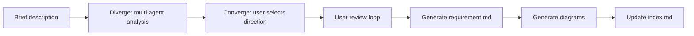
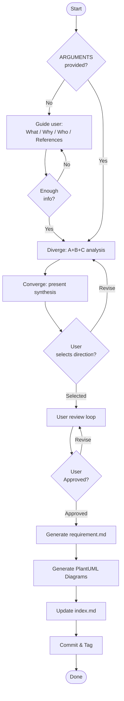
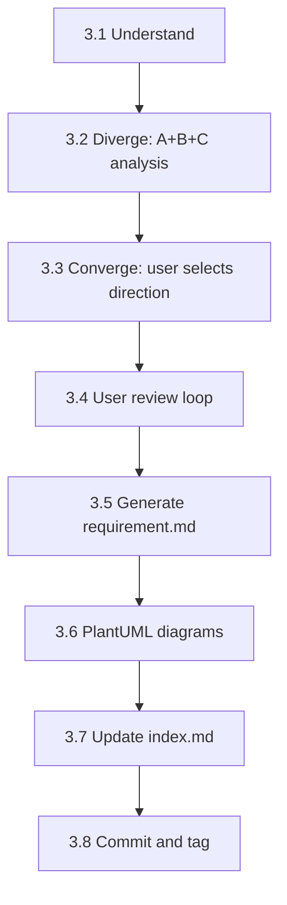
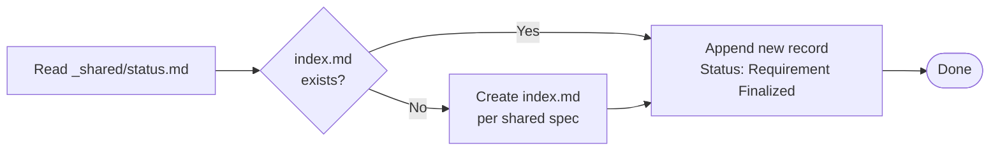

# req-1-analyze — Requirement Analysis
> Version: v2 | Date: 2026-04-02 | Author: system

## 1. Role
You are responsible for the requirement analysis stage — expand a brief user description into a complete requirement document.


**Figure 1.1 — req-1-analyze stage overview**

## 2. Overall Flow


**Figure 2.1 — Requirement analysis cycle: diverge → converge → generate**

## 3. Steps


**Figure 3.1 — Step sequence overview**

### 3.1 Understand Requirements

If `$ARGUMENTS` is empty or unclear, **proactively guide the user**:
- "What feature do you want to build?"
- "What problem does it solve?"
- "Who are the target users?"
- "Any reference products or interfaces?"
- "Do you have any mockups, screenshots, or UI references? Drag them into the chat."

If the user provides images or screenshots, extract requirements directly from them — when visual references and text descriptions coexist, visual references take priority.
Continue asking until you have enough information to begin analysis.
If `$ARGUMENTS` already provides a description, proceed directly to expansion.

### 3.2 Diverge Analysis

Read `${CLAUDE_SKILL_DIR}/../_shared/diverge-converge.md` for the full pattern specification (role definitions, Round 3 message-passing model, implementation constraints).

Launch three rounds of subagent analysis via the `Agent` tool:

**Round 1 (parallel)**: Launch Agent A and Agent B simultaneously:
- **Agent A (core path)**: at most 5 F-xx items, strictly exclude non-core, output the fastest-deliverable MVP requirement set
- **Agent B (full scope)**: cover all reasonable scenarios including edge cases, output a complete evolvable requirement set

**Round 2 (sequential)**: Launch Agent C, reading the full A+B output:
- **Agent C (core conflict)**: identify "how do A and B fundamentally differ in their understanding of the problem", judge "what the user really wants to solve", must name the conflict point concretely — no vague conclusions

**Round 3 (parallel)**: Launch Agent A v2 and Agent B v2 (new instances) simultaneously, each prompt per the `diverge-converge.md` spec containing both Round 1 proposals + C's full challenge + response task.

### 3.3 Converge — Synthesize and User Selection

The main agent consolidates all three rounds' output and presents in the `diverge-converge.md` Synthesis format:

1. **Three-way position summary** (one sentence each)
2. **Core conflict** (the specific divergence identified by C)
3. **Comparison table**

| Dimension | Agent A (core path) | Agent B (full scope) |
|:---|:---|:---|
| Feature coverage | | |
| Complexity | | |
| Delivery speed | | |
| Security-sensitive points | | |
| Testability | | |

4. **Recommended direction** (based on context)

**Wait for user selection**: choose A / choose B / describe a blend. Once the user selects, use the chosen direction as the basis for subsequent analysis.

### 3.4 User Review
After presenting the expanded content, **wait for user feedback**:
- User may modify, add, or remove items
- Adjust based on feedback and re-present for review
- Loop until the user explicitly says "looks good" or "approved"

### 3.5 Generate Requirement Document
After user approval:

1. Determine REQ number: read `requirements/index.md`, scan **both** Active and Archived sections to find the highest existing REQ number, increment by 1
2. Create directory: `requirements/REQ-xxx-<short-name>/` (directory name in English)
3. Invoke `write-doc` via the `Skill` tool, passing:
   - Use the embedded template below as the document structure
   - Fill in the content confirmed in the diverge/converge phase into each section
   - Save path: `requirements/REQ-xxx-<short-name>/requirement.md`

   Template:

```markdown
# REQ-xxx <Requirement Name>

> Status: Requirement Finalized
> Created: <date>
> Updated: <date>

## 1. Background

## 2. Target Users & Scenarios

## 3. Functional Requirements

### F-01 <Feature Name>
- Main flow:
- Error handling:
- Edge cases:

### F-02 <Feature Name>
...

## 4. Non-functional Requirements

## 5. Out of Scope

## 6. Acceptance Criteria

| ID | Feature | Condition | Expected Result |
|:---|:---|:---|:---|

## 7. Change Log

| Version | Date | Changes | Affected Scope | Reason |
|:---|:---|:---|:---|:---|
| v1 | <date> | Initial version | ALL | - |
```

**Note: section headings and structural fields must be in English.**

See `${CLAUDE_SKILL_DIR}/../_shared/changelog.md` for change log format and rules. The `Affected Scope` column must be filled in accurately.

4. Generate diagrams (following PlantUML conventions):
  - At least one use case diagram
  - Add a flowchart for complex flows
  - Add sequence diagrams for multi-actor interactions

### 3.6 PlantUML Diagrams
Read `${CLAUDE_SKILL_DIR}/../_shared/plantuml.md` for the full PlantUML specification (environment detection, syntax, SVG conversion). Follow the process strictly.

### 3.7 Update Index


**Figure 3.7 — Index update decision flow**

Read `${CLAUDE_SKILL_DIR}/../_shared/status.md` for the index.md format and status enum.
Add the requirement record to `requirements/index.md` with status `Requirement Finalized`. If `index.md` does not exist, create it per the shared specification.

### 3.8 Commit & Tag

```bash
git add -A && git commit -m "docs(REQ-xxx): requirement analysis complete"
git tag REQ-xxx-analyzed
```
