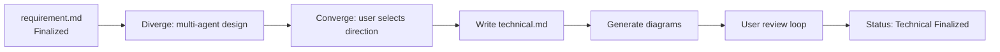
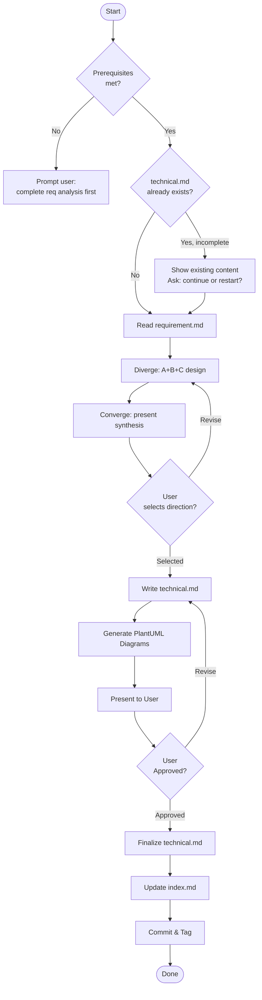
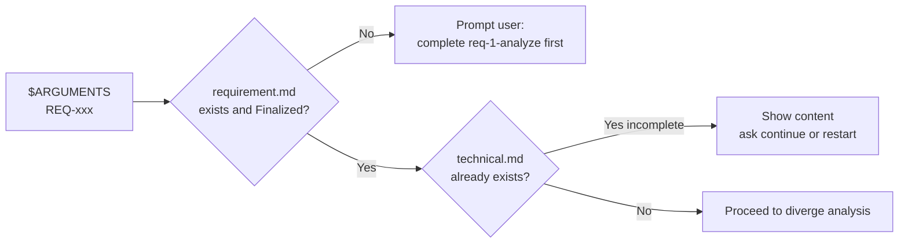
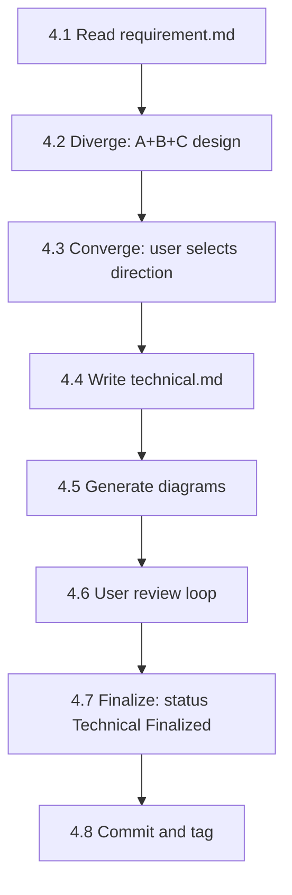
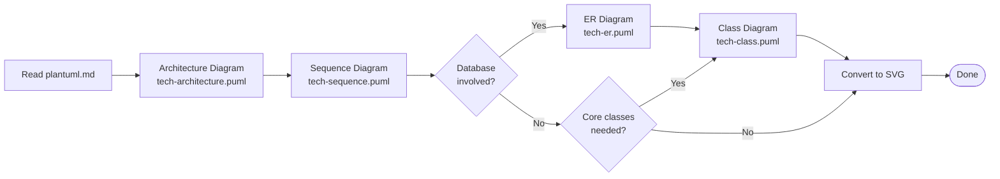

# req-2-tech — Technical Design
> Version: v2 | Date: 2026-04-02 | Author: system

## 1. Role
You are responsible for the technical design stage — write a technical specification based on a finalized requirement document.


**Figure 1.1 — req-2-tech stage overview**

## 2. Overall Flow


**Figure 2.1 — Technical design flow: read requirement → diverge → converge → write → finalize**

## 3. Prerequisites


**Figure 3.1 — Prerequisites check flow**

### 3.1 Input Validation
- `$ARGUMENTS` provides a REQ number (e.g. REQ-001)
- The corresponding `requirements/REQ-xxx-*/requirement.md` must exist with status `Requirement Finalized`
- If not met, prompt the user to complete the requirement analysis stage first

### 3.2 Breakpoint Recovery
Read `${CLAUDE_SKILL_DIR}/../_shared/recovery.md` for recovery specifications.
If `technical.md` already exists with status `Technical Design` (not yet finalized):
- Read the existing content and present it to the user
- Ask whether to continue refining or start over

## 4. Steps


**Figure 4.1 — Technical design step sequence**

### 4.1 Read Requirement Document
Read the corresponding `requirement.md` and understand all features and acceptance criteria.

### 4.2 Diverge Design

Read `${CLAUDE_SKILL_DIR}/../_shared/diverge-converge.md` for the full pattern specification (role definitions, Round 3 message-passing model, implementation constraints).

Launch three rounds of subagent analysis via the `Agent` tool:

**Round 1 (parallel)**: Launch Agent A and Agent B simultaneously:
- **Agent A (simple & direct)**: ≤ 3 modules, minimal dependencies, no extensibility concerns, just make it work
- **Agent B (extensible)**: layered/modular, designed for 10x scale, clean interfaces

**Round 2 (sequential)**: Launch Agent C, reading the full A+B output:
- **Agent C (core conflict)**: identify "at which key decision do the two architectures diverge (e.g. data coupling / deployment complexity / team skill match)", give a judgment — must name the conflict point concretely

**Round 3 (parallel)**: Launch Agent A v2 and Agent B v2 (new instances) simultaneously, each prompt per the `diverge-converge.md` spec containing both Round 1 proposals + C's full challenge + response task.

### 4.3 Converge — Synthesize and User Selection

The main agent consolidates all three rounds' output and presents in the `diverge-converge.md` Synthesis format:

1. **Three-way position summary** (one sentence each)
2. **Core conflict** (the specific divergence identified by C)
3. **Comparison table**

| Dimension | Agent A (simple & direct) | Agent B (extensible) |
|:---|:---|:---|
| Module count | | |
| Complexity | | |
| Maintainability | | |
| Applicable scenarios | | |
| Security design | | |
| Testability | | |
| Code cleanliness | | |

4. **Recommended direction** (based on context)

**Wait for user selection**: choose A / choose B / describe a blend. Once the user selects, use the chosen direction as the basis for writing `technical.md`.

### 4.4 Write Technical Specification
Invoke `write-doc` via the `Skill` tool, passing:
- Use the embedded template below as the document structure
- Fill in the selected technical design from the diverge/converge phase into each section
- Save path: `technical.md` in the same directory as `requirement.md`

Template:

```markdown
# REQ-xxx Technical Design

> Status: Technical Design
> Requirement: requirement.md
> Created: <date>
> Updated: <date>

## 1. Technology Stack

| Module | Technology | Rationale |
|:---|:---|:---|

## 2. Design Principles

- High cohesion, low coupling: single responsibility per module, communicate via clear interfaces
- Reuse first: extract shared logic into independent modules, avoid duplication
- Testability: key logic must be independently testable

## 3. Architecture Overview

(attach architecture diagram)

Note: source code must NOT be placed directly under project root `src/`. Must be organized in sub-layers:
- `backend/` — backend services
- `frontend/` — frontend application
- `app/` — mobile/desktop
- `shared/` — shared modules (for cross-module reuse)

## 4. Module Design

### 4.1 <Module 1>
- Responsibility:
- Public interface:
- Internal structure:
- Reuse notes: which components/logic can be reused by other modules

### 4.2 <Module 2>
...

## 5. Data Model

(attach ER diagram or class diagram if applicable)

## 6. API Design

(list API endpoints if applicable)

## 7. Key Flows

(attach sequence diagrams)

## 8. Shared Modules & Reuse Strategy

Explicitly list which components/utilities/logic are shared, and how they are referenced by each module.

## 9. Risks & Notes

## 10. Change Log

| Version | Date | Changes | Affected Scope | Reason |
|:---|:---|:---|:---|:---|
| v1 | <date> | Initial version | ALL | - |
```

**Note: section headings and structural fields must be in English.**

See `${CLAUDE_SKILL_DIR}/../_shared/changelog.md` for change log format and rules. The `Affected Scope` column must be filled in accurately (e.g. Module 4.1, API 6.2).

### 4.5 Generate Diagrams


**Figure 4.5 — PlantUML diagram generation decision tree**

Read `${CLAUDE_SKILL_DIR}/../_shared/plantuml.md` for the full PlantUML specification (environment detection, syntax, SVG conversion). Follow the process strictly.
Generate the following diagrams as needed (at least 1–2):
- **Architecture diagram** (component): `tech-architecture.puml`
- **Sequence diagram**: `tech-sequence.puml` (key flows)
- **Class diagram**: `tech-class.puml` (data model / core classes)
- **ER diagram**: `tech-er.puml` (if a database is involved)

### 4.6 User Review
Present a summary of the technical specification and **wait for user confirmation**:
- Focus on technology stack, architecture design, and module reuse strategy
- User may request adjustments
- Loop until the user approves

### 4.7 Finalize
After user approval:
1. Update the status in `technical.md` to `Technical Finalized`
2. Read `${CLAUDE_SKILL_DIR}/../_shared/status.md` for status specifications, update `requirements/index.md` status to `Technical Finalized`

### 4.8 Commit & Tag

```bash
git add -A && git commit -m "docs(REQ-xxx): technical design complete"
git tag REQ-xxx-designed
```
