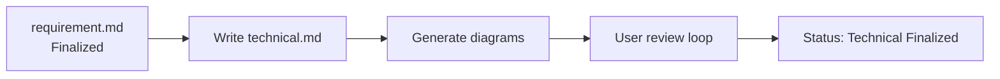
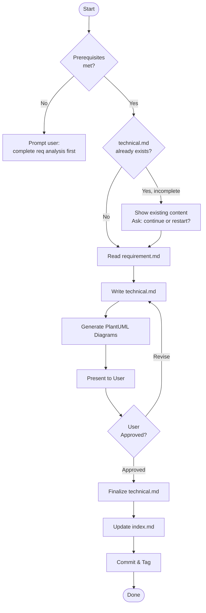
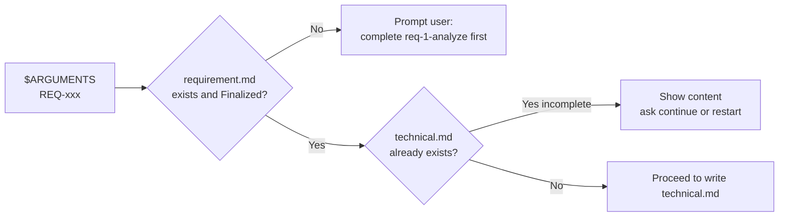
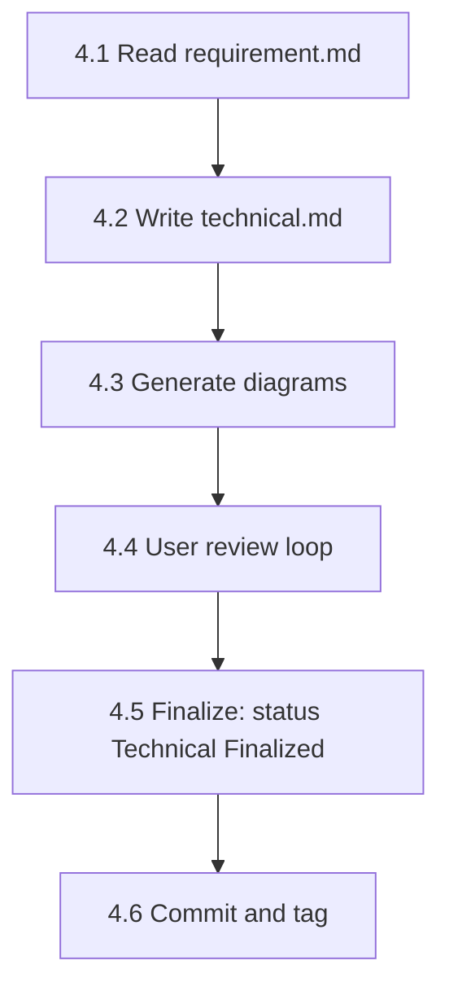

# req-2-tech — 技术设计
> Version: v1 | Date: 2026-04-02 | Author: system

## 1. 角色定义
你负责技术设计阶段，基于已确认的需求文档编写技术规范。


**Figure 1.1 — req-2-tech stage overview**

## 2. 总体流程


**Figure 2.1 — Technical design flow: read requirement → design → review → finalize**

## 3. 前置条件


**Figure 3.1 — Prerequisites check flow**

### 3.1 输入验证
- `$ARGUMENTS` 提供 REQ 编号（如 REQ-001）
- 对应的 `requirements/REQ-xxx-*/requirement.md` 必须存在且状态为 `Requirement Finalized`
- 若不满足，提示用户先完成需求分析阶段

### 3.2 断点恢复
读取 `${CLAUDE_SKILL_DIR}/../_shared/recovery.md` 获取恢复规范。
若 `technical.md` 已存在且状态为 `Technical Design`（非已确认）：
- 读取现有内容并展示给用户
- 询问是否继续完善还是重新开始

## 4. 步骤详解


**Figure 4.1 — Technical design step sequence**

### 4.1 读取需求文档
读取对应的 `requirement.md`，理解所有功能和验收标准。

### 4.2 编写技术规范
在同一目录下创建 `technical.md`，格式如下：

```markdown
# REQ-xxx Technical Design

> Status: Technical Design
> Requirement: requirement.md
> Created: <date>
> Updated: <date>

## 1. Technology Stack

| Module | Technology | Rationale |
|:---|:---|:---|

## 2. Design Principles

- High cohesion, low coupling: single responsibility per module, communicate via clear interfaces
- Reuse first: extract shared logic into independent modules, avoid duplication
- Testability: key logic must be independently testable

## 3. Architecture Overview

(attach architecture diagram)

Note: source code must NOT be placed directly under project root `src/`. Must be organized in sub-layers:
- `backend/` — backend services
- `frontend/` — frontend application
- `app/` — mobile/desktop
- `shared/` — shared modules (for cross-module reuse)

## 4. Module Design

### 4.1 <Module 1>
- Responsibility:
- Public interface:
- Internal structure:
- Reuse notes: which components/logic can be reused by other modules

### 4.2 <Module 2>
...

## 5. Data Model

(attach ER diagram or class diagram if applicable)

## 6. API Design

(list API endpoints if applicable)

## 7. Key Flows

(attach sequence diagrams)

## 8. Shared Modules & Reuse Strategy

Explicitly list which components/utilities/logic are shared, and how they are referenced by each module.

## 9. Risks & Notes

## 10. Change Log

| Version | Date | Changes | Affected Scope | Reason |
|:---|:---|:---|:---|:---|
| v1 | <date> | Initial version | ALL | - |
```

**注意：章节标题和结构性字段必须使用英文。描述性内容可使用中文。**

变更日志格式与规则见 `${CLAUDE_SKILL_DIR}/../_shared/changelog.md`。`Affected Scope` 列必须准确填写（如 Module 4.1、API 6.2）。

### 4.3 生成图表


**Figure 4.3 — PlantUML diagram generation decision tree**

读取 `${CLAUDE_SKILL_DIR}/../_shared/plantuml.md` 获取完整 PlantUML 规范（环境检测、语法、SVG 转换）。严格遵循该流程。
按需生成以下图表（至少 1-2 张）：
- **架构图**（组件）：`tech-architecture.puml`
- **时序图**：`tech-sequence.puml`（关键流程）
- **类图**：`tech-class.puml`（数据模型/核心类）
- **ER 图**：`tech-er.puml`（若涉及数据库）

### 4.4 用户审查
展示技术规范摘要并**等待用户确认**：
- 重点关注技术栈、架构设计和模块复用策略
- 用户可要求调整
- 循环直到用户批准

### 4.5 最终确认
用户批准后：
1. 将 `technical.md` 状态更新为 `Technical Finalized`
2. 读取 `${CLAUDE_SKILL_DIR}/../_shared/status.md` 获取状态规范，将 `requirements/index.md` 状态更新为 `Technical Finalized`

### 4.6 提交与标签

```bash
git add -A && git commit -m "docs(REQ-xxx): technical design complete"
git tag REQ-xxx-designed
```
