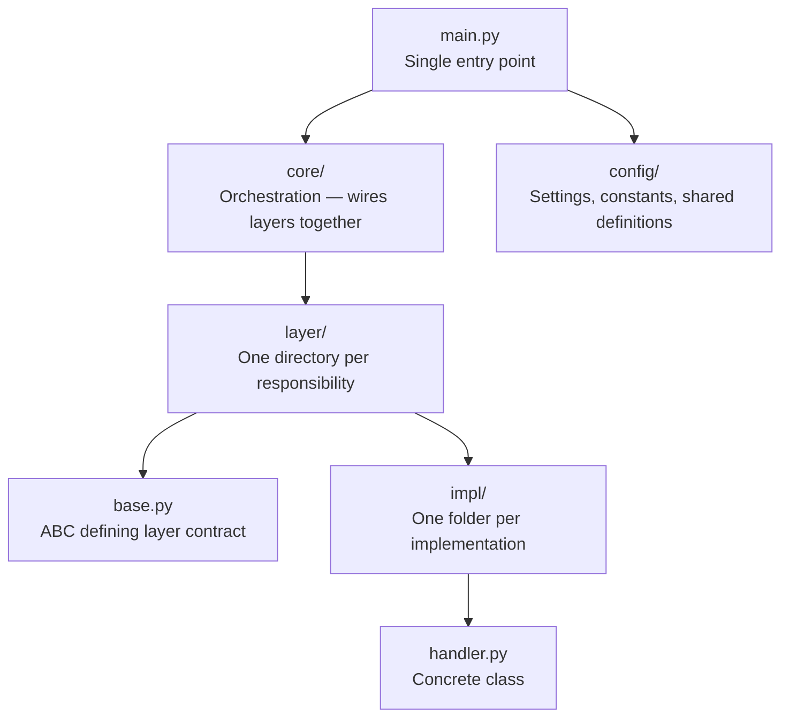
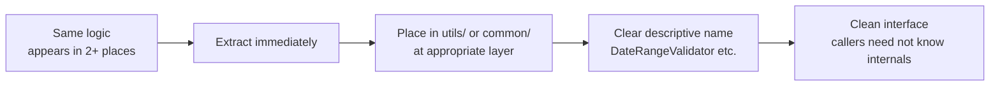
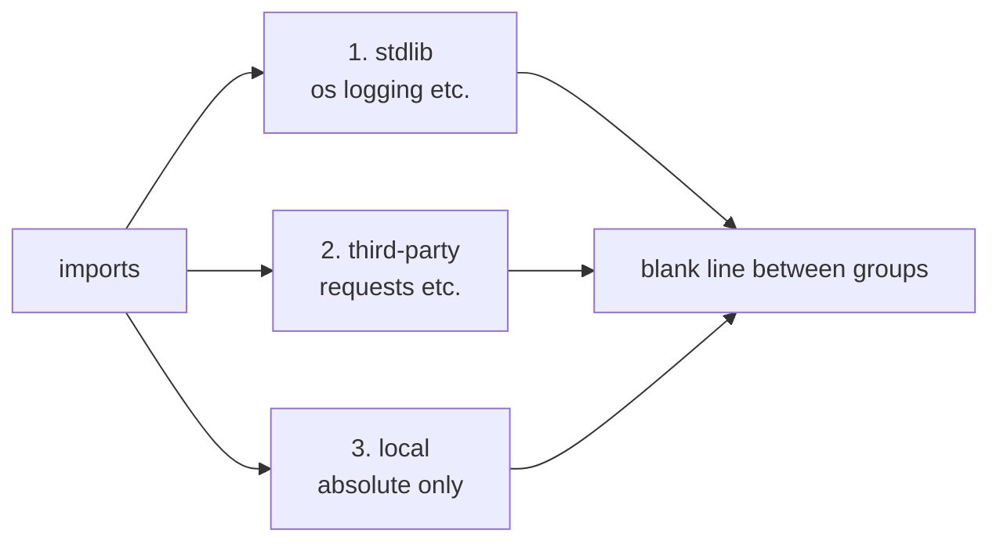
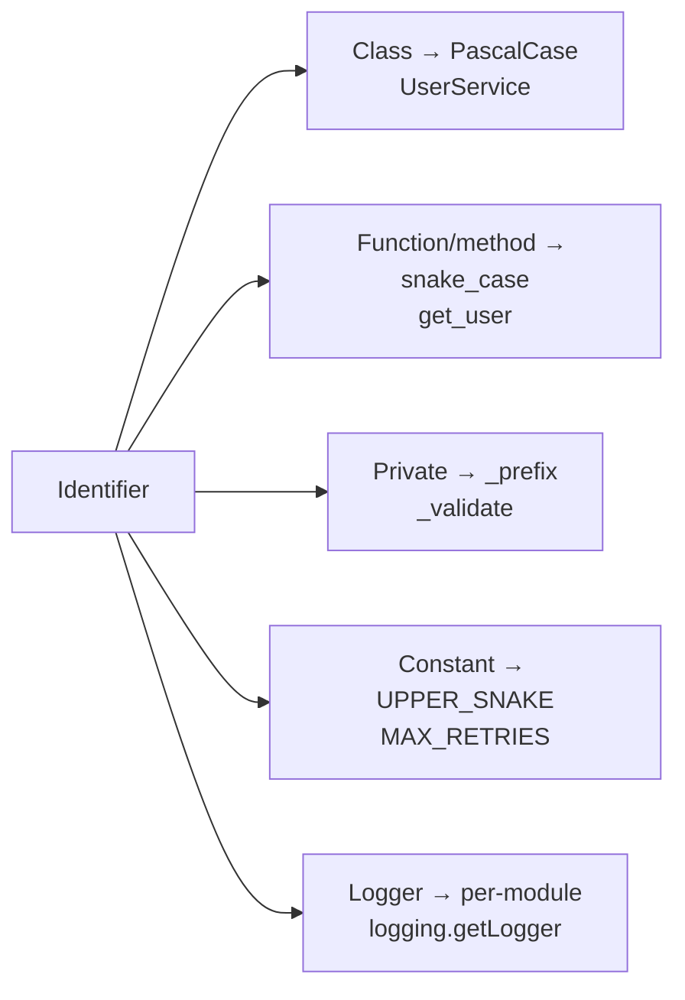
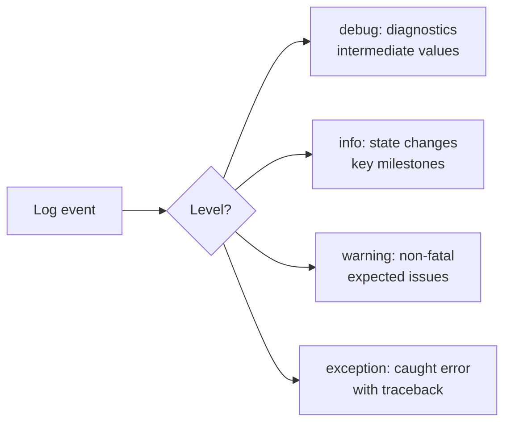
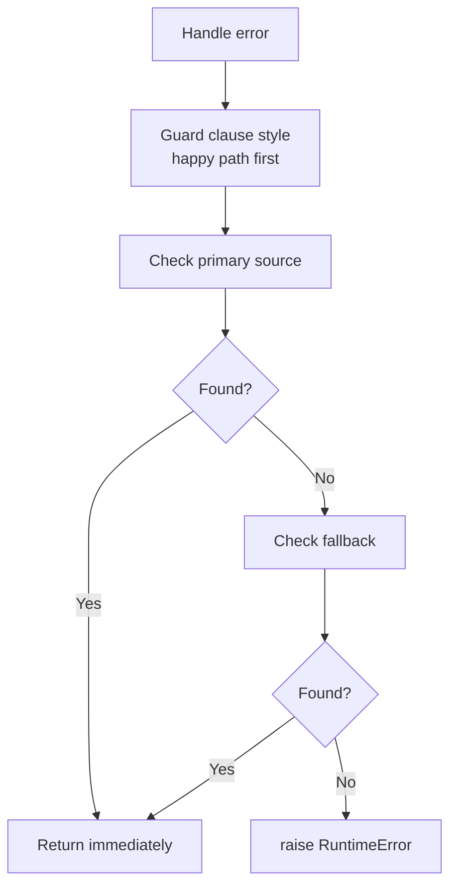
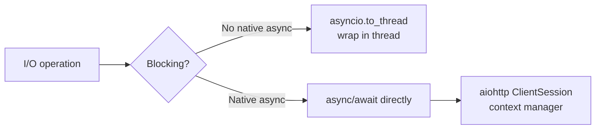
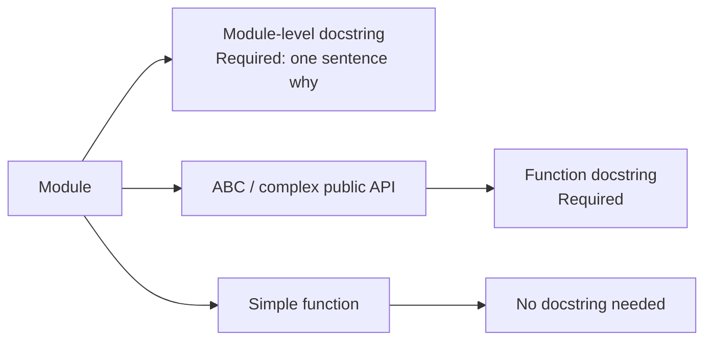
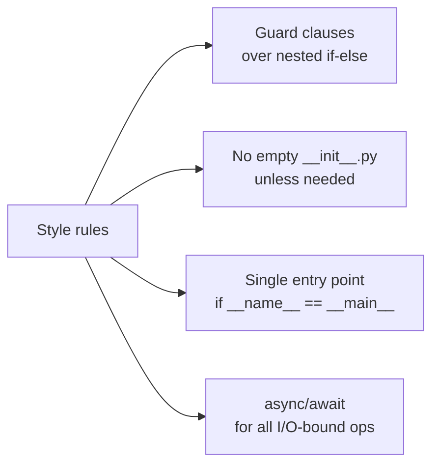

# Python Conventions
> Version: v1 | Date: 2026-04-02 | Author: system

## 1. Modularization


**Figure 1.1 — Layer structure and discovery flow**

### 1.1 Layer Structure

```text
app/
├── main.py                # Single entry point
├── config/                # Settings, constants, shared definitions
├── core/                  # Orchestration — wires layers together
└── <layer>/               # One directory per responsibility
    ├── base.py            # ABC defining the layer's contract
    └── <impl>/            # One folder per implementation
        └── handler.py     # Concrete class, conventional export name
```

- Each layer is one responsibility: I/O, external API, background task, capability, etc.
- `base.py` defines the ABC contract; implementations live in their own subfolder
- Each implementation module exports one class with a **conventional name** (e.g., all implementations in the same layer export the same class name)
- Core discovers implementations via `importlib` + folder name — no registry, no match-case, no if-else chain

### 1.2 Dependency Rules

```text
main → core → all other layers (via callback injection)
```

- **Peer layers never import each other.** No horizontal dependencies
- **Passive layers never import core.** No reverse dependencies
- `config/` is the only package shared across all layers
- Core injects callbacks into passive layers; passive layers call them without knowing who's behind

### 1.3 Adding a New Implementation
1. Create `<layer>/<name>/handler.py`
2. Export a class with the layer's conventional name, inheriting from `base.py`
3. Implement the abstract methods + a `validate()` for its own config
4. Done — core picks it up automatically. No wiring code, no config change

### 1.4 Self-Validating Modules
- Each implementation validates its own config in `validate()` or `authenticate()`
- Config class only loads and displays values — it never knows which fields belong to which implementation
- Fail fast: validate at startup, not at first use

## 2. Common Code Extraction


**Figure 2.1 — 2-occurrence rule: extract immediately**

Proactively extract shared logic during coding — do NOT leave it for later.

### 2.1 Rules
- **2-occurrence rule**: if the same logic appears (or is about to appear) in 2+ places, immediately extract it
- **Where to place**: `utils/` or `common/` package at the appropriate layer level
- **What qualifies**: data format conversion, validation patterns, string/date manipulation, logging helpers, retry/backoff wrappers, config parsing, common business calculations
- **Naming**: clear, descriptive names — `DateRangeValidator`, `format_currency()`, not `helper1` or `do_stuff()`
- **Do NOT over-abstract**: only extract when there is actual duplication or near-certain reuse

### 2.2 Example

```text
app/
├── utils/
│   ├── date_utils.py          # format_date_range(), parse_iso_date()
│   ├── validation.py          # validate_email(), validate_phone()
│   └── retry.py               # retry_with_backoff()
├── common/
│   ├── constants.py           # Shared constants across modules
│   └── types.py               # Shared TypeAlias, dataclass definitions
├── service_a/
│   └── handler.py             # Uses utils/validation.py
└── service_b/
    └── handler.py             # Also uses utils/validation.py
```

```python
# utils/validation.py — extracted because 3 services all validate emails
def validate_email(email: str) -> None:
    """Validate email format; raise ValueError if invalid."""
    if not email or "@" not in email:
        raise ValueError(f"Invalid email format: {email}")

# utils/retry.py — extracted because multiple external calls need retry
def retry_with_backoff(fn, max_retries: int = 3, base_delay: float = 1.0):
    """Retry a callable with exponential backoff."""
    for attempt in range(max_retries):
        try:
            return fn()
        except Exception:
            if attempt == max_retries - 1:
                raise
            time.sleep(base_delay * (2 ** attempt))
```

## 3. Methods as Documentation

### 3.1 Core Philosophy
The essence of a service/orchestration class is **orchestration** — a public method calls a sequence of steps, where each step is a semantically clear private method. **Reading the public method should feel like reading a business flowchart — no comments needed to understand what the business is doing.**

This principle applies recursively: service calls service, handler calls handler — every layer should decompose complex logic into clearly-named private methods. The end result: **anyone opening any method sees a sequence of method calls, not a block of procedural code. Want details? Click into a method. Don't care? Skip it. Drill down layer by layer, each level is crystal clear.**

### 3.2 Template

```python
class OrderService:
    """Orchestrates order creation workflow."""

    def __init__(self, repo: OrderRepository, payment: PaymentGateway, notifier: Notifier):
        self._repo = repo
        self._payment = payment
        self._notifier = notifier

    def create_order(self, data: OrderData) -> OrderResult:
        """Public method: a numbered flowchart of the business process."""
        # 1. Validate required fields
        self._validate_order_data(data)
        # 2. Reject duplicate submissions
        self._ensure_no_duplicate(data.idempotency_key)
        # 3. Fill in default values (currency, timestamps, etc.)
        enriched = self._enrich_with_defaults(data)
        # 4. Persist order to database
        order_id = self._persist_to_database(enriched)
        # 5. Charge payment
        self._charge_payment(order_id, enriched.amount)
        # 6. Notify downstream systems
        self._notify_order_created(order_id)
        # 7. Build and return result
        return self._build_result(order_id, enriched)

    # ══════════════════════════════════════════════
    #  Each private method corresponds to one step
    #  in the business flow. The method name IS the
    #  documentation. Click in to see details.
    # ══════════════════════════════════════════════

    def _validate_order_data(self, data: OrderData) -> None:
        logger.debug("Validating order data, customer_id=%s, item_count=%d",
                      data.customer_id, len(data.items) if data.items else 0)
        missing = []
        if not data.customer_id:
            missing.append("customer_id")
        if not data.items:
            missing.append("items")
        if missing:
            logger.warning("Order validation failed, missing fields: %s", missing)
            raise ValueError(f"Missing required fields: {', '.join(missing)}")
        logger.info("Order data validated, customer_id=%s", data.customer_id)

    def _ensure_no_duplicate(self, idempotency_key: str) -> None:
        logger.debug("Checking duplicate, idempotency_key=%s", idempotency_key)
        if self._repo.find_by_key(idempotency_key):
            logger.warning("Duplicate order detected, key=%s", idempotency_key)
            raise ValueError(f"Duplicate order: {idempotency_key}")

    def _enrich_with_defaults(self, data: OrderData) -> OrderData:
        currency = data.currency or "USD"
        logger.debug("Enriching order defaults, currency=%s", currency)
        return OrderData(
            customer_id=data.customer_id,
            items=data.items,
            currency=currency,
            created_at=datetime.now(),
        )

    def _persist_to_database(self, data: OrderData) -> int:
        order_id = self._repo.save(data)
        logger.info("Order persisted, id=%d, customer_id=%s", order_id, data.customer_id)
        return order_id

    def _charge_payment(self, order_id: int, amount: Decimal) -> None:
        logger.info("Charging payment, order_id=%d, amount=%s", order_id, amount)
        self._payment.charge(order_id, amount)
        logger.info("Payment charged successfully, order_id=%d", order_id)

    def _notify_order_created(self, order_id: int) -> None:
        logger.info("Sending order_created event, order_id=%d", order_id)
        self._notifier.send("order_created", {"order_id": order_id})

    def _build_result(self, order_id: int, data: OrderData) -> OrderResult:
        logger.debug("Building result, order_id=%d", order_id)
        return OrderResult(id=order_id, status="created", currency=data.currency)
```

**Anti-pattern (do NOT write like this):**

```python
# Wrong: no step numbers, no logging, all logic flattened — reader must parse every line
def create_order(self, data: OrderData) -> OrderResult:
    if not data.customer_id or not data.items:
        raise ValueError("Missing required fields")
    existing = self._repo.find_by_key(data.idempotency_key)
    if existing:
        raise ValueError("Duplicate order")
    data.currency = data.currency or "USD"
    data.created_at = datetime.now()
    order_id = self._repo.save(data)
    self._payment.charge(order_id, data.amount)
    self._notifier.send("order_created", {"order_id": order_id})
    return OrderResult(id=order_id, status="created", currency=data.currency)
# Same logic, but: no numbered steps, no logs, can't trace what happened in production
```

### 3.3 Recursive Application

```text
OrderService.create_order()                  ← Public method, reads like a business flow
  ├── _validate_order_data(data)             ← Private method
  ├── _ensure_no_duplicate(key)              ← Private method
  ├── _enrich_with_defaults(data)            ← Private method
  ├── _persist_to_database(data)             ← Private method
  │     └── repo.save(data)                  ← Click in, same structure
  ├── _charge_payment(order_id, amount)      ← Private method
  │     └── payment.charge(order_id, amount) ← Click in, same structure
  ├── _notify_order_created(order_id)        ← Private method
  └── _build_result(order_id, data)          ← Private method
```

### 3.4 Private Method Naming Convention

| Verb Prefix | Semantics | Example |
|:---|:---|:---|
| `validate` / `check` | Validate; raise on failure | `_validate_email_format(email)` |
| `ensure` | Assert a condition holds | `_ensure_no_duplicate(key)` |
| `enrich` / `fill` | Populate defaults/derived fields | `_enrich_with_defaults(data)` |
| `persist` / `save` | Write to storage | `_persist_to_database(data)` |
| `notify` / `send` | Send notification/event | `_notify_order_created(order_id)` |
| `build` / `assemble` | Construct return object | `_build_result(order_id, data)` |
| `query` / `find` / `fetch` | Retrieve data | `_find_existing_user(email)` |
| `transform` / `convert` | Convert data format | `_transform_to_internal(raw)` |

### 3.5 Rules
1. **Public methods only orchestrate** — body contains only private method calls and simple variable passing; no `if`/`try`/`for` procedural logic in the public method body
2. **Numbered step comments in public methods** — every line in the public method body must have a numbered comment (`# 1. ...`, `# 2. ...`) describing the business step in plain language. The public method is a numbered flowchart
3. **Private methods are atomic steps** — each does one thing; the method name describes that thing
4. **Sufficient logging in private methods** — every private method must log at entry or key outcome:
  - `logger.info` — key milestones: data persisted, payment charged, event sent
  - `logger.debug` — intermediate values: inputs received, defaults applied
  - `logger.warning` — expected failures: validation failed, duplicate detected
  - Goal: by reading logs alone, you can reconstruct the full business flow
5. **Recursive layering** — every layer follows the same pattern: public = table of contents, private = chapters
6. **When in doubt, extract** — if a block of code needs a comment to explain "what", extract it into a private method whose name replaces the comment
7. **Prefix with `_`** — all private methods use the Python single-underscore convention

## 4. Imports


**Figure 4.1 — Import ordering**

```python
import os               # 1. stdlib
import logging

import requests         # 2. third-party

from myapp.utils import helper   # 3. local (absolute only)
```

- Blank line between each group
- Always absolute imports, never relative
- Inline imports only to break circular dependencies

## 5. Type Hints

```mermaid
flowchart LR
    A[Type annotations] --> B[str | None\nPython 3.10+ union]
    A --> C[TypeAlias\ncomplex callbacks]
    A --> D[@dataclass\nstructured data]
    A --> E[@dataclass frozen=True\nimmutable config]
```
**Figure 5.1 — Type hint patterns**

- Python 3.10+ union syntax: `str | None` instead of `Optional[str]`
- `TypeAlias` for complex callback signatures
- `@dataclass` for structured data; `@dataclass(frozen=True)` for immutable config

## 6. Naming


**Figure 6.1 — Python naming conventions**

| Kind | Style | Example |
|:---|:---|:---|
| Class | PascalCase | `UserService`, `BaseHandler` |
| Function / method | snake_case | `get_user`, `parse_response` |
| Private | `_` prefix | `_validate()`, `_cache` |
| Constant | UPPER_SNAKE_CASE | `MAX_RETRIES = 3` |
| Private constant | `_` + UPPER | `_DEFAULT_TIMEOUT = 30` |
| Logger | per-module | `logger = logging.getLogger("app.module")` |

## 7. Logging


**Figure 7.1 — Python logging levels**

```python
logger = logging.getLogger("app.service.auth")

# Lazy formatting — never f-strings in log calls
logger.info("Loaded %d items", count)
logger.warning("Retry %d/%d for %s", attempt, max_retries, url)
logger.exception("Failed to process %s", item_id)
```

- One logger per module, named after module path
- `debug` for diagnostics, `info` for state changes, `warning` for non-fatal issues, `exception` for caught errors with traceback
- Truncate large values before logging; never log secrets

## 8. Error Handling


**Figure 8.1 — Guard clause error handling pattern**

```python
# Guard clause style — happy path reads top-down, errors at bottom
if primary_source:
    return primary_source

if fallback_source:
    return fallback_source

raise RuntimeError("No source available")
```

```python
# Collect all validation errors before raising
missing = []
if not config.api_key:
    missing.append("api_key")
if not config.base_url:
    missing.append("base_url")
if missing:
    raise ValueError(f"Missing required config: {', '.join(missing)}")
```

- Prefer standard exceptions (`ValueError`, `RuntimeError`, `EnvironmentError`)
- `except SpecificException` preferred; bare `except Exception` only with `logger.exception()`

## 9. Async


**Figure 9.1 — Async I/O decision**

```python
# async for all I/O
async def fetch_data(url: str) -> dict: ...

# Wrap blocking I/O in a thread
result = await asyncio.to_thread(blocking_func, arg)

# Context manager for HTTP sessions
async with aiohttp.ClientSession() as session:
    async with session.get(url) as resp:
        data = await resp.json()
```

## 10. Docstrings


**Figure 10.1 — Docstring requirements by scope**

```python
"""Module purpose — one sentence explaining why this exists.

Optional detail on design, constraints, or non-obvious behavior.
"""
```

- Module-level docstring required
- Function/method docstrings only on ABCs or complex public APIs
- English only

## 11. Path Handling

```mermaid
flowchart LR
    A[File path needed] --> B[pathlib.Path\nnever string concat]
    B --> C[.resolve()\nfor absolute path]
    B --> D[.parent\nfor relative navigation]
```
**Figure 11.1 — Path handling with pathlib**

- Always `pathlib.Path`, never string concatenation
- `.resolve()` for absolute paths
- `.parent` chaining for relative navigation

## 12. General Style


**Figure 12.1 — General style principles**

- Guard clauses over nested if-else
- No empty `__init__.py` — only when package-level init is needed
- Single `if __name__ == "__main__"` entry point, never in library modules
- `async/await` for all I/O-bound operations
