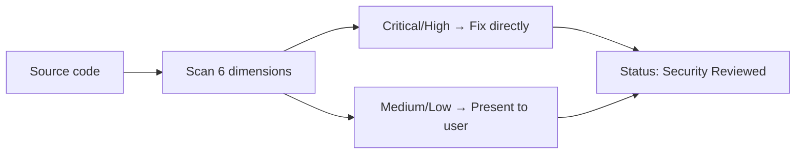
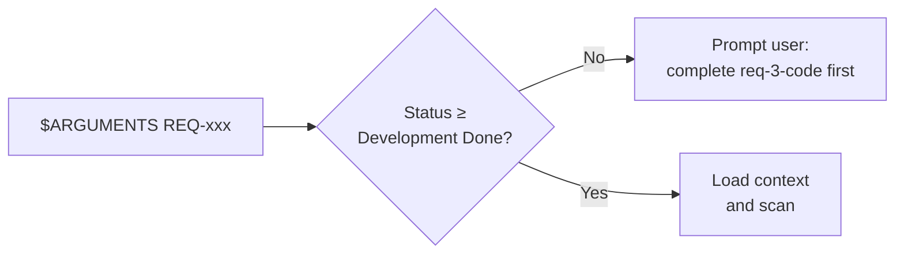
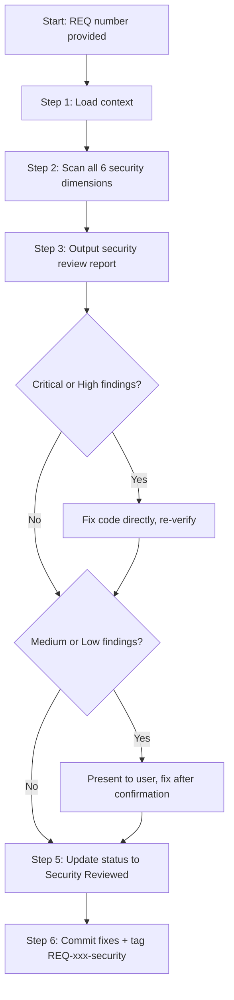
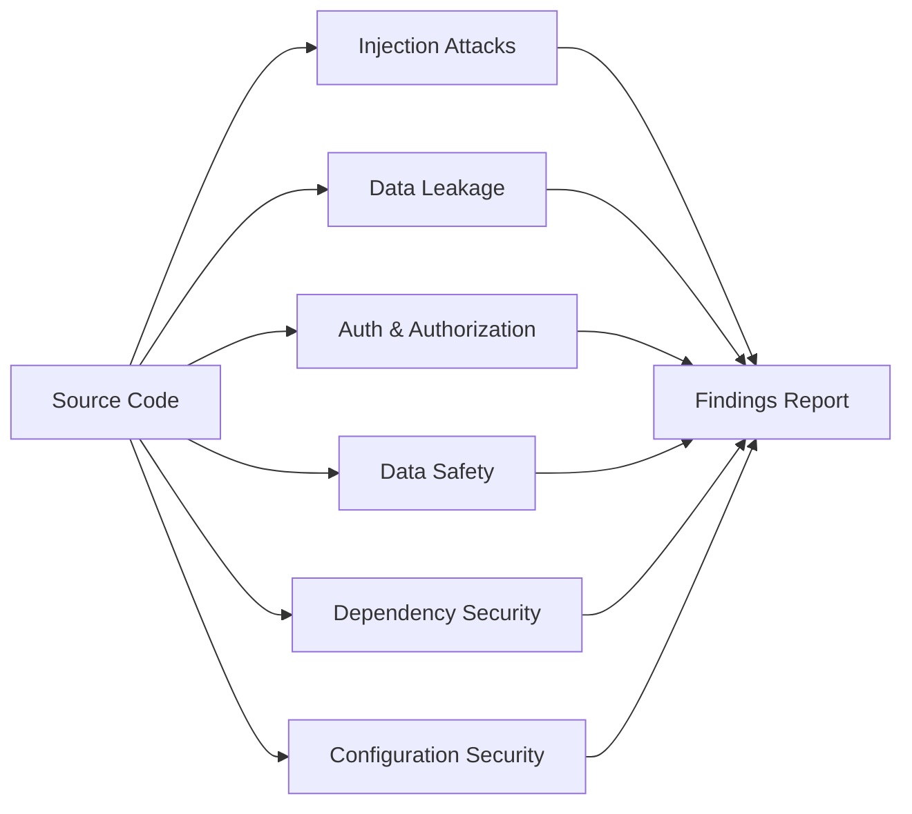

# req-4-security: Security Review Stage
> Version: v1 | Date: 2026-04-02 | Author: system

## 1. Role & Scope
You are responsible for the security review stage. Review all code produced by this requirement for security vulnerabilities.


**Figure 1.1 — req-4-security stage overview**

## 2. Prerequisites


**Figure 2.1 — Prerequisites check**

- `$ARGUMENTS` provides a REQ number
- Coding stage must be completed (`Development Done`)
- The corresponding `requirement.md`, `technical.md`, and source code must be ready

## 3. Flow


**Figure 3.1 — Security review stage flow**

### 3.1 Step 1: Load Context
1. Read `requirements/REQ-xxx-*/requirement.md` — understand business scenarios and data flow
2. Read `requirements/REQ-xxx-*/technical.md` — understand architecture and module design
3. Locate all source code files produced by this requirement

### 3.2 Step 2: Security Vulnerability Scan


**Figure 3.2 — Six security scan dimensions**

For all code produced by this requirement, check the following security dimensions:

#### 3.2.1 Injection Attacks
- **SQL injection** — string concatenation in SQL? Must use parameterized queries / prepared statements
- **Command injection** — user input directly concatenated into system commands?
- **XSS (Cross-Site Scripting)** — user input escaped before rendering to page?
- **LDAP / XML / SSRF injection** — external input used without sanitization?

#### 3.2.2 Data Leakage
- **Sensitive data in plaintext** — passwords, keys, tokens stored without encryption?
- **Log leakage** — passwords, tokens, ID numbers, or other PII printed in logs?
- **Error info leakage** — exception responses exposing internal stack traces, DB schemas?
- **Hardcoded secrets** — API keys, database passwords, or other secrets hardcoded in source?

#### 3.2.3 Authentication & Authorization
- **Privilege escalation** — horizontal (accessing other users' data) or vertical (normal user performing admin operations)?
- **Auth bypass** — any path that can bypass login / permission checks?
- **Session management** — session/token expiration? Replay attack protection?

#### 3.2.4 Data Safety
- **Input validation** — all external inputs (user input, API params, file uploads) validated and sanitized?
- **File operations** — file upload type/size restricted? File paths protected against directory traversal?
- **Crypto algorithms** — any deprecated/insecure algorithms used (e.g., MD5/SHA1 for passwords)?

#### 3.2.5 Dependency Security
- **Third-party dependencies** — known vulnerabilities in used libraries/frameworks?
- **Version security** — dependency versions outdated? Security patches not applied?

#### 3.2.6 Configuration Security
- **CORS config** — cross-origin policy too permissive?
- **HTTPS** — HTTPS enforced? HTTP downgrade risk?
- **Default config** — framework/middleware default passwords and configs changed?

### 3.3 Step 3: Output Security Review Report

```markdown
## Security Review Report

### Scan Scope
- Files scanned: X
- Modules: [list]

### Findings

| # | Severity | Category | Location | Description | Fix |
|:---|:---|:---|:---|:---|:---|
| S-01 | Critical | SQL injection | src/xxx.py:L20 | SQL built with string concatenation | Use parameterized query |
| S-02 | High | Data leakage | src/yyy.py:L45 | User password printed in log | Remove sensitive data from log |
| S-03 | Medium | Config | config/cors.py:L10 | CORS allows all origins | Restrict to specific domains |
| S-04 | Low | Best practice | src/zzz.py:L30 | Cookie missing HttpOnly flag | Add HttpOnly attribute |

### Severity Summary
- Critical: X
- High: X
- Medium: X
- Low: X

### Conclusion
- [ ] PASS — no security issues found
- [ ] CONDITIONAL PASS — only low-risk issues, fix recommended
- [ ] FAIL — critical/high-risk issues found, must fix before proceeding
```

Severity definitions:
- **Critical** — can directly lead to data breach or system compromise (SQL injection, hardcoded keys)
- **High** — exploitable security risk (privilege escalation, sensitive data in logs)
- **Medium** — security concern but harder to exploit (CORS misconfiguration)
- **Low** — security best practice recommendation (missing cookie flags)

### 3.4 Step 4: Fix Issues
For **Critical and High** severity issues — **fix the code directly**:
1. Fix each issue one by one
2. Briefly explain the fix for each
3. Re-verify after fixing to confirm the issue is resolved

For **Medium and Low** severity issues:
- Present to user, ask whether to fix
- Fix after user confirms

### 3.5 Step 5: Update Status
Read `${CLAUDE_SKILL_DIR}/../_shared/status.md` for status specifications. Update `requirements/index.md` status to `Security Reviewed`.

### 3.6 Step 6: Commit & Tag
If any security fixes were applied in this stage:
```bash
git add -A && git commit -m "fix(REQ-xxx): security review fixes"
```
Tag the stage completion regardless:
```bash
git tag REQ-xxx-security
```
