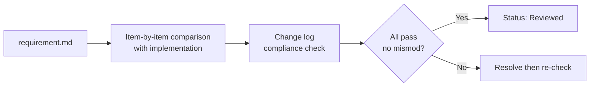
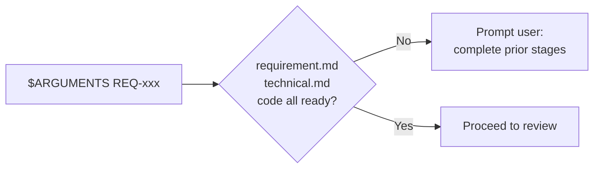
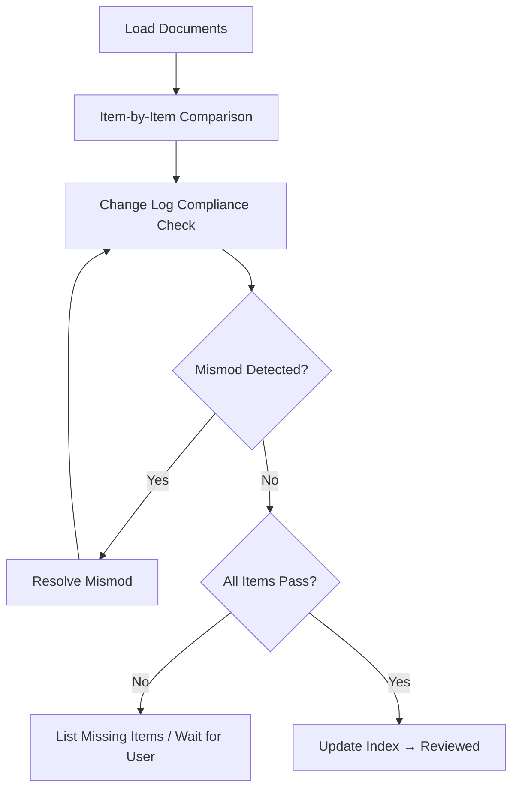
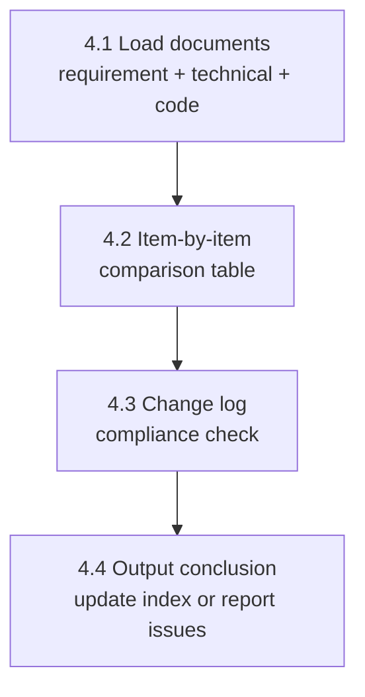
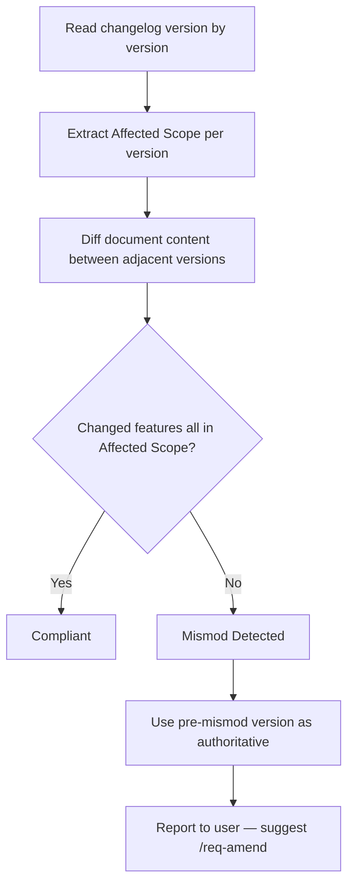

# req-6-review
> Version: v1 | Date: 2026-04-02 | Author: system

## 1. Overview
You are responsible for the requirement review stage — verify item by item that the code implementation satisfies the requirement document.


**Figure 1.1 — req-6-review stage overview**

## 2. Prerequisites


**Figure 2.1 — Prerequisites check**

- `$ARGUMENTS` provides a REQ number
- The corresponding requirement document, technical document, and source code must all be ready

## 3. Overall Flow


**Figure 3.1 — req-6-review overall flow**

## 4. Steps


**Figure 4.1 — Review step sequence**

### 4.1 Load Documents
1. Read `requirements/REQ-xxx-*/requirement.md`
2. Read `requirements/REQ-xxx-*/technical.md`
3. Read `${CLAUDE_SKILL_DIR}/../_shared/changelog.md` for change log specifications
4. Pay close attention to the changes and **Affected Scope** of each version in the change log

### 4.2 Item-by-Item Comparison
For **every functional requirement** and **every acceptance criterion** in the requirement document:
1. Find the corresponding code implementation
2. Determine whether it is satisfied
3. Output the comparison result table:

```markdown
| Requirement | Status | Code Location | Notes |
|:---|:---|:---|:---|
| F-01 Feature 1 | Implemented | src/xxx.py:L20 | |
| F-02 Feature 2 | Partial | src/yyy.py:L45 | Missing edge case handling |
| F-03 Feature 3 | Not implemented | - | Needs development |
```

### 4.3 Change Log Compliance Check
This is the **core rule** of this stage — it must be enforced strictly.

#### 4.3.1 Version Priority Principle
When the change log contains multiple versions, **the latest version (highest number) takes precedence**. Example:
- v1 defines feature A
- v2 adds feature B
- v3 modifies the behavior of feature A

The code should implement feature A per v3's description + feature B per v2.

#### 4.3.2 Structured Mismod Detection Flow


**Figure 4.3.2 — Mismod detection flow**

Use the **`Affected Scope`** column in the change log to detect mismod precisely:
1. Read the change log version by version
2. Check the scope declared by each version (e.g. F-01, F-03)
3. Compare the full document content between adjacent versions
4. **If a feature changed but does not appear in that version's `Affected Scope`, flag it as a mismod (undeclared change)**

Example change log:

```markdown
| Version | Date | Changes | Affected Scope | Reason |
|:---|:---|:---|:---|:---|
| v1 | 2024-01-01 | Initial version | ALL | - |
| v2 | 2024-01-15 | Add feature C | F-03 | New requirement |
```

If in v2 the content of F-02 differs from v1 but `Affected Scope` only declares F-03 → **flag as mismod**.

When a mismod is found:
1. Clearly identify the mismod content and the affected features
2. **Use the pre-mismod version as authoritative** (i.e. F-02 follows v1's description)
3. Report to the user, suggest using `/req-amend` for a formal change process

#### 4.3.3 Output Compliance Report

```markdown
## Change Log Compliance Report

| Version | Declared Scope | Actual Changes | Compliant | Notes |
|:---|:---|:---|:---|:---|
| v1 | ALL | - | Yes | |
| v2 | F-03 | F-02 modified, F-03 added | No | F-02 undeclared change |
```

### 4.4 Output Conclusion
- All items satisfied and no mismod → update `requirements/index.md` status to `Reviewed` (see `${CLAUDE_SKILL_DIR}/../_shared/status.md`), notify user they can proceed to the verification stage
- Items not implemented or partially implemented → list pending items and wait for user decision
- Mismod found → the mismod issue must be resolved and confirmed by the user before proceeding
