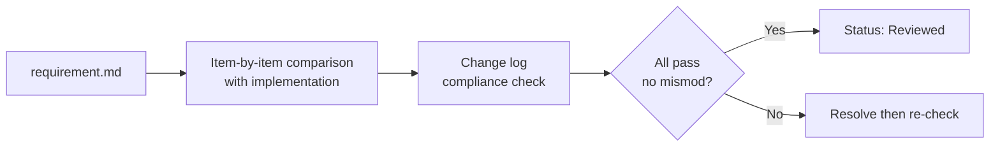
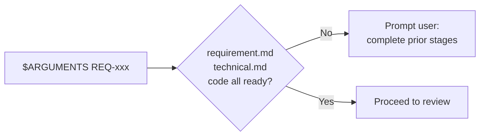
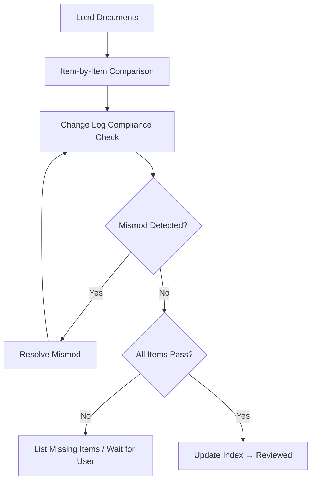
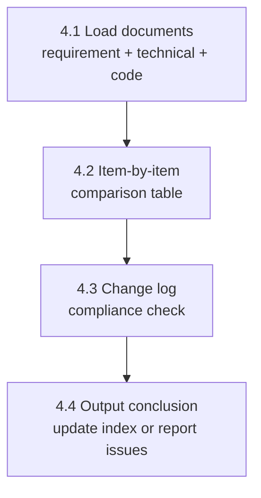
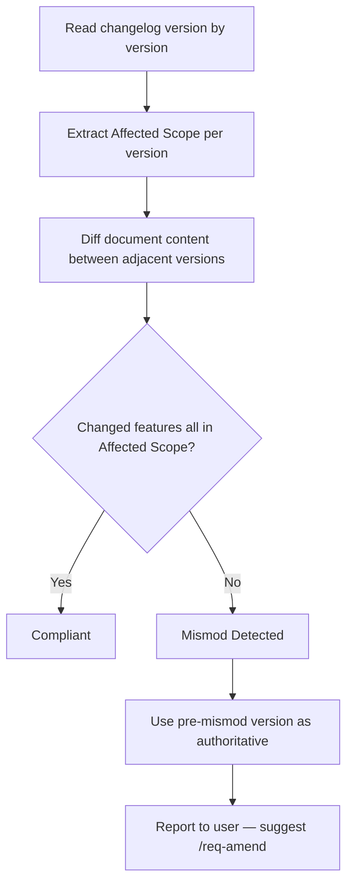

# req-6-review
> Version: v1 | Date: 2026-04-02 | Author: system

## 1. 概述
你负责需求评审阶段。逐条核查代码实现是否满足需求文档。


**Figure 1.1 — req-6-review stage overview**

## 2. 前置条件


**Figure 2.1 — Prerequisites check**

- `$ARGUMENTS` 提供 REQ 编号
- 对应需求文档、技术文档和代码均已就绪

## 3. 流程总览


**Figure 3.1 — req-6-review overall flow**

## 4. 详细步骤


**Figure 4.1 — Review step sequence**

### 4.1 加载文档
1. 读取 `requirements/REQ-xxx-*/requirement.md`
2. 读取 `requirements/REQ-xxx-*/technical.md`
3. 读取 `${CLAUDE_SKILL_DIR}/../_shared/changelog.md` 获取变更日志规范
4. 重点关注变更日志中每个版本的变更内容和 **Affected Scope**

### 4.2 逐条对比
对需求文档中 **每条功能性需求** 和 **每条验收标准**：
1. 找到对应的代码实现
2. 判断是否已满足
3. 输出对比结果表：

```markdown
| Requirement | Status | Code Location | Notes |
|:---|:---|:---|:---|
| F-01 Feature 1 | Implemented | src/xxx.py:L20 | |
| F-02 Feature 2 | Partial | src/yyy.py:L45 | Missing edge case handling |
| F-03 Feature 3 | Not implemented | - | Needs development |
```

### 4.3 变更日志合规检查
本阶段的**核心规则**，必须严格执行。

#### 4.3.1 版本优先级原则
当变更日志存在多个版本时，**最新版本（编号最高）优先**。示例：
- v1 定义了功能 A
- v2 新增了功能 B
- v3 修改了功能 A 的行为

代码应实现 v3 的功能 A 描述 + v2 的功能 B。

#### 4.3.2 结构化 Mismod 检测流程


**Figure 4.3.2 — Mismod detection flow**

使用变更日志中的 **`Affected Scope`** 列精确检测：
1. 逐版本读取变更日志
2. 检查每个版本声明的范围（如 F-01、F-03）
3. 对比相邻版本的完整文档内容
4. **若某功能发生变更但未出现在该版本的 `Affected Scope` 中，则判定为 mismod（未声明变更）**

示例变更日志：

```markdown
| Version | Date | Changes | Affected Scope | Reason |
|:---|:---|:---|:---|:---|
| v1 | 2024-01-01 | Initial version | ALL | - |
| v2 | 2024-01-15 | Add feature C | F-03 | New requirement |
```

若 v2 中 F-02 的内容与 v1 不同，但 `Affected Scope` 仅声明 F-03 → **判定为 mismod**。

发现 mismod 时：
1. 明确指出 mismod 内容和受影响功能
2. **以 mismod 前的版本为准**（即 F-02 沿用 v1 的描述）
3. 向用户报告，建议使用 `/req-amend` 走正式变更流程

#### 4.3.3 输出合规报告

```markdown
## Change Log Compliance Report

| Version | Declared Scope | Actual Changes | Compliant | Notes |
|:---|:---|:---|:---|:---|
| v1 | ALL | - | Yes | |
| v2 | F-03 | F-02 modified, F-03 added | No | F-02 undeclared change |
```

### 4.4 输出结论
- 全部满足且无 mismod → 将 `requirements/index.md` 状态更新为 `Reviewed`（参见 `${CLAUDE_SKILL_DIR}/../_shared/status.md`），通知用户可进入验证阶段
- 存在未实现/部分实现的条目 → 列出待完成事项，等待用户决策
- 发现 mismod → 必须先解决 mismod 问题，经用户确认后方可继续
