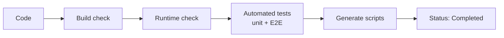
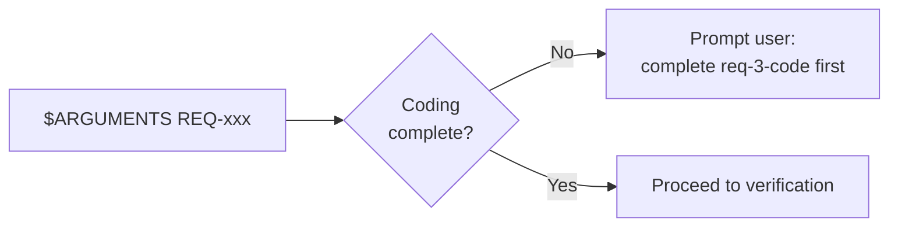
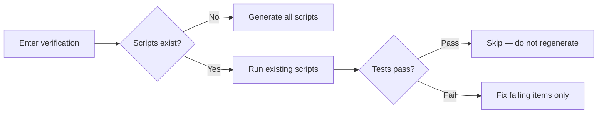
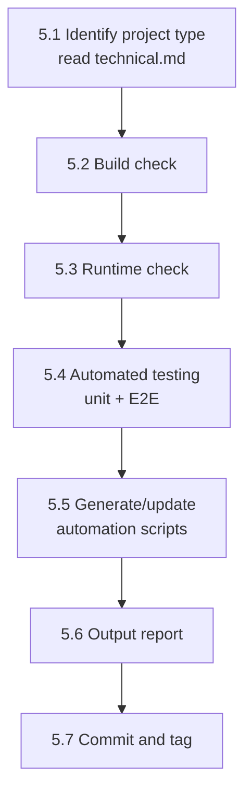

# req-7-verify
> Version: v1 | Date: 2026-04-02 | Author: system

## 1. 概述
你负责验证阶段。确保代码能够构建、运行并通过测试。


**Figure 1.1 — req-7-verify three-layer pipeline**

## 2. 前置条件


**Figure 2.1 — Prerequisites check**

- `$ARGUMENTS` 提供 REQ 编号
- 编码工作已完成

## 3. 流程总览

```mermaid
flowchart TD
    A[Identify Project Type] --> B[Build Check]
    B -- Fail --> B1[Fix errors, retry]
    B1 --> B
    B -- Pass --> C[Runtime Check]
    C --> D[Automated Testing]
    D --> E[Generate / Update Scripts]
    E --> F[Output Report]
    F --> G[Commit and Tag]
**Figure 3.1 — req-7-verify three-layer verification pipeline**
```

## 4. 断点恢复


**Figure 4.1 — Verification breakpoint recovery**

读取 `${CLAUDE_SKILL_DIR}/../_shared/recovery.md` 获取恢复规范。

若上次验证被中断：
1. 检查 `scripts/` 下是否已有脚本
2. 检查测试文件是否已存在
3. 若存在，运行现有脚本查看哪些通过/失败
4. 仅修复失败项，不重新生成已通过项

## 5. 详细步骤


**Figure 5.1 — Verification step sequence**

### 5.1 识别项目类型
读取 `requirements/REQ-xxx-*/technical.md`，确定技术栈和构建方式。

### 5.2 构建检查

```mermaid
flowchart LR
    A{Tech Stack} --> B[Python: py_compile / mypy]
    A --> C[Java Maven: mvn compile]
    A --> D[Java Gradle: gradle build]
    A --> E[TypeScript: tsc --noEmit]
    A --> F[Go: go build ./...]
    B & C & D & E & F --> G{Pass?}
    G -- No --> H[Fix and Retry]
    G -- Yes --> I[Continue]
**Figure 5.2 — Build check by technology stack**
```

| Technology | Command |
|:---|:---|
| Python | `python -m py_compile <files>` or `mypy <package>` |
| Java (Maven) | `mvn compile` |
| Java (Gradle) | `gradle build` |
| TypeScript | `tsc --noEmit` |
| Go | `go build ./...` |

构建必须通过。若出现错误，修复后重试。

### 5.3 运行时检查
尝试运行项目入口点，确认可正常启动：
- CLI 工具：执行 `--help` 或简单命令
- Web 服务：启动并检查健康检查端点
- 库：尝试 import/load

### 5.4 自动化测试

```mermaid
flowchart TD
    A[Check if test files exist] --> B{Exist?}
    B -- No --> C[Generate from acceptance criteria]
    B -- Yes --> D[Run existing tests]
    C --> D
    D --> E{Web project?}
    E -- Yes --> F[Playwright E2E tests]
    E -- No --> G[Unit / Integration tests]
    F & G --> H{All pass?}
    H -- No --> I[Fix failing tests]
    I --> D
    H -- Yes --> J[Continue]
**Figure 5.4 — Automated testing flow**
```

1. 检查测试文件是否已存在
2. 若不存在，**根据需求文档的验收标准生成测试用例**
3. **Web 项目特殊要求**：使用 Playwright 进行端到端测试，与项目语言保持一致：
  - TypeScript/Node.js 项目 → Playwright with TypeScript（`tests/e2e/*.spec.ts`）
  - Python 项目 → Playwright with Python（`tests/e2e/test_e2e_<feature>.py`）
  - 不得为 E2E 测试引入不同语言运行时
  - 测试脚本放置在 `tests/e2e/`
  - 根据需求功能和验收标准设计测试流程
  - 测试不仅限于 UI 交互（点击、输入、导航）
  - 同时测试数据流（提交数据、验证数据库/API 响应正确）
4. 单元/集成测试命令：

| Technology | Command |
|:---|:---|
| Python | `pytest tests/ -v` |
| Java (Maven) | `mvn test` |
| Java (Gradle) | `gradle test` |
| TypeScript | `npm test` |
| Go | `go test ./...` |

5. 所有测试必须通过

### 5.5 生成/更新自动化脚本
读取 `${CLAUDE_SKILL_DIR}/../_shared/scripts.md` 获取脚本规范。

在 `scripts/` 下生成验证脚本（.bat + .sh），严格遵循共享脚本规范。

至少需要：
- `scripts/build.bat` + `scripts/build.sh` — 构建/编译
- `scripts/test.bat` + `scripts/test.sh` — 运行所有测试（单元 + 集成）
- `scripts/test-e2e.bat` + `scripts/test-e2e.sh` — 运行 E2E 测试（Web 项目）
- `scripts/run.bat` + `scripts/run.sh` — 启动/运行

若脚本已存在，检查是否需要更新。

### 5.6 输出报告

```markdown
## Verification Report

- Build check: PASS / FAIL
- Runtime check: PASS / FAIL
- Unit/Integration tests: X/Y passed
- E2E tests: X/Y passed (web projects)

### Automation Scripts
- scripts/build.bat + build.sh ✓
- scripts/test.bat + test.sh ✓
- scripts/run.bat + run.sh ✓

### Issues (if any)
1. ...
```

所有检查通过后，通知用户可进入归档阶段。

### 5.7 提交与打标签

```bash
git add -A && git commit -m "test(REQ-xxx): verification tests and scripts"
git tag REQ-xxx-verified
```
