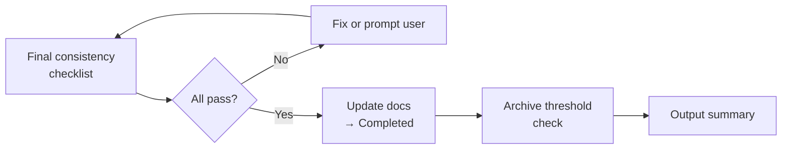
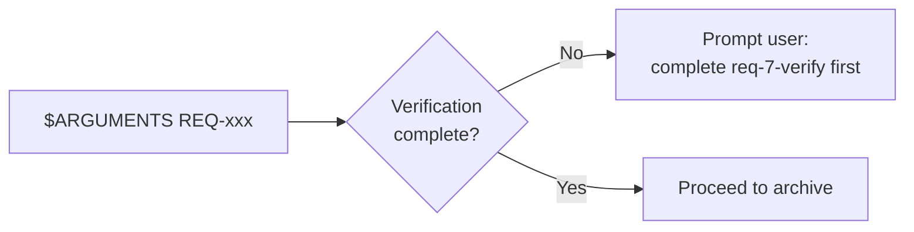
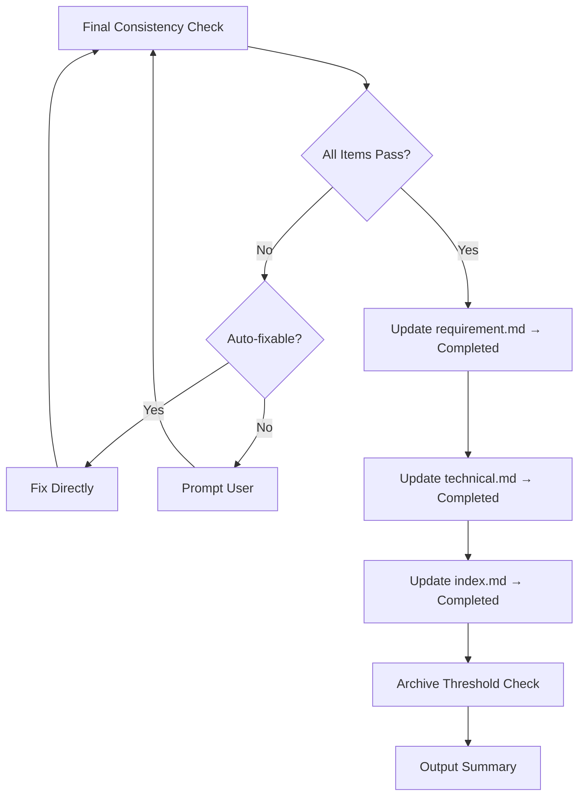
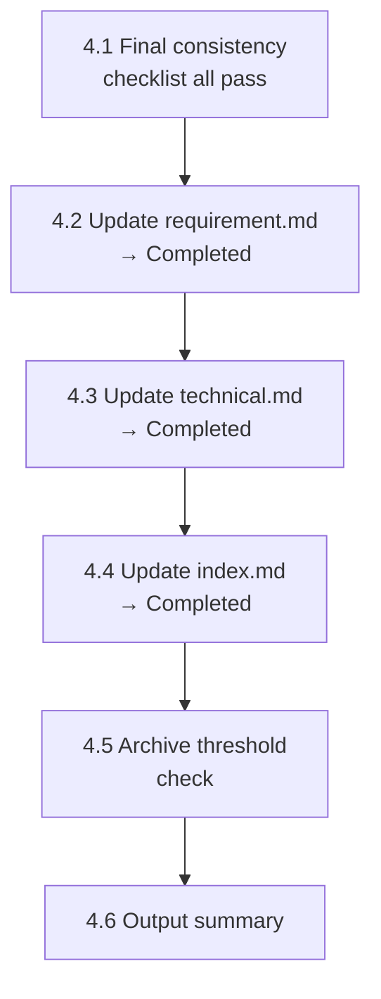
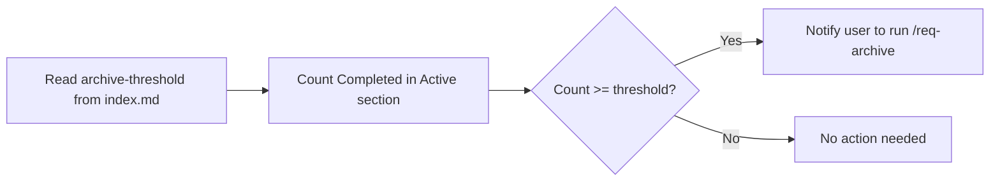

# req-8-done
> Version: v1 | Date: 2026-04-02 | Author: system

## 1. 概述
你负责归档阶段。执行最终一致性检查，然后将需求标记为已完成。


**Figure 1.1 — req-8-done archive flow**

## 2. 前置条件


**Figure 2.1 — Prerequisites check**

- `$ARGUMENTS` 提供 REQ 编号
- 验证阶段必须已通过

## 3. 流程总览


**Figure 3.1 — req-8-done archive checklist flow**

## 4. 详细步骤


**Figure 4.1 — Archive step sequence**

### 4.1 最终一致性检查
归档前执行以下检查清单，**所有项目必须通过**。

```markdown
## Final Consistency Checklist

### Documents
- [ ] requirement.md exists and status is finalized
- [ ] technical.md exists and status is finalized
- [ ] All .puml files have corresponding .svg files
- [ ] All .svg files are valid (size > 0, no Syntax Error)

### Code
- [ ] Source code exists for all modules defined in technical.md
- [ ] Code builds successfully (run scripts/build.bat or build.sh)
- [ ] All tests pass (run scripts/test.bat or test.sh)

### Scripts
- [ ] scripts/build.bat + build.sh exist and are executable
- [ ] scripts/run.bat + run.sh exist and are executable
- [ ] scripts/test.bat + test.sh exist and are executable

### Git
- [ ] All changes are committed (no uncommitted modifications)
- [ ] On a feature branch (feat/REQ-xxx-*), not directly on main
```

若有检查项失败：
1. 列出所有失败项
2. 可自动修复的问题（缺少 SVG、缺少脚本），直接修复
3. 需要人工干预的问题（未提交代码、测试失败），提示用户
4. **所有项目通过后方可继续归档**

### 4.2 更新需求文档状态
修改 `requirements/REQ-xxx-*/requirement.md`：
- 将 Status 设为 `Completed`
- 更新 Updated 日期

### 4.3 更新技术文档状态
修改 `requirements/REQ-xxx-*/technical.md`：
- 将 Status 设为 `Completed`
- 更新 Updated 日期

### 4.4 更新索引
读取 `${CLAUDE_SKILL_DIR}/../_shared/status.md` 获取状态规范。修改 `requirements/index.md`：
- 将该需求的状态设为 `Completed`
- 更新日期

### 4.5 归档阈值检查


**Figure 4.5 — Archive threshold check**

1. 从 `index.md` 读取 `<!-- archive-threshold: N -->` 注释（若不存在，默认为 `5`）
2. 统计 **Active** 区块中 `Completed` 条目数量
3. 若数量 >= 阈值，通知用户：
   > "Active 中已有 X 个需求完成（阈值：N）。建议运行 `/req-archive` 进行批量归档并生成里程碑摘要。"

### 4.6 输出摘要

```markdown
## REQ-xxx <Name> — Completed

### Consistency Check
- Documents: ALL PASS
- Code: ALL PASS
- Scripts: ALL PASS
- Git: ALL PASS

### Summary
- Requirement document: archived
- Technical design: archived
- Code: implemented and verified
- Completed: <date>
```
