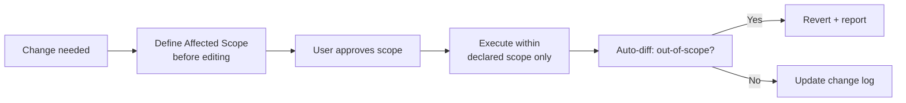
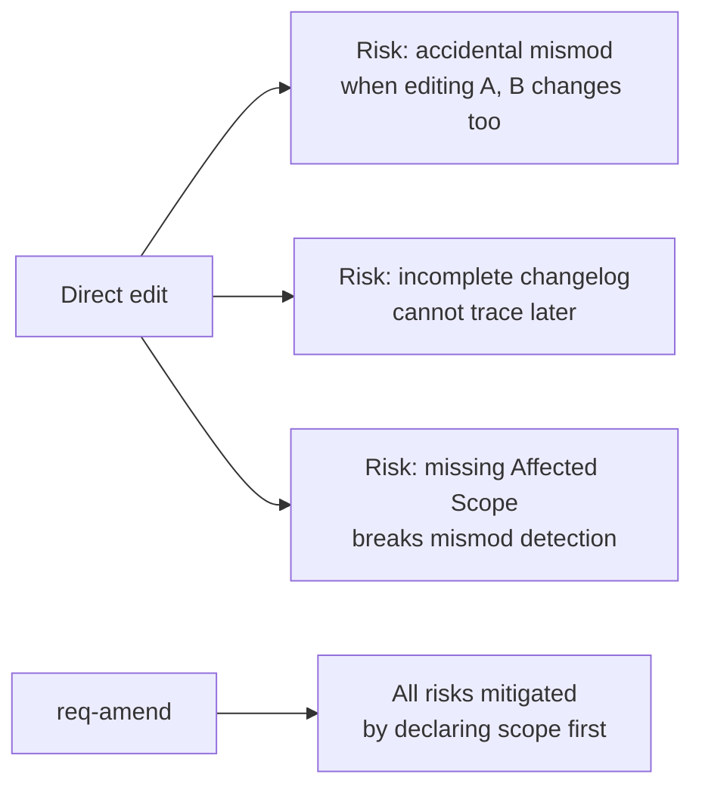
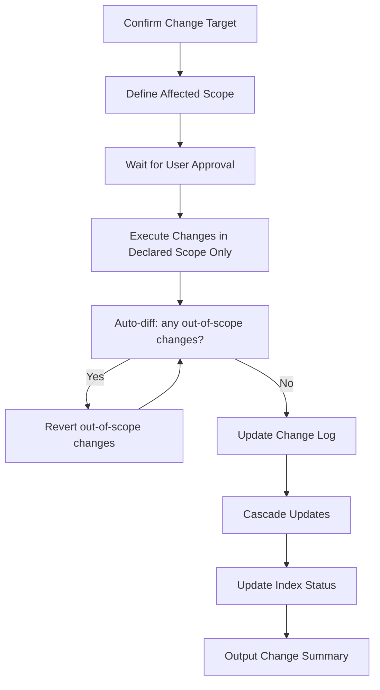
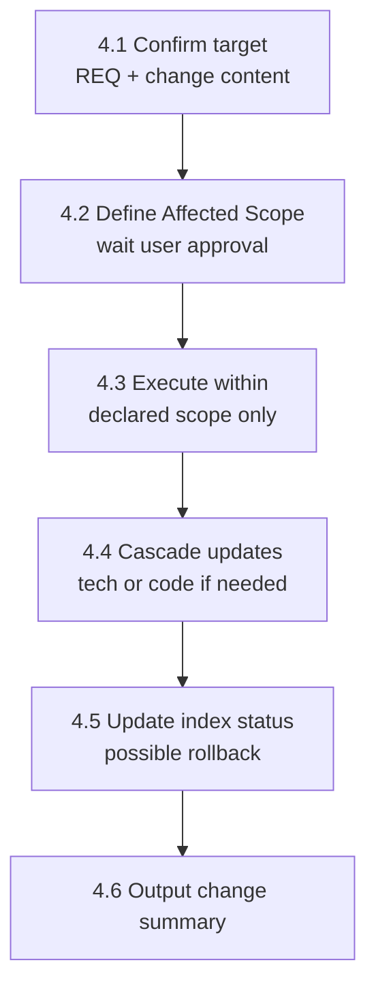
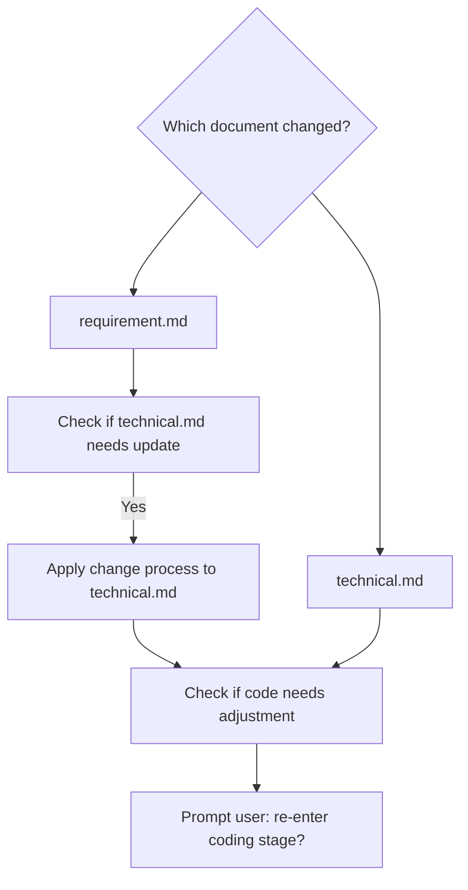

# req-amend
> Version: v1 | Date: 2026-04-02 | Author: system

## 1. 概述
你负责正式变更流程。当已定稿的需求文档或技术文档需要修改时，**必须通过本 skill 进行变更**——禁止直接手动编辑文档。


**Figure 1.1 — req-amend formal change flow**

## 2. 存在本流程的原因


**Figure 2.1 — Why direct editing is prohibited**

直接编辑文档容易导致：
- 修改 A 时意外改动 B（mismod）
- 变更日志不完整，导致后续评审无法追溯
- 缺少 `Affected Scope`，破坏 mismod 检测机制

## 3. 流程总览


**Figure 3.1 — req-amend change request to execution flow**

## 4. 详细步骤


**Figure 4.1 — Amendment step sequence**

### 4.1 确认变更目标
1. 从 `$ARGUMENTS` 读取 REQ 编号
2. 读取当前 `requirement.md` 和 `technical.md`
3. 询问用户希望变更的内容：
  - "您想修改哪些功能？（例如 F-01、F-03）"
  - "变更原因是什么？"
  - "这是需求变更还是技术设计变更？"

### 4.2 定义受影响范围
根据用户描述，**在进行任何修改之前**，列出受影响范围：

```markdown
## Proposed Change

- Target document: requirement.md / technical.md
- Affected scope: F-01, F-03
- Change description: <what will change>
- Reason: <why>

### Impact Analysis
- F-01: <current> → <proposed>
- F-03: <current> → <proposed>
- Other features: NO CHANGE
```

**等待用户确认受影响范围后，方可进行任何编辑。**

### 4.3 执行变更
用户确认后：
1. **仅修改声明的受影响范围内的内容**
2. 修改后自动对比文档变更：
  - 检查受影响范围之外是否有任何内容被修改
  - 若有，**撤销该变更**并报告
3. 在变更日志中新增一行：

```markdown
| v<N+1> | <date> | <change description> | <F-xx, F-xx> | <reason> |
```

### 4.4 级联更新


**Figure 4.4 — Cascade update decision flow**

若修改了 `requirement.md`：
1. 检查 `technical.md` 是否需要相应更新
2. 若需要，对技术文档也执行变更流程
3. 检查代码是否需要调整，提示用户是否重新进入编码阶段

若修改了 `technical.md`：
1. 检查代码是否需要调整
2. 提示用户是否重新进入编码阶段

### 4.5 更新索引状态
根据变更影响，`index.md` 中的状态可能需要回退：
- 需求文档变更 → 回退到 `Requirement Finalized`（需重新执行技术设计）
- 技术文档变更 → 回退到 `Technical Finalized`（需重新执行编码）
- 若用户认为变更较小，不影响后续阶段，需明确确认后方可保留当前状态

### 4.6 输出变更摘要

```markdown
## Change Summary

- REQ: REQ-xxx
- Document: requirement.md
- Version: v1 → v2
- Affected Scope: F-01, F-03
- Undeclared changes: None ✓
- Index status: reverted to Requirement Finalized
- Next step: /req-2-tech REQ-xxx
```
