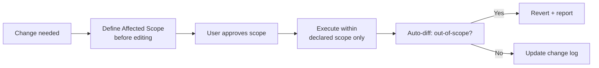
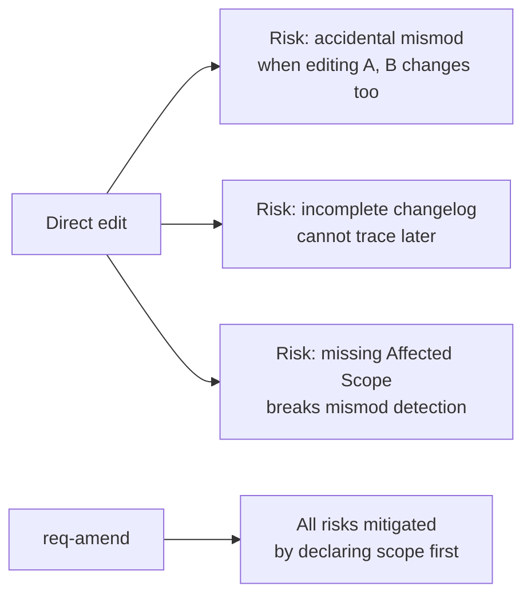
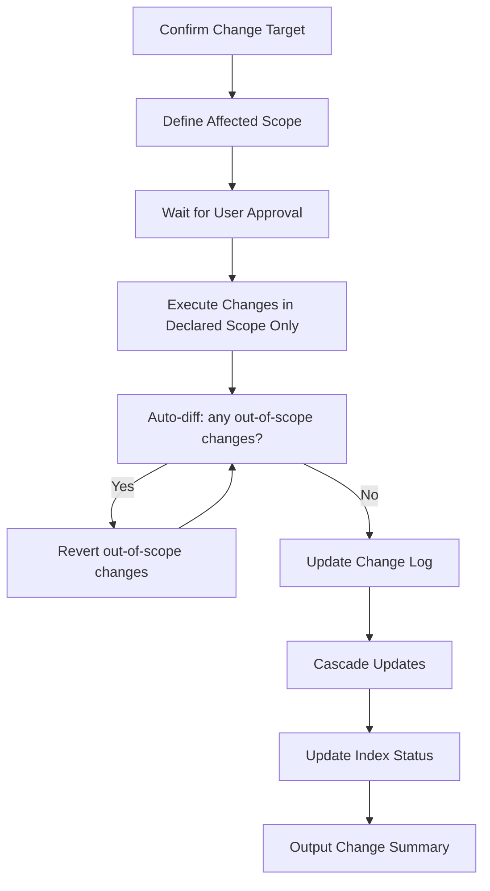
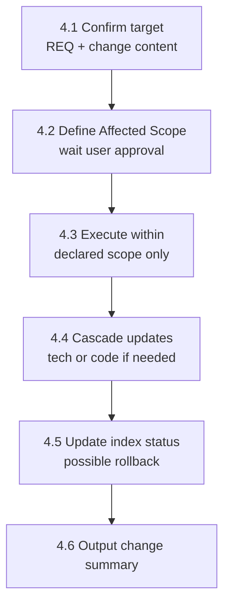
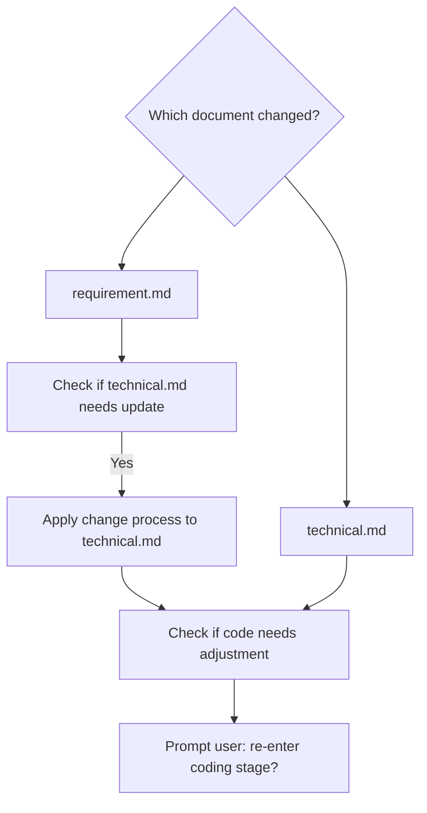

# req-amend
> Version: v1 | Date: 2026-04-02 | Author: system

## 1. Overview
You are responsible for the formal change process. When a finalized requirement or technical document needs modification, **it must go through this skill** — direct manual editing of documents is prohibited.


**Figure 1.1 — req-amend formal change flow**

## 2. Why This Process Exists


**Figure 2.1 — Why direct editing is prohibited**

Direct document editing is prone to:
- Accidentally modifying B while editing A (mismod)
- Incomplete change log, making subsequent reviews untraceable
- Missing `Affected Scope`, breaking the mismod detection mechanism

## 3. Overall Flow


**Figure 3.1 — req-amend change request to execution flow**

## 4. Steps


**Figure 4.1 — Amendment step sequence**

### 4.1 Confirm Change Target
1. Read the REQ number from `$ARGUMENTS`
2. Read the current `requirement.md` and `technical.md`
3. Ask the user what they want to change:
  - "Which features do you want to modify? (e.g. F-01, F-03)"
  - "What is the reason for the change?"
  - "Is this a requirement change or a technical design change?"

### 4.2 Define Affected Scope
Based on the user's description, **before making any edits**, list the affected scope:

```markdown
## Proposed Change

- Target document: requirement.md / technical.md
- Affected scope: F-01, F-03
- Change description: <what will change>
- Reason: <why>

### Impact Analysis
- F-01: <current> → <proposed>
- F-03: <current> → <proposed>
- Other features: NO CHANGE
```

**Wait for user confirmation of the affected scope before making any edits.**

### 4.3 Execute Change
After user confirmation:
1. **Only modify content within the declared affected scope**
2. After editing, automatically diff the document changes:
  - Check whether any content outside the affected scope was modified
  - If so, **revert that change** and report it
3. Add a new row to the change log:

```markdown
| v<N+1> | <date> | <change description> | <F-xx, F-xx> | <reason> |
```

### 4.4 Cascade Updates


**Figure 4.4 — Cascade update decision flow**

If `requirement.md` was modified:
1. Check whether `technical.md` needs a corresponding update
2. If so, apply the change process to the technical document as well
3. Check whether code adjustments are needed; ask the user whether to re-enter the coding stage

If `technical.md` was modified:
1. Check whether code adjustments are needed
2. Ask the user whether to re-enter the coding stage

### 4.5 Update Index Status
Depending on the impact of the change, the status in `index.md` may need to roll back:
- Requirement document changed → roll back to `Requirement Finalized` (technical design must be re-run)
- Technical document changed → roll back to `Technical Finalized` (coding must be re-run)
- If the user considers the change minor and not affecting subsequent stages, they must explicitly confirm before the current status is preserved

### 4.6 Output Change Summary

```markdown
## Change Summary

- REQ: REQ-xxx
- Document: requirement.md
- Version: v1 → v2
- Affected Scope: F-01, F-03
- Undeclared changes: None ✓
- Index status: reverted to Requirement Finalized
```
