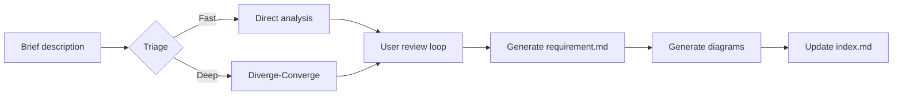
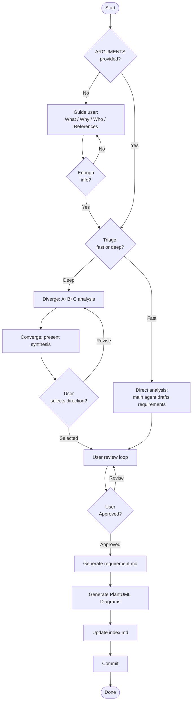
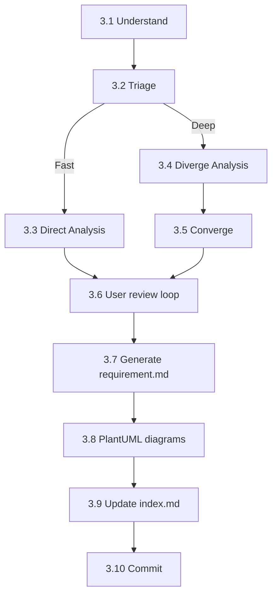
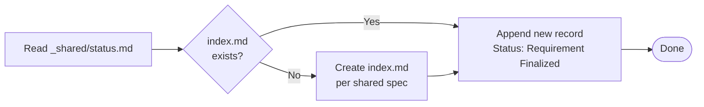

# req-analyze — Requirement Analysis
> Version: v3 | Date: 2026-04-16 | Author: system

## 1. Role
You are responsible for the requirement analysis stage — expand a brief user description into a complete requirement document.


**Figure 1.1 — req-analyze stage overview**

## 2. Overall Flow


**Figure 2.1 — Requirement analysis cycle: triage → analyze → generate**

## 3. Steps


**Figure 3.1 — Step sequence overview**

### 3.1 Understand Requirements

If `$ARGUMENTS` is empty or unclear, **proactively guide the user**:
- "What feature do you want to build?"
- "What problem does it solve?"
- "Who are the target users?"
- "Any reference products or interfaces?"
- "Do you have any mockups, screenshots, or UI references? Drag them into the chat."

If the user provides images or screenshots, extract requirements directly from them — when visual references and text descriptions coexist, visual references take priority.
Continue asking until you have enough information to begin analysis.
If `$ARGUMENTS` already provides a description, proceed directly to triage.

### 3.2 Triage — Fast or Deep?

Before launching any subagent, the main agent evaluates the task and chooses a path. Announce the decision to the user (e.g. "方向明确，走快车道" or "多种可能方向，展开分析").

**Fast path — any of these conditions**:
- User has stated a clear direction (e.g. "把 X 移到 Y", "删掉 Z", "按照 A 模式改 B")
- Task is refactoring / cleanup / deletion (single viable direction, no fundamental choice)
- Scope is closed and enumerable (affected modules/files are known)

**Deep path — any of these conditions**:
- Multiple fundamentally different implementation directions exist
- User explicitly says they are uncertain or exploring
- New feature design involving architectural choices
- Cross-cutting concerns affecting multiple subsystems

**User override**: If the user requests deeper analysis (e.g. "展开分析", "我想看看不同方案"), switch to deep path regardless of triage result.

### 3.3 Direct Analysis (fast path)

The main agent directly drafts the requirement points:
1. List functional requirements (F-xx items) with main flow, error handling, edge cases
2. List non-functional requirements
3. List out-of-scope items
4. Draft acceptance criteria

Present the draft to the user and proceed to §3.6 User Review.

### 3.4 Diverge Analysis (deep path)

Read `${CLAUDE_SKILL_DIR}/../_shared/diverge-converge.md` for the full pattern specification (role definitions, implementation constraints).

Launch two rounds of subagent analysis via the `Agent` tool:

**Round 1 (parallel)**: Launch Agent A and Agent B simultaneously:
- **Agent A (core path)**: at most 5 F-xx items, strictly exclude non-core, output the fastest-deliverable MVP requirement set
- **Agent B (full scope)**: cover all reasonable scenarios including edge cases, output a complete evolvable requirement set

**Round 2 (sequential)**: Launch Agent C, reading the full A+B output:
- **Agent C (core conflict)**: identify "how do A and B fundamentally differ in their understanding of the problem", judge "what the user really wants to solve", must name the conflict point concretely — no vague conclusions

### 3.5 Converge — Synthesize and User Selection (deep path)

The main agent consolidates the output and presents in the `diverge-converge.md` Synthesis format:

1. **Recommended direction** (conclusion first — A / B / blend, with reasoning)
2. **Core conflict** (the specific divergence identified by C)
3. **Comparison table** (optional — only when the two approaches differ significantly)

**Wait for user selection**: choose A / choose B / describe a blend. Once the user selects, use the chosen direction as the basis for subsequent analysis.

### 3.6 User Review
After presenting the expanded content, **wait for user feedback**:
- User may modify, add, or remove items
- Adjust based on feedback and re-present for review
- Loop until the user explicitly says "looks good" or "approved"

### 3.7 Generate Requirement Document
After user approval:

1. Determine REQ number: read `requirements/index.md`, scan **both** Active and Archived sections to find the highest existing REQ number, increment by 1
2. Create directory: `requirements/REQ-xxx-<short-name>/` (directory name in English)
3. Invoke `write-doc` via the `Skill` tool, passing:
   - Use the embedded template below as the document structure
   - Fill in the content confirmed in the analysis/converge phase into each section
   - **If the orchestrator's pipeline plan skips the tech stage**: include the `§ 7. Technical Approach` section with file-level change plan and superseded components. If tech will run normally, omit § 7 entirely.
   - Save path: `requirements/REQ-xxx-<short-name>/requirement.md`

   Template:

```markdown
# REQ-xxx <Requirement Name>

> Status: Requirement Finalized
> Created: <date>
> Updated: <date>

## 1. Background

## 2. Target Users & Scenarios

## 3. Functional Requirements

### F-01 <Feature Name>
- Main flow:
- Error handling:
- Edge cases:

### F-02 <Feature Name>
...

## 4. Non-functional Requirements

## 5. Out of Scope

## 6. Acceptance Criteria

| ID | Feature | Condition | Expected Result |
|:---|:---|:---|:---|

## 7. Technical Approach (only when tech stage will be skipped)

> **Include this section only when the orchestrator's pipeline plan indicates that the tech stage will be skipped.** If tech will run normally, omit this section entirely.

### Files to Modify

| File | Change |
|------|--------|
| path/to/file.py | Description of change |

### Superseded Components

| Component | File Path | Superseded By | Cleanup Action |
|:---|:---|:---|:---|

If nothing is superseded, write **None**.

`Cleanup Action` values:
- **Remove** — delete the code outright during req-code
- **Mark** — add `# LEGACY(REQ-xxx): superseded by <new component>` comment

## 8. Change Log

| Version | Date | Changes | Affected Scope | Reason |
|:---|:---|:---|:---|:---|
| v1 | <date> | Initial version | ALL | - |
```

**Note: section headings and structural fields must be in English.**

See `${CLAUDE_SKILL_DIR}/../_shared/changelog.md` for change log format and rules. The `Affected Scope` column must be filled in accurately.

4. Generate diagrams (following PlantUML conventions):
  - At least one use case diagram
  - Add a flowchart for complex flows
  - Add sequence diagrams for multi-actor interactions

### 3.8 PlantUML Diagrams
Read `${CLAUDE_SKILL_DIR}/../_shared/plantuml.md` for the full PlantUML specification (environment detection, syntax, SVG conversion). Follow the process strictly.

### 3.9 Update Index


**Figure 3.9 — Index update decision flow**

Read `${CLAUDE_SKILL_DIR}/../_shared/status.md` for the index.md format and status enum.
Add the requirement record to `requirements/index.md` with status `Requirement Finalized`. If `index.md` does not exist, create it per the shared specification.

### 3.10 Commit

```bash
git add -A && git commit -m "docs(REQ-xxx): requirement analysis complete"
```

