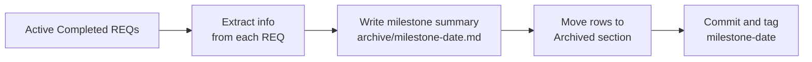
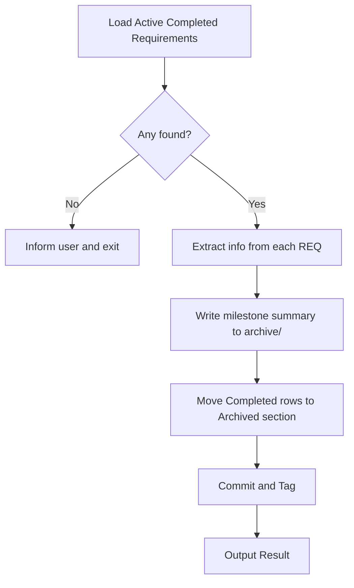
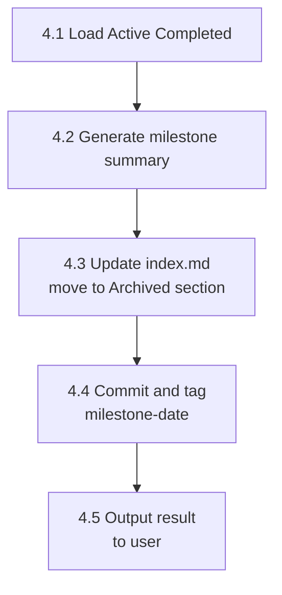

# req-archive
> Version: v1 | Date: 2026-04-02 | Author: system

## 1. 概述
将 `requirements/index.md` Active 区块中所有 Completed 需求批量归档，并生成里程碑摘要文档。


**Figure 1.1 — req-archive batch archive overview**

## 2. 触发时机

```mermaid
flowchart LR
    A[Trigger] --> B[/req-8-done\narcive-threshold reached]
    A --> C[User runs\n/req-archive manually]
    B --> D[Execute archive flow]
    C --> D
```
**Figure 2.1 — Archive trigger conditions**

由 `/req-8-done` 触发（归档阈值达到），或用户随时手动运行。

## 3. 流程总览


**Figure 3.1 — req-archive batch archive flow**

## 4. 详细步骤


**Figure 4.1 — Detailed step sequence**

### 4.1 加载 Active 已完成需求
1. 读取 `requirements/index.md`
2. 收集 **Active** 区块中所有状态为 `Completed` 的行
3. 若无，通知用户并退出

### 4.2 生成里程碑摘要
针对每个已完成需求，读取其 `requirement.md` 和 `technical.md`，提取：
- 所构建内容的单行描述
- 新引入的共享模块/工具（来自 technical.md § Shared Modules & Reuse Strategy）
- 确立的关键技术决策（来自 technical.md § Design Principles 或 Risks & Notes）

若 `requirements/archive/` 目录不存在则创建。写入 `requirements/archive/milestone-<YYYY-MM-DD>.md`：

```markdown
# Milestone — <YYYY-MM-DD>

## Delivered Requirements

| ID | Name | Summary |
|:---|:---|:---|
| REQ-xxx | <name> | <one-line description> |

## New Shared Modules & Utilities

Shared modules/utilities introduced in this batch that future requirements can reuse:

- `<module/path>` — <what it does>

## Technical Decisions Established

Patterns, constraints, or architectural decisions confirmed across this batch:

- <decision>

## Stats

- Requirements archived: X
- Active requirements remaining: Y
```

### 4.3 更新 index.md
将所有 Completed 行从 **Active** 移至 **Archived** 区块：
- 在 Archived 区块中，将 `Status` + `Updated` 列替换为单个 `Completed` 日期列
- 保持所有其他行内容不变
- 不触碰非 Completed 状态的行

### 4.4 提交与打标签

```bash
git add -A && git commit -m "chore: archive milestone <YYYY-MM-DD>"
git tag milestone-<YYYY-MM-DD>
```

### 4.5 输出结果
通知用户：
- 已归档多少个需求
- 里程碑摘要位置：`requirements/archive/milestone-<date>.md`
- 剩余活跃需求数量
- 已创建 Git tag：`milestone-<date>`
