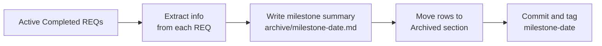
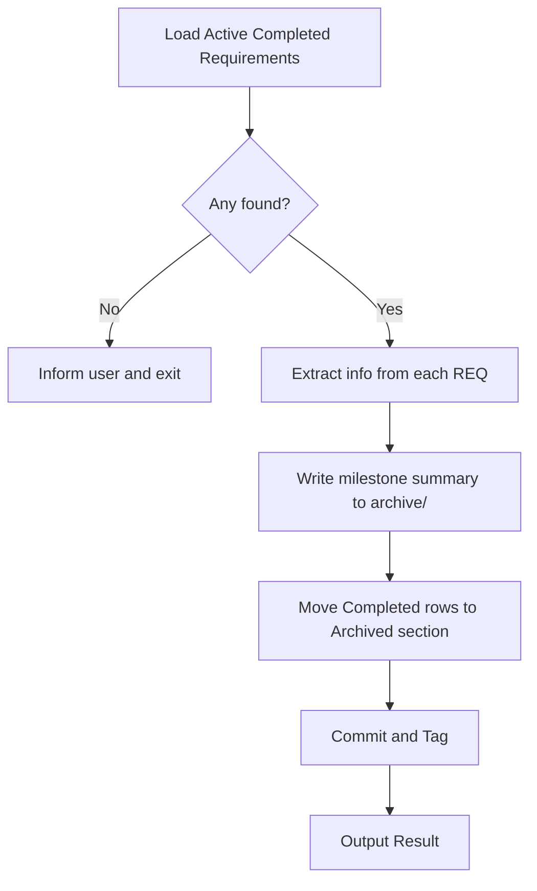
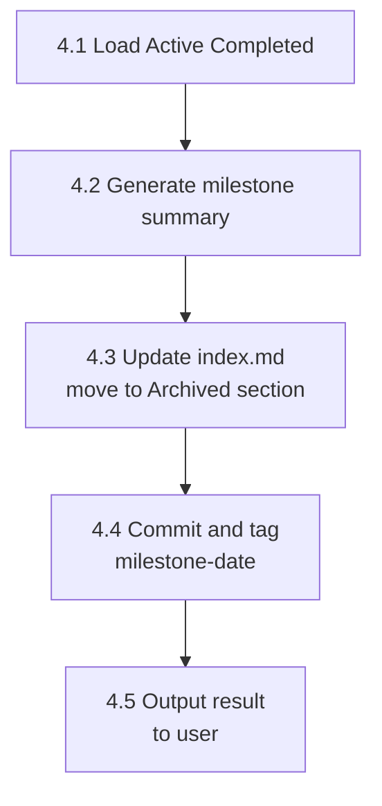

# req-archive
> Version: v1 | Date: 2026-04-02 | Author: system

## 1. Overview
Batch-archive all Completed requirements from the Active section of `requirements/index.md` and generate a milestone summary document.


**Figure 1.1 — req-archive batch archive overview**

## 2. When to Trigger

```mermaid
flowchart LR
    A[Trigger] --> B[/req-8-done\narcive-threshold reached]
    A --> C[User runs\n/req-archive manually]
    B --> D[Execute archive flow]
    C --> D
```
**Figure 2.1 — Archive trigger conditions**

Triggered by `/req-8-done` when the archive threshold is reached, or run manually by the user at any time.

## 3. Overall Flow


**Figure 3.1 — req-archive batch archive flow**

## 4. Steps


**Figure 4.1 — Detailed step sequence**

### 4.1 Load Active Completed Requirements
1. Read `requirements/index.md`
2. Collect all rows with status `Completed` from the **Active** section
3. If none found, notify the user and exit

### 4.2 Generate Milestone Summary
For each completed requirement, read its `requirement.md` and `technical.md` and extract:
- A one-line description of what was built
- New shared modules/utilities introduced (from technical.md § Shared Modules & Reuse Strategy)
- Key technical decisions established (from technical.md § Design Principles or Risks & Notes)

Create `requirements/archive/` if it does not exist. Write `requirements/archive/milestone-<YYYY-MM-DD>.md`:

```markdown
# Milestone — <YYYY-MM-DD>

## Delivered Requirements

| ID | Name | Summary |
|:---|:---|:---|
| REQ-xxx | <name> | <one-line description> |

## New Shared Modules & Utilities

Shared modules/utilities introduced in this batch that future requirements can reuse:

- `<module/path>` — <what it does>

## Technical Decisions Established

Patterns, constraints, or architectural decisions confirmed across this batch:

- <decision>

## Stats

- Requirements archived: X
- Active requirements remaining: Y
```

### 4.3 Update index.md
Move all Completed rows from the **Active** section to the **Archived** section:
- In the Archived section, replace the `Status` + `Updated` columns with a single `Completed` date column
- Leave all other row content unchanged
- Do not touch rows with non-Completed status

### 4.4 Commit & Tag

```bash
git add -A && git commit -m "chore: archive milestone <YYYY-MM-DD>"
git tag milestone-<YYYY-MM-DD>
```

### 4.5 Output Result
Notify the user:
- How many requirements were archived
- Milestone summary location: `requirements/archive/milestone-<date>.md`
- Number of remaining active requirements
- Git tag created: `milestone-<date>`
