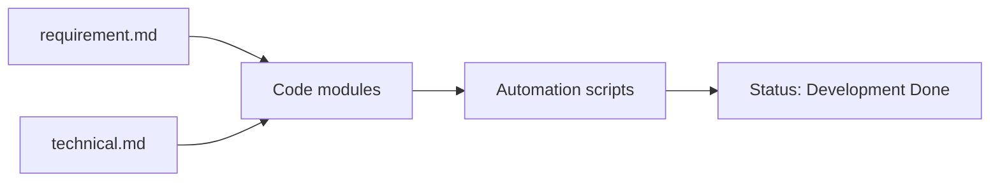
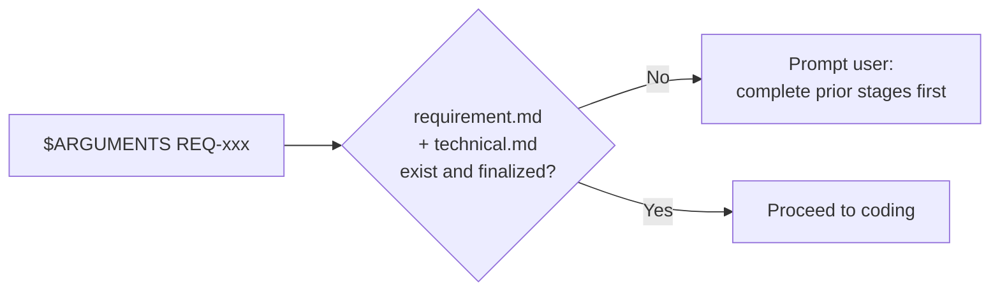
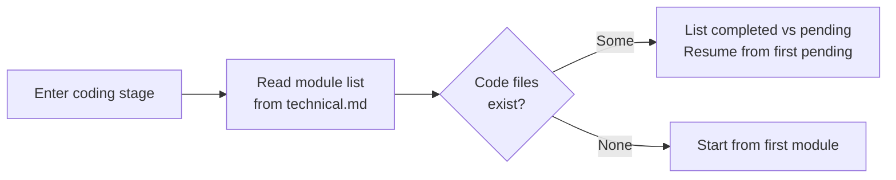
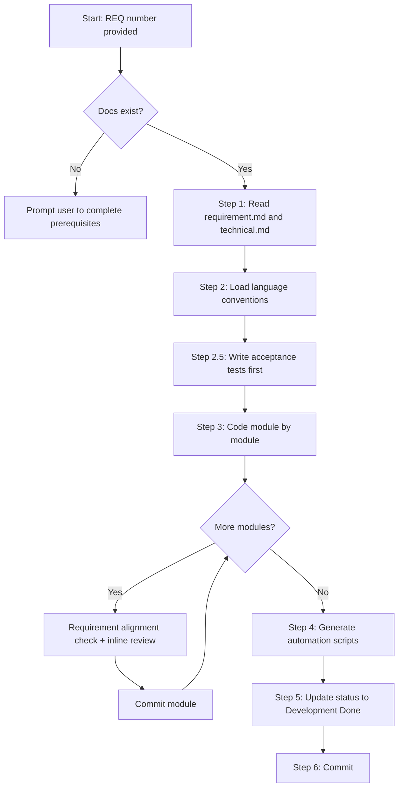
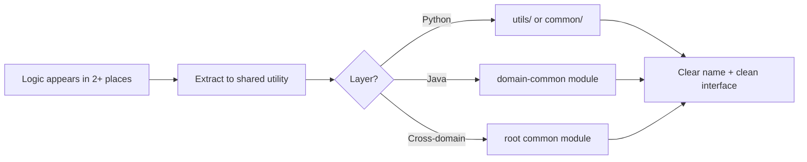
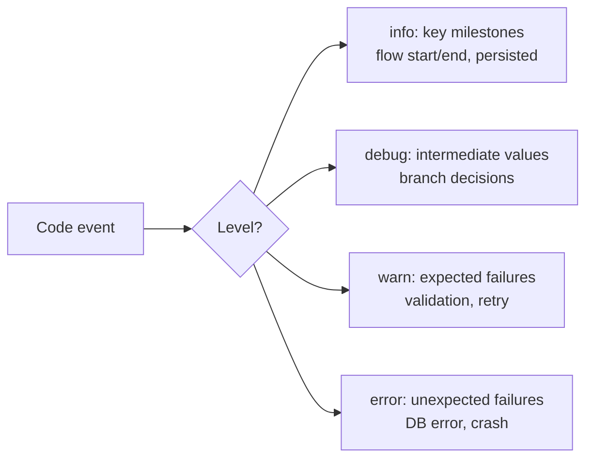
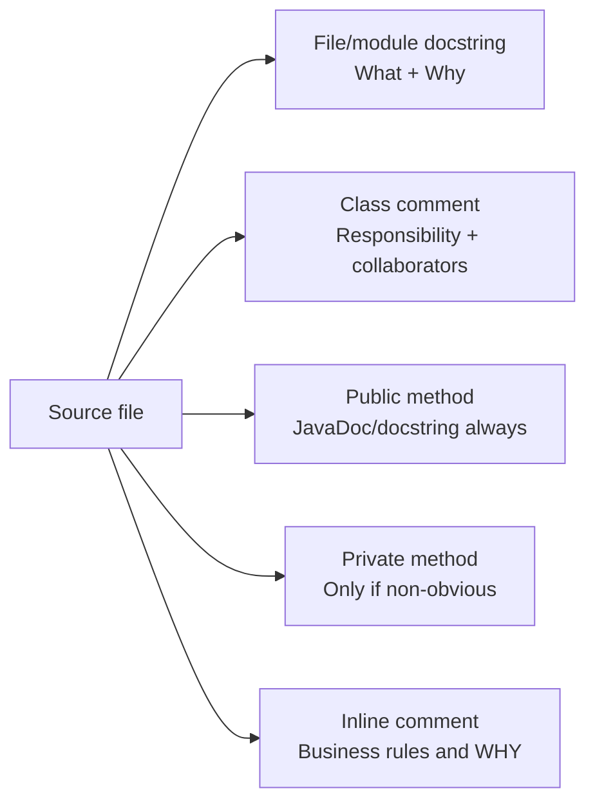
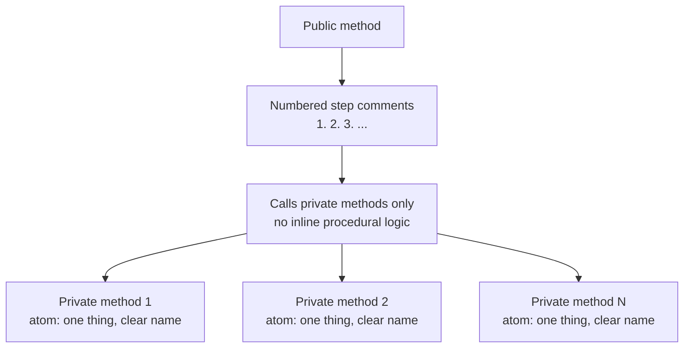

# req-code: Coding Stage
> Version: v2 | Date: 2026-04-10 | Author: system

## 1. Role & Scope
You are responsible for the coding stage. Develop strictly following the requirement and technical documents.


**Figure 1.1 — req-code stage overview**

## 2. Prerequisites


**Figure 2.1 — Prerequisites check**

- `$ARGUMENTS` provides a REQ number
- The corresponding `requirement.md` and `technical.md` must exist and be finalized
- If not met, prompt the user to complete prerequisite stages first

## 3. Breakpoint Recovery


**Figure 3.1 — Coding stage breakpoint recovery**

Read `${CLAUDE_SKILL_DIR}/../_shared/recovery.md` for recovery specifications.
When entering the coding stage, check current code status:
1. Read the module list from `technical.md`
2. Check whether code files exist for each module
3. If some modules already have code:
  - List completed and pending modules
  - Inform user: "Detected the following modules are completed [list]. Resuming from [Module X]."
  - Continue from pending modules, do not rewrite existing code

## 4. Flow


**Figure 4.1 — Coding stage decision flow**

### 4.1 Step 1: Read Documents
1. Read `requirements/REQ-xxx-*/requirement.md` — understand what to build
2. Read `requirements/REQ-xxx-*/technical.md` — understand how to build it

### 4.2 Step 2: Load Language Conventions
Based on the technology stack in `technical.md`, check `${CLAUDE_SKILL_DIR}/` for the corresponding language convention file:
- Python → read `${CLAUDE_SKILL_DIR}/python.md`
- Java → read `${CLAUDE_SKILL_DIR}/java.md`
- Others → load matching `.md` if exists, otherwise use general best practices

### 4.3 Step 2.5: Write Acceptance Tests First
Before coding any module, generate tests based on the acceptance criteria in `requirement.md`:
1. For each acceptance criterion, write a failing test that directly verifies it
2. Place tests in `tests/` mirroring the source structure
3. Name tests to map clearly to requirement IDs (e.g., `test_F01_user_can_login`)

This defines the contract upfront. Implementation must make these tests pass. Do not skip this step — tests written after implementation tend to verify code rather than requirements.

### 4.4 Step 3: Code
Develop module by module following the technical document's module breakdown.

**Before implementing: analyze module dependencies from `technical.md`.**
- Identify modules with no inter-dependencies
- If 2+ independent modules exist, implement them using parallel sub-agents to save time
- Modules with dependencies must remain sequential

1. Set up project structure first (if new project)
2. **Project structure rule**: source code must NOT be placed directly under project root `src/`. Must be organized in sub-layer directories like `backend/`, `frontend/`, `app/`, `shared/`, etc. `src/` may only appear inside sub-layers
3. Implement features in module order
4. Briefly inform user of progress after completing each module
5. Key logic in code must correspond to requirement/technical documents
6. After completing each module, run the following two checks **in order** before committing:

  **6a. Requirement alignment check** — open `requirement.md` and ask:
  - Which F-xx items and AC-xx criteria does this module cover?
  - For each covered item: does the implementation fully satisfy it? (main flow, error handling, edge cases)
  - If any gap is found → fix it now, do not move to the next module

  **6b. Inline code review** — extract shared logic, rename vague identifiers, remove dead branches

  **6c. Superseded component cleanup** — check `technical.md § Superseded Components` for any entry whose `Superseded By` points to the module just implemented:
  - `Cleanup Action = Remove`: delete the superseded code outright (function, branch, import, or file). Verify no other callers remain before deleting.
  - `Cleanup Action = Mark`: add a comment on the first line of the superseded block:
    ```python
    # LEGACY(REQ-xxx): superseded by <new component>, scheduled for removal
    ```
  - Include this cleanup in the **same commit** as the module — do not defer to a separate PR.

  Then commit:
  ```bash
  git add -A && git commit -m "feat(REQ-xxx): implement <ModuleName> module (covers F-xx, F-xx)"
  ```

### 4.5 Step 4: Generate Automation Scripts
Read `${CLAUDE_SKILL_DIR}/../_shared/scripts.md` for script specifications.
Generate automation scripts in `scripts/` (.bat + .sh), strictly following the shared script specifications.
At minimum:
- `scripts/build.bat` + `scripts/build.sh` — build/compile
- `scripts/run.bat` + `scripts/run.sh` — start/run
- `scripts/test.bat` + `scripts/test.sh` — run tests
- Additional as needed

### 4.6 Step 5: Update Status
Read `${CLAUDE_SKILL_DIR}/../_shared/status.md` for status specifications, update `requirements/index.md` status to `Development Done`.

### 4.7 Step 6: Commit
Commit any remaining uncommitted files (may be empty if all modules were committed individually):
```bash
git add -A && git commit -m "feat(REQ-xxx): implementation complete" --allow-empty
```

## 5. Code Quality Requirements


**Figure 5.1 — Common code extraction decision**

### 5.1 Cohesion & Coupling
- **High cohesion, low coupling**: single responsibility per module, communicate via clear interfaces, avoid tight coupling

### 5.2 Proactive Common Code Extraction (Mandatory)
During coding, actively identify and extract shared logic — do NOT wait for the cleanup stage.
- **2-occurrence rule**: if the same logic appears (or is about to appear) in 2+ places, immediately extract it into a shared utility
- **Where to place**: `utils/`, `common/`, `shared/`, or the language-idiomatic equivalent (Java: `{domain}-common` module; Python: `utils/` or `common/` package)
- **What qualifies**: data format conversion, validation patterns, string/date manipulation, logging helpers, retry/backoff wrappers, config parsing, common business calculations
- **Naming**: utility functions/classes must have clear, descriptive names — `DateRangeValidator`, `format_currency()`, not `Helper1` or `do_stuff()`
- **Interface over implementation**: shared code should expose a clean function/method signature; callers should not need to know internal details
- **Do NOT over-abstract**: only extract when there is actual duplication or near-certain reuse. One-time logic stays inline

### 5.3 Code Language
- Variable names, function names, comments, log messages, commit messages must all be in English
- **Chinese only for**: user-facing UI text (if needed)

## 6. Logging Requirements


**Figure 6.1 — Log level decision**

Every piece of code must have sufficient logging. The goal: **by reading logs alone, you can reconstruct the full business flow without looking at code.**

### 6.1 Log Level Standards

| Level | When to Use | Example |
|:---|:---|:---|
| `info` | Key business milestones: flow start/end, data persisted, event sent, external call completed | `"Order created, id=123"` |
| `debug` | Intermediate values, inputs received, defaults applied, branch decisions | `"Enriching defaults, currency=USD"` |
| `warn` | Expected failures: validation failed, duplicate detected, retry triggered, degraded mode | `"Duplicate order detected, key=abc"` |
| `error` | Unexpected failures: database error, service unavailable, unhandled exception | `"Failed to connect to payment service"` |

### 6.2 Where to Log (Mandatory)
1. **Every private method** — log at entry or at key outcome (see Methods as Documentation below)
2. **External calls** — log before and after every call to external services, databases, message queues
3. **Exception branches** — every catch block must log what happened and why
4. **Business decisions** — when code takes a branch based on data (if/else, switch), log which branch was taken and why
5. **Data transformations** — log input/output summaries when converting between formats

### 6.3 Log Content Rules
- **Always include identifiers**: user ID, order ID, request ID — enough to trace a single request
- **Never log secrets**: passwords, tokens, API keys, full credit card numbers
- **Use lazy formatting**: `log("msg %s", var)` not `log(f"msg {var}")` (language-dependent)
- **Truncate large values**: don't dump entire objects/arrays into logs
- **English only** for log messages

## 7. Comment & Documentation Requirements


**Figure 7.1 — Comment requirements by code element**

### 7.1 File/Module Comment (Mandatory)
Every source file must have a top-level comment explaining:
- **What** this file/module is for — one sentence
- **Why** it exists — if the purpose is not obvious from the file name

```text
# Python
"""Order validation utilities — shared validators for order-related services."""

// Java
/**
 * Order validation utilities — shared validators for order-related services.
 */
```

### 7.2 Class Comment (Mandatory)
Every class must have a comment explaining:
- **What** this class does — one sentence describing its responsibility
- **Key collaborators** — what it depends on or interacts with (if not obvious)

```text
# Python
class OrderService:
    """Orchestrates order creation workflow.

    Coordinates between OrderRepository, PaymentGateway, and Notifier.
    """

// Java
/**
 * Orchestrates order creation workflow.
 * Coordinates between IOrderService, IPaymentService, and INotifier.
 */
```

### 7.3 Method Comment Rules

| Method Type | Comment Required? | What to Document |
|:---|:---|:---|
| Public methods | **Yes, always** | What it does, params, return value, exceptions thrown |
| Private methods | **Only if non-obvious** | Skip if the method name is self-explanatory (see Methods as Documentation) |
| Interface/abstract methods | **Yes, always** | Contract: what implementors must guarantee |

### 7.4 Inline Comment Rules
- **Do NOT comment obvious code** — `i += 1  // increment i` is noise
- **DO comment business rules** — `// Discount only applies to orders above $100 per policy XYZ`
- **DO comment non-obvious decisions** — `// Using insertion sort here because n < 10 in all cases`
- **DO comment workarounds** — `// Workaround for upstream bug #1234, remove after v2.1`

## 8. Methods as Documentation (Mandatory)


**Figure 8.1 — Methods as documentation pattern**

This is the **core coding philosophy** — it applies to every language, every layer, every module.

### 8.1 Principle
A public method should read like a business flowchart. Its body contains only a sequence of clearly-named private method calls — no inline procedural logic (no if/try/for blocks in the public method body). Each private method does exactly one thing, and its name describes that thing. **Reading the public method tells you *what* happens; clicking into a private method tells you *how*.**

### 8.2 Rules
1. **Public methods only orchestrate** — the body is a sequence of private/helper method calls and simple variable passing. No procedural logic (conditionals, loops, try-catch, long expressions) in the public method body
2. **Numbered step comments in public methods** — every line in the public method body must have a numbered comment (`// 1. ...`, `// 2. ...`) describing the business step. The public method is a numbered flowchart, not just code
3. **Private methods are atomic steps** — each does one thing; the method name is the documentation
4. **Sufficient logging in private methods** — every private method must log at entry or key outcome (see Logging Requirements above for level standards)
5. **Recursive layering** — this pattern applies at every level: service calls service, each one's public method is a "table of contents", private methods are "chapters". Drill down layer by layer, each level is self-explanatory
6. **When in doubt, extract** — if a block of code needs a comment to explain what it does, extract it into a private method whose name replaces the comment

### 8.3 Naming Convention for Private Methods

| Verb Prefix | Semantics | Example |
|:---|:---|:---|
| `validate` / `check` | Validate; raise/throw on failure | `validate_email_uniqueness(email)` |
| `enrich` / `fill` | Populate defaults or derived fields | `enrich_with_defaults(data)` |
| `persist` / `save` | Write to storage | `persist_to_database(data)` |
| `notify` / `send` | Send notification or event | `notify_downstream(record_id)` |
| `build` / `assemble` | Construct return object | `build_result(record_id, data)` |
| `query` / `find` / `fetch` | Retrieve data | `find_existing_user(email)` |
| `transform` / `convert` | Convert data format | `transform_to_internal_format(raw)` |

### 8.4 Anti-Pattern vs Correct Pattern

```python
# Wrong: all logic flattened in the public method
def do_action(self, data):
    if not data.email:
        raise ValueError("missing email")
    existing = self.repo.find_by_email(data.email)
    if existing:
        raise ValueError("duplicate")
    data.created_at = datetime.now()
    record_id = self.repo.save(data)
    self.event_bus.publish("created", record_id)
    return {"id": record_id, "email": data.email}

# Correct: public method is a numbered flowchart
def do_action(self, data):
    # 1. Validate email format and presence
    self._validate_email(data.email)
    # 2. Check for duplicate records
    self._ensure_no_duplicate(data.email)
    # 3. Fill in default values and derived fields
    enriched = self._enrich_with_defaults(data)
    # 4. Persist to database
    record_id = self._persist_to_database(enriched)
    # 5. Publish creation event to downstream
    self._notify_created(record_id)
    # 6. Build and return result
    return self._build_result(record_id, enriched)
```

