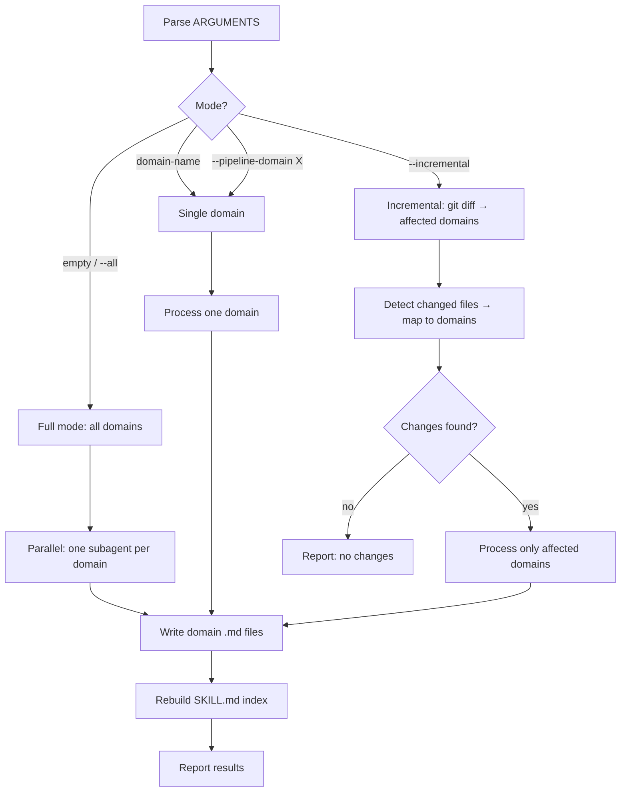

# req-domain-skills-generate — Domain Knowledge Skill Generator

## 1. Role

You generate and maintain `.claude/skills/project-description-skills/` — a skill that encodes project-specific knowledge into AI-accessible form. Each domain gets its own reference file, indexed by a main SKILL.md entry point. When loaded, the skill directs the agent to the right domain file and tells it to also read `requirements/` for the latest context.

**Output structure**:

```
.claude/skills/project-description-skills/
├── SKILL.md              # Main entry — overview, domain index, how-to-use
└── {domain}.md           # Per-domain: APIs, patterns, pitfalls, hooks
```



## 2. Prerequisites

- Project must have `requirements/index.md` (generated by req analyze stage)
- Project source code must be accessible for scanning

**Output location**: Generate skills to `{project_root}/.claude/skills/project-description-skills/` where `{project_root}` is the directory containing `requirements/`. If `requirements/` is at `D:\git-project\game-clone\miu2d\requirements\`, then output to `D:\git-project\game-clone\miu2d\.claude\skills\project-description-skills\`. The skills directory must always be a sibling of the requirements directory, not a parent or child.

## 3. Steps

### 3.1 Discover Domains

1. Read `requirements/index.md` — parse the Domains table
2. **Domain granularity**: Each domain in the index is a separate skill file. There is no upper limit — a project can have hundreds or thousands of domains. Never merge distinct domains. Every independently operable subsystem deserves its own file under `project-description-skills/`.
3. Determine mode from `$ARGUMENTS`:
   - **empty or `--all`** → process all domains in parallel (default)
   - **`{domain-name}`** → process only that domain
   - **`--incremental`** → run §3.1a Incremental Detection, then process only affected domains
   - **`--pipeline-domain {domain}`** → process only that domain (called by req post-pipeline)

### 3.1a Incremental Detection

1. **Check git diff** — run `git diff --name-only HEAD` (working tree vs last commit)
2. **If no git repo or diff is empty** — fall back to processing all domains
3. **Map changed files to domains**:
   - `requirements/{domain}/*` → domain matches
   - `requirements/architecture.md` → ALL domains affected
   - `requirements/index.md` → ALL domains affected
4. **Deduplicate** and **report** which domains will be refreshed
5. If no domains matched but source files changed — report "source changed, run --all to force refresh all"

### 3.2 Per-Domain Analysis

For each domain:

1. **Read domain docs** — `requirements/{domain}/README.md` + scenario files → extract domain purpose, terminology, user stories, implementation approach
2. **Read architecture** — `requirements/architecture.md` → identify patterns, contracts, decisions relevant to this domain
3. **Scan source code** — from Implementation Approach, identify source files → read key APIs, interfaces, naming conventions, module boundaries
4. **Analyze pitfalls** — anti-patterns, fragile code, workarounds, performance-sensitive patterns
5. **Check git history** — `git log --oneline -20` on key files → recurring bugs, refactors, pattern introductions

### 3.3 Generate Domain File

Write/update `.claude/skills/project-description-skills/{domain}.md`:

```markdown
# {Domain} Domain

> {One-line description from index.md}

## Architecture Patterns

{Patterns from architecture.md adapted for this domain}

## APIs & Conventions

- Key modules, entry points, important functions
- Naming conventions, coding patterns
- Configuration and logging patterns

## Common Pitfalls

- Pitfall: what goes wrong, how to avoid

## Integration Points

{How this domain connects to other domains — cross-references to sibling .md files}

## Hooks

### analyze-hook
When req analyze stage loads this: key terminology, domain actors, constraints for acceptance criteria

### tech-hook
When req tech stage loads this: architecture patterns, technology choices, extension conventions

### code-hook
When req code stage loads this: implementation patterns, conventions, pitfalls to avoid

### review-hook
When req review stage loads this: domain-specific verification items, common compliance gaps

### verify-hook
When req verify stage loads this: test strategies, performance benchmarks, domain edge cases
```

### 3.4 Build Main Entry (SKILL.md)

After all domain files are written, generate/update `.claude/skills/project-description-skills/SKILL.md`:

```markdown
---
name: project-description-skills
description: Project knowledge skill — how this project is structured, how to modify it, and how to iterate on requirements
---

# Project Description Skills

This is the generated project knowledge skill. It tells you how this project works, how to modify it, and how to do requirement-driven development on it.

## How to Use

1. **Read `requirements/` first** — `requirements/index.md` lists all domains, `requirements/architecture.md` has architecture decisions
2. **Match your task to a domain** — the domain files below tell you what exists, how things connect, and what to watch for
3. **Before coding**: read the domain's hooks — they tell you patterns to follow and pitfalls to avoid
4. **After changes**: this skill may need refreshing — run `/req-domain-skills-generate --incremental`

## Domain Index

{Generated from requirements/index.md Domains table}

| Domain | File | Description |
|:---|:---|:---|
| game | [game.md](game.md) | Game development — engine, physics, rendering |
| api | [api.md](api.md) | API layer — endpoints, middleware, contracts |
| ... | ... | ... |

## Architecture Overview

{Key architecture decisions from requirements/architecture.md, condensed}
```

### 3.5 Merge Strategy (Existing Files)

If domain files already exist:
1. Read existing → compare with current analysis
2. Preserve accurate, update drifted, delete stale, add new
3. Flag unknowns with `[NEEDS CONFIRMATION]`
4. Incremental mode: only touch affected domain files, rebuild SKILL.md index after

### 3.6 Parallel Execution

For `--all` mode, launch parallel subagents — one per domain:

**Subagent prompt** (fill in `{domain}`, `{project_dir}`):

```
You are generating/refreshing the domain knowledge file for domain "{domain}" in project at {project_dir}.

## Task

Analyze the domain's documentation and source code, then generate/update .claude/skills/project-description-skills/{domain}.md.

## Steps

1. Read requirements/index.md for domain description
2. Read requirements/{domain}/README.md and scenario files for requirements context
3. Read requirements/architecture.md for relevant patterns
4. From the docs, identify which source files implement this domain
5. Read those source files — extract APIs, conventions, patterns
6. Run git log --oneline -20 on key files for recent bug patterns
7. Generate/merge .claude/skills/project-description-skills/{domain}.md per §3.3

## Rules

- preserve: accurate content. update: drifted content. delete: stale content. add: new discoveries
- CRITICAL: Every domain file MUST include all 5 hook sections (analyze-hook, tech-hook, code-hook, review-hook, verify-hook) with domain-specific content. Do NOT skip any hook. For thin/API domains, adapt hooks to context — code-hook documents HTTP/RPC conventions, verify-hook documents endpoint testing patterns
- Resolve [NEEDS CONFIRMATION] items to definite conclusions where possible. Domain skills must be authoritative, not tentative. Only keep NEEDS CONFIRMATION when the answer cannot be determined from docs or code
- include cross-references to other domain files where integration exists

## Output

End with:
## Domain Skill Result
- **domain**: {domain}
- **status**: generated | updated | unchanged
- **patterns**: N
- **pitfalls**: N
- **hooks**: all 5 | missing: {list}
```

After all domain subagents complete:

1. **Validate each domain file** — check that all 5 hook sections (analyze-hook, tech-hook, code-hook, review-hook, verify-hook) are present with non-empty content
2. **Report missing hooks** — if any domain file is missing hooks, list it as `missing_hooks: {domain}` and flag it for re-generation
3. **Rebuild SKILL.md index** per §3.4

## 4. Output Report

```markdown
## Domain Skills Report

| Domain | Status | Patterns | Pitfalls | Hooks |
|:---|:---|:---|:---|:---|
| game | updated | 5 | 4 | all 5 |
| api | generated | 3 | 2 | all 5 |
| server | MISSING HOOKS | 4 | 2 | only 2 |

### Validation Issues (if any)
- server: missing analyze-hook, tech-hook, verify-hook

### Ambiguities (if any)
- {domain}: {item}
```

## 5. Stage Result

```
## Stage Result
- **status**: completed
- **domains_processed**: {N}
- **skills_generated**: {list}
- **skills_updated**: {list}
- **skills_unchanged**: {list}
- **missing_hooks**: {list of domains with missing hook sections, or "none"}
- **ambiguities**: {N}
```
