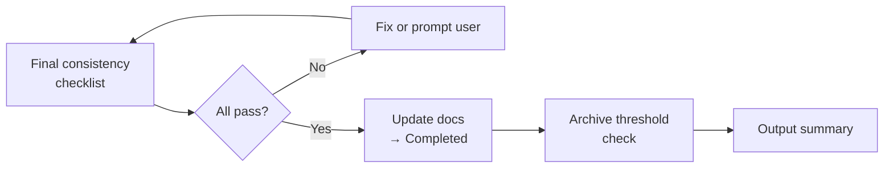
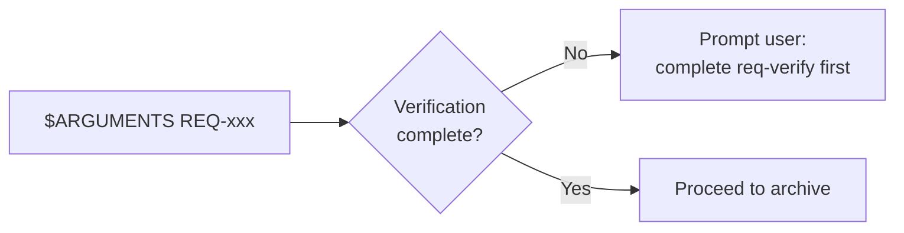
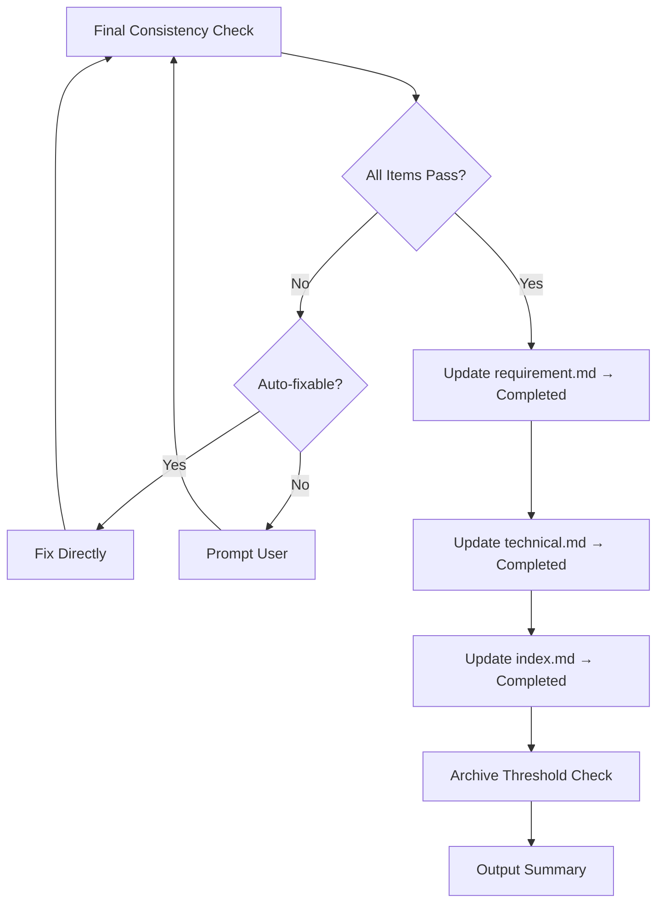
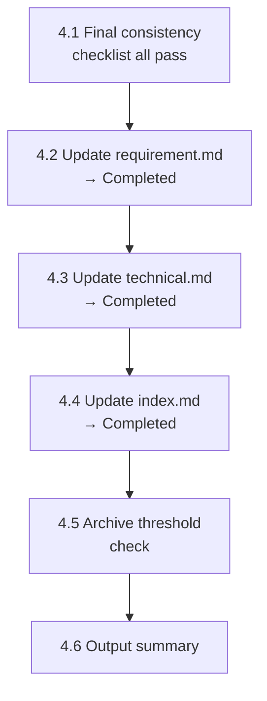
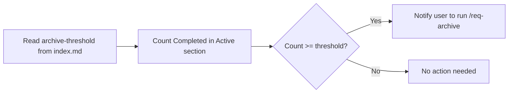

# req-done
> Version: v1 | Date: 2026-04-02 | Author: system

## 1. Overview
You are responsible for the archive stage — run a final consistency check, then mark the requirement as completed.


**Figure 1.1 — req-done archive flow**

## 2. Prerequisites


**Figure 2.1 — Prerequisites check**

- `$ARGUMENTS` provides a REQ number
- The verification stage must have passed

## 3. Overall Flow


**Figure 3.1 — req-done archive checklist flow**

## 4. Steps


**Figure 4.1 — Archive step sequence**

### 4.1 Final Consistency Check
Run the following checklist before archiving — **all items must pass**.

```markdown
## Final Consistency Checklist

### Documents
- [ ] requirement.md exists and status is finalized
- [ ] technical.md exists and status is finalized
- [ ] All .puml files have corresponding .svg files
- [ ] All .svg files are valid (size > 0, no Syntax Error)

### Code
- [ ] Source code exists for all modules defined in technical.md
- [ ] Code builds successfully (run scripts/build.bat or build.sh)
- [ ] All tests pass (run scripts/test.bat or test.sh)

### Scripts
- [ ] scripts/build.bat + build.sh exist and are executable
- [ ] scripts/run.bat + run.sh exist and are executable
- [ ] scripts/test.bat + test.sh exist and are executable

### Git
- [ ] All changes are committed (no uncommitted modifications)
```

If any item fails:
1. List all failing items
2. Auto-fixable issues (missing SVG, missing scripts) — fix directly
3. Issues requiring manual intervention (uncommitted code, failing tests) — prompt the user
4. **Proceed to archive only after all items pass**

### 4.2 Update Requirement Document Status
Edit `requirements/REQ-xxx-*/requirement.md`:
- Set Status to `Completed`
- Update the Updated date

### 4.3 Update Technical Document Status
Edit `requirements/REQ-xxx-*/technical.md`:
- Set Status to `Completed`
- Update the Updated date

### 4.4 Update Index
Read `${CLAUDE_SKILL_DIR}/../_shared/status.md` for status specifications. Edit `requirements/index.md`:
- Set this requirement's status to `Completed`
- Update the date

### 4.5 Archive Threshold Check


**Figure 4.5 — Archive threshold check**

1. Read the `<!-- archive-threshold: N -->` comment from `index.md` (default: `5` if absent)
2. Count the number of `Completed` entries in the **Active** section
3. If count >= threshold, notify the user:
   > "X requirements are completed in Active (threshold: N). Consider running `/req-archive` to batch-archive and generate a milestone summary."

### 4.6 Output Summary

```markdown
## REQ-xxx <Name> — Completed

### Consistency Check
- Documents: ALL PASS
- Code: ALL PASS
- Scripts: ALL PASS
- Git: ALL PASS

### Summary
- Requirement document: archived
- Technical design: archived
- Code: implemented and verified
- Completed: <date>
```

