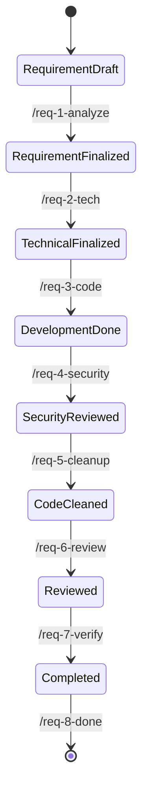
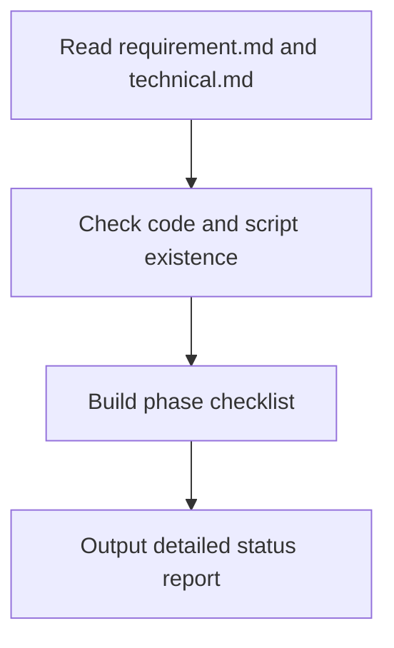

# req-status
> Version: v1 | Date: 2026-04-02 | Author: system

## 1. Overview
Quickly view requirement statuses without having to read `index.md` manually.

```mermaid
flowchart LR
    A[/req-status] --> B{Argument?}
    B -- none or all --> C[Show all Active\nrequirements]
    B -- REQ-xxx --> D[Show single REQ\ndetailed status]
    B -- archived --> E[Show Archived\nsection]
```
**Figure 1.1 — req-status usage modes**

## 2. Usage

```mermaid
flowchart LR
    A[/req-status all] --> B[Read index.md\nActive section only]
    C[/req-status REQ-xxx] --> D[Read requirement.md\ntechnical.md\ncheck code + scripts]
    E[/req-status archived] --> F[Read index.md\nArchived section]
```
**Figure 2.1 — Usage command flow**

- `/req-status` or `/req-status all` — view all requirement statuses
- `/req-status REQ-001` — view the detailed status of a specific requirement
- `/req-status archived` — view the list of archived requirements

## 3. State Transition Diagram


**Figure 3.1 — Requirement lifecycle state transitions**

## 4. Flow

```mermaid
flowchart LR
    A[/req-status] --> B[Read index.md]
    B --> C{Argument?}
    C -- all or none --> D[4.1 Show Active\nrequirements table]
    C -- REQ-xxx --> E[4.2 Show single REQ\ndetailed checklist]
    C -- archived --> F[Show Archived\nsection]
```
**Figure 4.1 — Flow by argument type**

### 4.1 View All Requirements
1. Read `requirements/index.md`
2. By default, output only the **Active** section — do not list Archived rows
3. Include statistics:

```markdown
## Requirement Status Overview

| ID | Name | Status | Updated |
|:---|:---|:---|:---|
| REQ-002 | Data Export | In Development | 2024-01-20 |
| REQ-003 | Dashboard | Technical Design | 2024-01-22 |

### Summary
- Active: 2
- Archived: 1 (run `/req-status archived` to list)
- archive-threshold: 5 (current Completed in Active: 0)
```

If the user passes `archived`, show the Archived section instead.

### 4.2 View a Single Requirement


**Figure 4.2 — Single requirement status check flow**

1. Read `requirements/REQ-xxx-*/requirement.md` and `technical.md`
2. Check whether code and scripts exist
3. Output detailed status:

```markdown
## REQ-xxx <Name>

### Current Status: <status>

### Phase Checklist
- [x] Requirement analysis — requirement.md (finalized)
- [x] Technical design — technical.md (finalized)
- [ ] Coding — 3/5 modules completed
- [ ] Requirement review — not started
- [ ] Verification — not started
- [ ] Archive — not started

### Files
- requirement.md ✓
- technical.md ✓
- 2 diagrams (.puml → .svg) ✓
- scripts/build.bat + .sh ✓
- scripts/test.bat + .sh ✗ (missing)

### Last Change Log Entry
| Version | Date | Changes | Affected Scope |
|:---|:---|:---|:---|
| v2 | 2024-01-20 | Added pagination | F-05 |
```
