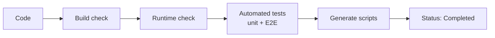
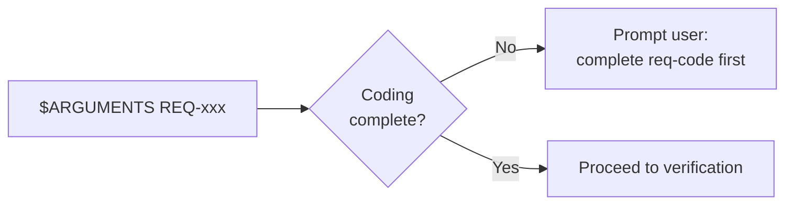
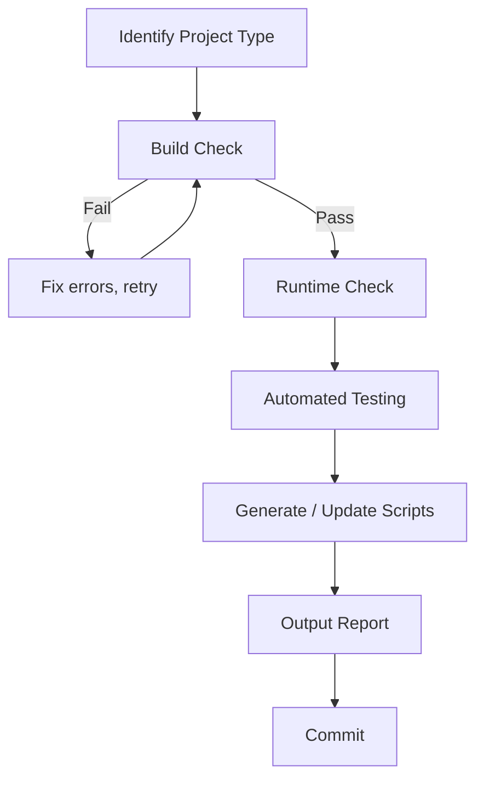
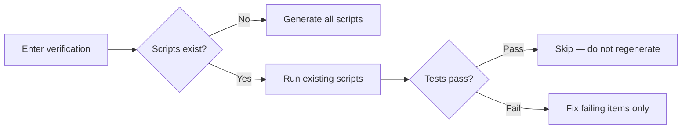
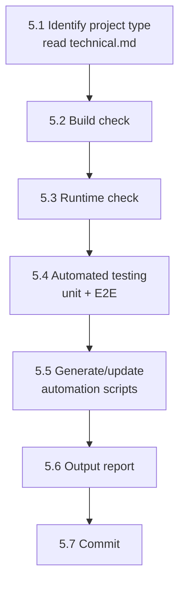
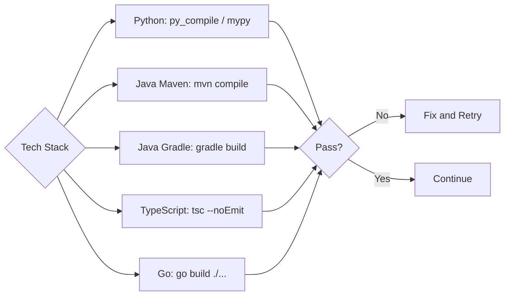
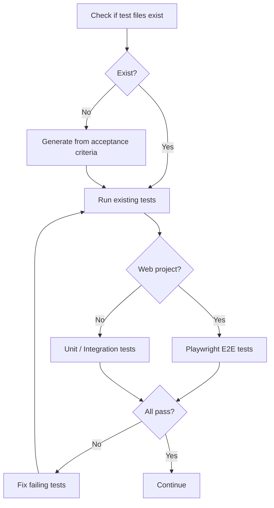

# req-verify
> Version: v1 | Date: 2026-04-02 | Author: system

## 1. Overview
You are responsible for the verification stage — ensure the code can build, run, and pass tests.


**Figure 1.1 — req-verify three-layer pipeline**

## 2. Prerequisites


**Figure 2.1 — Prerequisites check**

- `$ARGUMENTS` provides a REQ number
- Coding must be complete

## 3. Overall Flow


**Figure 3.1 — req-verify three-layer verification pipeline**

## 4. Breakpoint Recovery


**Figure 4.1 — Verification breakpoint recovery**

Read `${CLAUDE_SKILL_DIR}/../_shared/recovery.md` for recovery specifications.

If a previous verification was interrupted:
1. Check whether scripts already exist under `scripts/`
2. Check whether test files already exist
3. If they exist, run the existing scripts to see which pass/fail
4. Fix only the failing items — do not regenerate passing ones

## 5. Steps


**Figure 5.1 — Verification step sequence**

### 5.1 Identify Project Type
Read `requirements/REQ-xxx-*/technical.md` to determine the technology stack and build method.

### 5.2 Build Check


**Figure 5.2 — Build check by technology stack**

| Technology | Command |
|:---|:---|
| Python | `python -m py_compile <files>` or `mypy <package>` |
| Java (Maven) | `mvn compile` |
| Java (Gradle) | `gradle build` |
| TypeScript | `tsc --noEmit` |
| Go | `go build ./...` |

The build must pass. Fix errors and retry if any occur.

### 5.3 Runtime Check
Attempt to run the project entry point and confirm it starts correctly:
- CLI tools: execute `--help` or a simple command
- Web services: start up and check a health-check endpoint
- Libraries: attempt import/load

### 5.4 Automated Testing


**Figure 5.4 — Automated testing flow**

1. Check whether test files already exist
2. If not, **generate test cases from the acceptance criteria in the requirement document**
3. **Special requirement for web projects**: use Playwright for end-to-end tests, matching the project language:
  - TypeScript/Node.js projects → Playwright with TypeScript (`tests/e2e/*.spec.ts`)
  - Python projects → Playwright with Python (`tests/e2e/test_e2e_<feature>.py`)
  - Do NOT introduce a different language runtime for E2E tests
  - Test scripts go in `tests/e2e/`
  - Design test flows based on requirement features and acceptance criteria
  - Tests are not limited to UI interaction (clicks, input, navigation)
  - Also test data flow (submit data, verify database/API response is correct)
4. Unit/integration test commands:

| Technology | Command |
|:---|:---|
| Python | `pytest tests/ -v` |
| Java (Maven) | `mvn test` |
| Java (Gradle) | `gradle test` |
| TypeScript | `npm test` |
| Go | `go test ./...` |

5. All tests must pass

### 5.5 Generate / Update Automation Scripts
Read `${CLAUDE_SKILL_DIR}/../_shared/scripts.md` for script specifications.

Generate verification scripts under `scripts/` (.bat + .sh), strictly following the shared script specifications.

At minimum:
- `scripts/build.bat` + `scripts/build.sh` — build/compile
- `scripts/test.bat` + `scripts/test.sh` — run all tests (unit + integration)
- `scripts/test-e2e.bat` + `scripts/test-e2e.sh` — run E2E tests (web projects)
- `scripts/run.bat` + `scripts/run.sh` — start/run

If scripts already exist, check whether they need updating.

### 5.6 Output Report

```markdown
## Verification Report

- Build check: PASS / FAIL
- Runtime check: PASS / FAIL
- Unit/Integration tests: X/Y passed
- E2E tests: X/Y passed (web projects)

### Automation Scripts
- scripts/build.bat + build.sh ✓
- scripts/test.bat + test.sh ✓
- scripts/run.bat + run.sh ✓

### Issues (if any)
1. ...
```

After all checks pass, output the verification report.

### 5.7 Commit

```bash
git add -A && git commit -m "test(REQ-xxx): verification tests and scripts"
```

