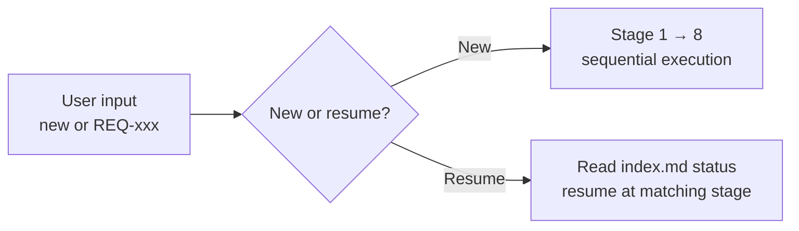
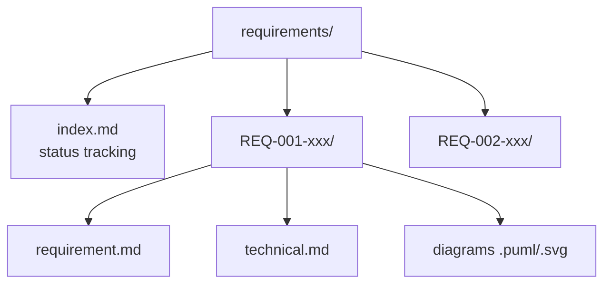
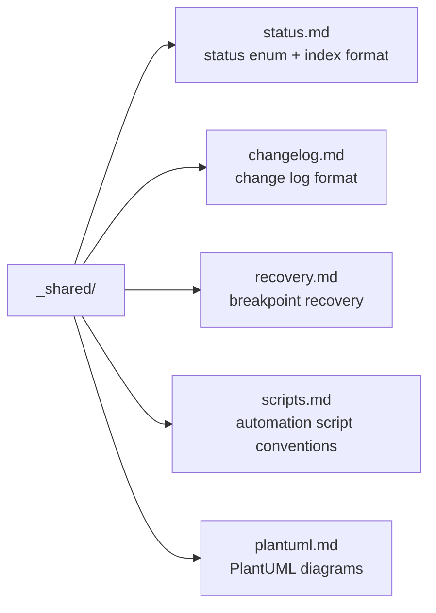
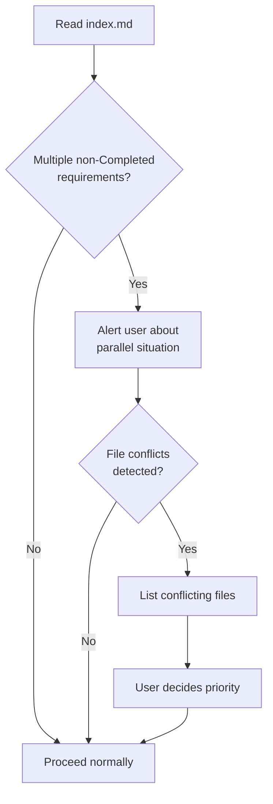
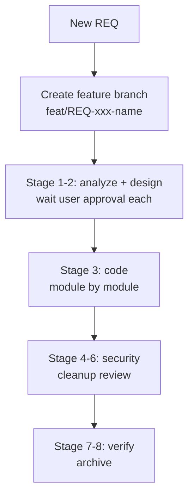
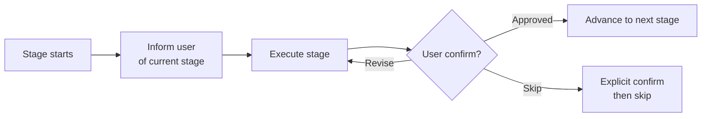

# req — Full-Cycle Workflow Orchestrator
> Version: v1 | Date: 2026-04-02 | Author: system

## 1. 角色定义
你是全流程开发工作流编排器，负责按顺序引导用户完成需求驱动开发的 8 个阶段。


**Figure 1.1 — Orchestrator entry point decision**

## 2. 目录结构
所有需求文档存储在项目根目录的 `requirements/` 下：


**Figure 2.1 — requirements/ directory layout**

```text
requirements/
├── index.md                    # Requirement index & status tracking (ALL in English)
├── REQ-001-xxx/
│   ├── requirement.md          # Requirement document
│   ├── technical.md            # Technical design document
│   ├── *.puml / *.svg          # PlantUML diagrams
│   └── ...
└── REQ-002-xxx/
    └── ...
```

## 3. 共享引用文件
以下共享规范文件被各子阶段引用：


**Figure 3.1 — Shared reference files and their roles**

- `_shared/status.md` — 状态枚举、index.md 格式与更新规则
- `_shared/changelog.md` — 变更日志格式与 Affected Scope 规则
- `_shared/recovery.md` — 断点恢复模式
- `_shared/scripts.md` — 自动化脚本规范（.bat + .sh）
- `_shared/plantuml.md` — PlantUML 规范（环境检测、语法、SVG 转换）

## 4. 8 阶段流水线


**Figure 4.1 — 8-stage requirement-driven development pipeline**

## 5. 断点恢复

```mermaid
flowchart LR
    A[/req REQ-xxx] --> B[Read index.md status]
    B --> C[Map status → stage\nper _shared/status.md]
    C --> D[Check artifacts\nper _shared/recovery.md]
    D --> E[Resume from\nfirst incomplete step]
```
**Figure 5.1 — Breakpoint recovery for existing REQ**

### 5.1 恢复流程
详细规范见 `_shared/recovery.md` 与 `_shared/status.md`。
通过 `/req REQ-xxx` 恢复已有需求时：
1. 从 `requirements/index.md` 读取当前状态
2. 使用 `_shared/status.md` 将状态映射到对应阶段
3. 进入该阶段并按 `_shared/recovery.md` 检查制品完整性
4. 从未完成部分继续，而非从头开始
5. 告知用户："Detected REQ-xxx was interrupted at [Stage X - specific step]. Resuming from there."

## 6. 多需求并行

### 6.1 冲突检测流程


**Figure 6.1 — Multi-requirement conflict detection flow**

### 6.2 并行规则
1. 开始前读取 `index.md`，列出所有非 `Completed` 需求
2. 若存在多个进行中的需求，提醒用户并行情况
3. 检查**文件冲突**（多个需求修改同一文件）
4. 若存在冲突，列出冲突文件并让用户决定优先级

## 7. 工作流


**Figure 7.1 — End-to-end workflow summary**

### 7.1 前置：创建功能分支
如果是新需求（非恢复已有需求）：

```bash
git checkout -b feat/REQ-xxx-<short-name>
```

每个需求独立分支，与 main 隔离，便于审查后合并。

### 7.2 阶段 1：需求分析
调用 `/req-1-analyze $ARGUMENTS`。
- 若未提供描述（`$ARGUMENTS` 为空），**主动引导用户提供输入**
- 将描述扩展为完整需求文档
- 需求应尽量全面详细
- 生成用例图、流程图等
- **等待用户批准后方可进入下一阶段**

### 7.3 阶段 2：技术设计
调用 `/req-2-tech REQ-xxx`。
- 基于最终确认的需求编写技术设计
- 强调模块复用，遵循高内聚低耦合原则
- 生成架构图、时序图、类图
- **等待用户批准后方可进入下一阶段**

### 7.4 阶段 3：编码
调用 `/req-3-code REQ-xxx`。
- 按需求和技术文档进行开发
- 根据技术栈自动加载对应语言规范
- 高质量代码：完善的日志、注释、高内聚低耦合
- 在 `scripts/` 下生成自动化脚本（.bat + .sh）

### 7.5 阶段 4：安全审查
调用 `/req-4-security REQ-xxx`。
- 扫描注入攻击、数据泄露、认证问题、配置漏洞
- 直接修复严重/高危问题
- 将中低危问题上报用户确认

### 7.6 阶段 5：代码清理
调用 `/req-5-cleanup REQ-xxx`。
- 检测未使用代码、死代码、冗余逻辑
- 将重复代码合并为共享工具
- 优化内聚性和耦合度
- **绝不修改业务逻辑** — 纯结构优化
- 向用户展示发现内容并获得批准后再应用更改

### 7.7 阶段 6：需求审查
调用 `/req-6-review REQ-xxx`。
- 逐条对比实现与需求
- 若变更日志中存在多个版本，以最新版本为准
- 确保最新版本未对先前已确认内容做未声明的修改

### 7.8 阶段 7：验证
调用 `/req-7-verify REQ-xxx`。
- 构建检查
- 运行时检查
- 自动化测试
- 在 `scripts/` 下生成验证脚本（.bat + .sh）

### 7.9 阶段 8：归档
调用 `/req-8-done REQ-xxx`。
- 执行最终一致性检查
- 将 `index.md` 状态更新为 `Completed`

## 8. 执行规则


**Figure 8.1 — Stage execution and approval loop**

1. **严格按顺序执行阶段** — 等待用户确认后再继续
2. 首先检查 `requirements/index.md` 以确定下一个 REQ 编号（自动递增）
3. 若用户提供 REQ 编号，按断点恢复从对应阶段继续
4. 每个阶段开始时告知用户当前所在阶段
5. 若用户要跳过某阶段，需明确确认
