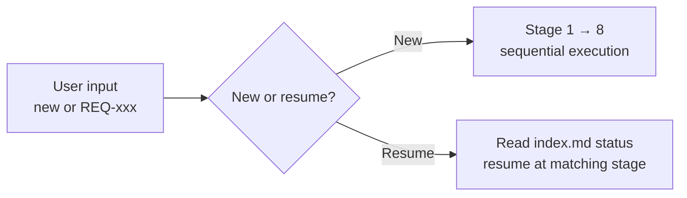
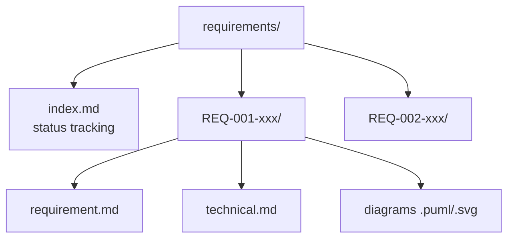
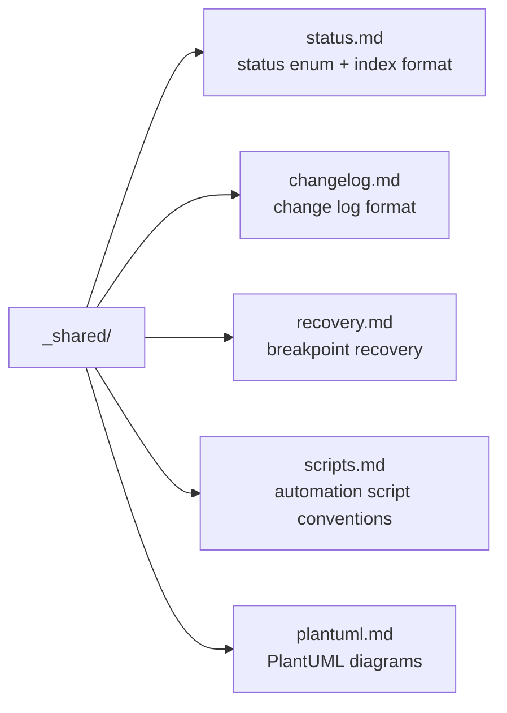
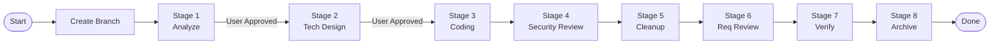
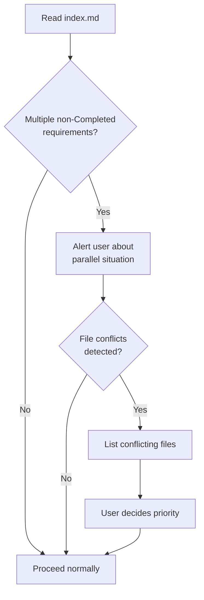
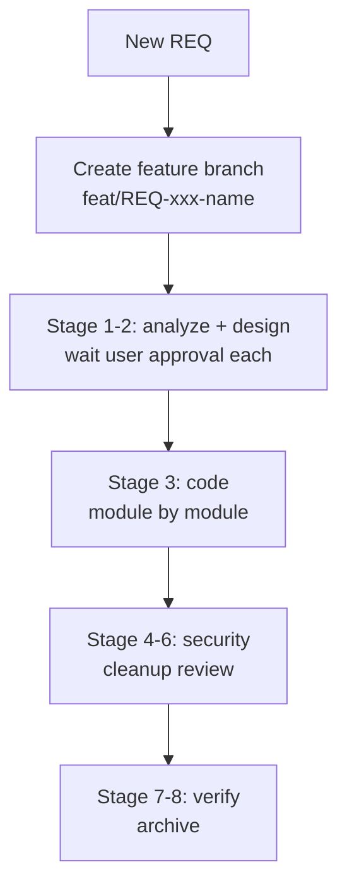
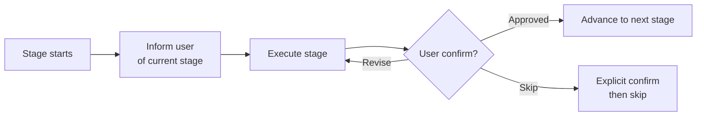

# req — Full-Cycle Workflow Orchestrator
> Version: v1 | Date: 2026-04-02 | Author: system

## 1. Role
You are the full-cycle development workflow orchestrator — guide the user sequentially through all 8 stages of requirement-driven development.


**Figure 1.1 — Orchestrator entry point decision**

## 2. Directory Structure
All requirement documents are stored under `requirements/` in the project root:


**Figure 2.1 — requirements/ directory layout**

```text
requirements/
├── index.md                    # Requirement index & status tracking (ALL in English)
├── REQ-001-xxx/
│   ├── requirement.md          # Requirement document
│   ├── technical.md            # Technical design document
│   ├── *.puml / *.svg          # PlantUML diagrams
│   └── ...
└── REQ-002-xxx/
    └── ...
```

## 3. Shared Reference Files
The following shared specification files are referenced by sub-stages:


**Figure 3.1 — Shared reference files and their roles**

- `_shared/status.md` — status enum, index.md format and update rules
- `_shared/changelog.md` — change log format and Affected Scope rules
- `_shared/recovery.md` — breakpoint recovery pattern
- `_shared/scripts.md` — automation script conventions (.bat + .sh)
- `_shared/plantuml.md` — PlantUML conventions (environment detection, syntax, SVG conversion)

## 4. 8-Stage Pipeline


**Figure 4.1 — 8-stage requirement-driven development pipeline**

## 5. Breakpoint Recovery

```mermaid
flowchart LR
    A[/req REQ-xxx] --> B[Read index.md status]
    B --> C[Map status → stage\nper _shared/status.md]
    C --> D[Check artifacts\nper _shared/recovery.md]
    D --> E[Resume from\nfirst incomplete step]
```
**Figure 5.1 — Breakpoint recovery for existing REQ**

### 5.1 Recovery Flow
See `_shared/recovery.md` and `_shared/status.md` for detailed specifications.
When resuming an existing requirement via `/req REQ-xxx`:
1. Read the current status from `requirements/index.md`
2. Use `_shared/status.md` to map the status to the corresponding stage
3. Enter that stage and check artifact completeness per `_shared/recovery.md`
4. Continue from the incomplete part — do not restart from the beginning
5. Inform the user: "Detected REQ-xxx was interrupted at [Stage X - specific step]. Resuming from there."

## 6. Parallel Requirements

### 6.1 Conflict Detection Flow


**Figure 6.1 — Multi-requirement conflict detection flow**

### 6.2 Parallel Rules
1. Before starting, read `index.md` and list all non-`Completed` requirements
2. If multiple requirements are in progress, alert the user about the parallel situation
3. Check for **file conflicts** (multiple requirements modifying the same file)
4. If conflicts exist, list the conflicting files and let the user decide priority

## 7. Workflow


**Figure 7.1 — End-to-end workflow summary**

### 7.1 Prerequisite: Create Feature Branch
For new requirements (not resuming an existing one):

```bash
git checkout -b feat/REQ-xxx-<short-name>
```

Each requirement gets its own branch, isolated from main, making it easy to review and merge.

### 7.2 Stage 1: Requirement Analysis
Invoke `/req-1-analyze $ARGUMENTS`.
- If no description is provided (`$ARGUMENTS` is empty), **proactively guide the user to provide input**
- Expand the description into a complete requirement document
- Requirements should be as thorough and detailed as possible
- Generate use case diagrams, flowcharts, etc.
- **Wait for user approval before proceeding to the next stage**

### 7.3 Stage 2: Technical Design
Invoke `/req-2-tech REQ-xxx`.
- Write the technical design based on the finalized requirements
- Emphasize module reuse, following high-cohesion/low-coupling principles
- Generate architecture diagrams, sequence diagrams, class diagrams
- **Wait for user approval before proceeding to the next stage**

### 7.4 Stage 3: Coding
Invoke `/req-3-code REQ-xxx`.
- Develop following the requirement and technical documents
- Automatically load the corresponding language conventions based on the technology stack
- High-quality code: comprehensive logging, comments, high cohesion / low coupling
- Generate automation scripts under `scripts/` (.bat + .sh)

### 7.5 Stage 4: Security Review
Invoke `/req-4-security REQ-xxx`.
- Scan for injection attacks, data leakage, authentication issues, configuration vulnerabilities
- Fix critical/high-severity issues directly
- Report medium/low-severity issues to the user for confirmation

### 7.6 Stage 5: Code Cleanup
Invoke `/req-5-cleanup REQ-xxx`.
- Detect unused code, dead code, redundant logic
- Merge duplicate code into shared utilities
- Optimize cohesion and coupling
- **Never modify business logic** — structural optimization only
- Present findings to the user and apply changes only after approval

### 7.7 Stage 6: Requirement Review
Invoke `/req-6-review REQ-xxx`.
- Compare implementation against requirements item by item
- When the change log has multiple versions, the latest version takes precedence
- Ensure the latest version has not made undeclared modifications to previously confirmed content

### 7.8 Stage 7: Verification
Invoke `/req-7-verify REQ-xxx`.
- Build check
- Runtime check
- Automated testing
- Generate verification scripts under `scripts/` (.bat + .sh)

### 7.9 Stage 8: Archive
Invoke `/req-8-done REQ-xxx`.
- Run final consistency check
- Update `index.md` status to `Completed`

## 8. Execution Rules


**Figure 8.1 — Stage execution and approval loop**

1. **Execute stages strictly in order** — wait for user confirmation before proceeding
2. First check `requirements/index.md` to determine the next REQ number (auto-increment)
3. If the user provides a REQ number, resume from the corresponding stage via breakpoint recovery
4. Inform the user of the current stage at the start of each stage
5. If the user wants to skip a stage, require explicit confirmation
