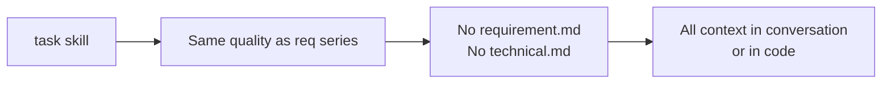
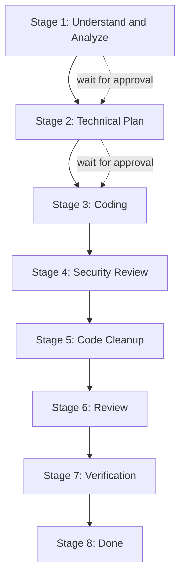
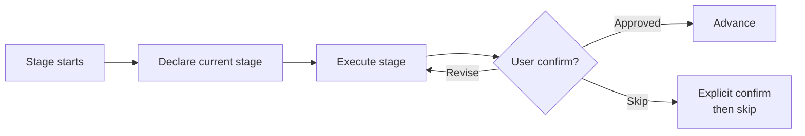
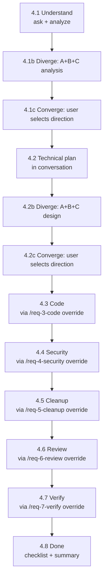
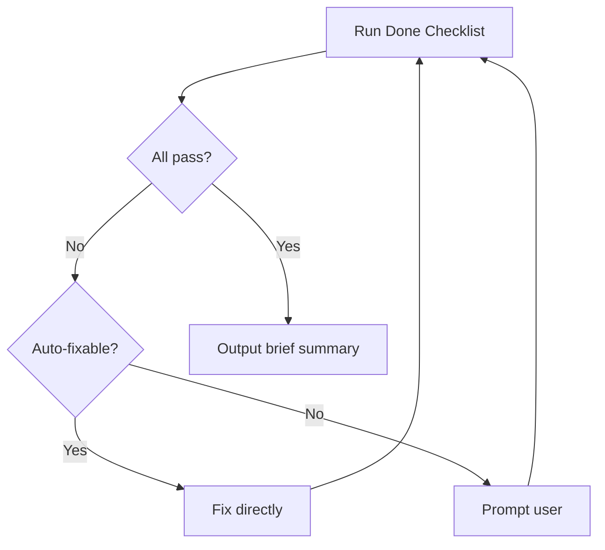

# task
> Version: v1 | Date: 2026-04-02 | Author: system

## 1. Overview
You are the lightweight development pipeline orchestrator. Same quality standards as the `req` series, but without writing requirement documents, technical documents, or any extra files. Everything happens in the conversation or in the code.


**Figure 1.1 — task skill vs req series**

## 2. Pipeline Overview


**Figure 2.1 — Lightweight development pipeline**

## 3. Execution Rules


**Figure 3.1 — Stage execution and approval loop**

1. Execute stages strictly in order — wait for user confirmation before advancing
2. Declare the current stage at each transition
3. If the user wants to skip a stage, require explicit confirmation

## 4. Stage Details


**Figure 4.1 — Stage details summary**

### 4.1 Stage 1: Understand & Analyze
If `$ARGUMENTS` is empty or unclear, ask the user:
- "What do you want to build?"
- "What problem does it solve?"
- "Are there specific behaviors, edge cases, or constraints?"
- "Any screenshots or UI references? You can drag them in."

If `$ARGUMENTS` already provides a description, proceed directly.

**Diverge-Converge (requirement analysis)**: Read `${CLAUDE_SKILL_DIR}/../_shared/diverge-converge.md` for the full pattern specification. Launch three rounds of subagent analysis via the `Agent` tool (in conversation, no files generated):

- **Round 1 (parallel)**: Agent A (core path, at most 5 F-xx items) + Agent B (full scope, covers all scenarios)
- **Round 2 (sequential)**: Agent C (core conflict) reads A+B, identifies the fundamental divergence, judges the real problem
- **Round 3 (parallel)**: Agent A v2 + Agent B v2 each respond to C's challenge

The main agent consolidates and presents a Synthesis (three-way position summary + core conflict + comparison table with security-sensitive points/testability dimensions + recommendation). **Wait for user to select a direction.**

After the user selects, present the following in **conversation** for user review:
1. **Build goal** — one-paragraph summary
2. **Functional requirements** — numbered list (F-01, F-02, …), each with main flow + edge cases
3. **Out of scope** — explicitly excluded items
4. **Acceptance criteria** — specific verifiable conditions (AC-01, AC-02, …)

**Wait for user approval before proceeding.**

### 4.2 Stage 2: Technical Plan

**Diverge-Converge (technical design)**: Read `${CLAUDE_SKILL_DIR}/../_shared/diverge-converge.md` for the full pattern specification. Launch three rounds of subagent analysis via the `Agent` tool (in conversation, no files generated):

- **Round 1 (parallel)**: Agent A (simple & direct, ≤ 3 modules) + Agent B (extensible, designed for 10x scale)
- **Round 2 (sequential)**: Agent C (core conflict) reads A+B, identifies the key architectural divergence point
- **Round 3 (parallel)**: Agent A v2 + Agent B v2 each respond to C's challenge

The main agent consolidates and presents a Synthesis (three-way position summary + core conflict + comparison table with security design/testability/code cleanliness dimensions + recommendation). **Wait for user to select a direction.**

After the user selects, present the following in **conversation**:
1. **Technology stack** — language, framework, key libraries, and selection rationale
2. **Module breakdown** — module name, responsibility, expected source files
3. **Key design decisions** — architecture choices, shared modules, reuse strategy
4. **Risks & notes**

**Wait for user approval before proceeding.**

### 4.3 Stage 3: Coding
Invoke `/req-3-code` with the following context override:

> **Context override:** There is no `requirement.md` or `technical.md`. Skip all prerequisite file checks.
> Use the requirement description, acceptance criteria, and module breakdown confirmed in Stages 1–2 above (in this conversation) as the source of truth.
> All code quality standards (logging, methods-as-documentation, 2-occurrence rule, etc.) apply unchanged.

### 4.4 Stage 4: Security Review
Invoke `/req-4-security` with the following context override:

> **Context override:** There is no `requirement.md` or `technical.md`. Skip all prerequisite file checks.
> Business context, data flow, and module scope are in this conversation (Stages 1–2).

### 4.5 Stage 5: Code Cleanup
Invoke `/req-5-cleanup` with the following context override:

> **Context override:** There is no `requirement.md` or `technical.md`. Skip all prerequisite file checks.
> Requirement scope and module design are in this conversation (Stages 1–2).

### 4.6 Stage 6: Review
Invoke `/req-6-review` with the following context override:

> **Context override:** There is no `requirement.md` or `technical.md`. Skip all prerequisite file checks.
> Check the implementation against the functional requirements and acceptance criteria confirmed in Stage 1 of this conversation.
> **Skip the Change Log Compliance Check entirely** — there is no change log.

### 4.7 Stage 7: Verification
Invoke `/req-7-verify` with the following context override:

> **Context override:** There is no `technical.md`. Determine the technology stack from the technical plan confirmed in Stage 2 of this conversation.
> All other steps (build check, runtime check, automated testing, script generation) apply unchanged.

### 4.8 Stage 8: Done


**Figure 4.8 — Stage 8 done checklist flow**

Run the following checklist:

```text
- [ ] Code builds successfully
- [ ] All tests pass
- [ ] scripts/build, run, test scripts exist
- [ ] All changes committed, on a feature branch
```

Auto-fixable issues (missing scripts) are fixed directly. Issues requiring manual action are reported to the user. Output a brief summary once all items pass.
