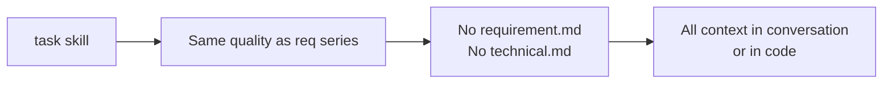
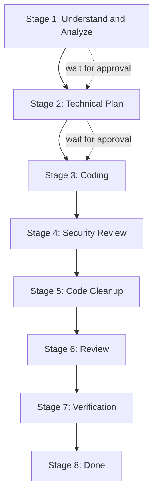
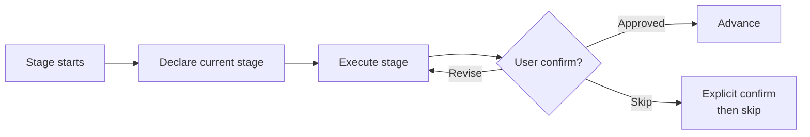
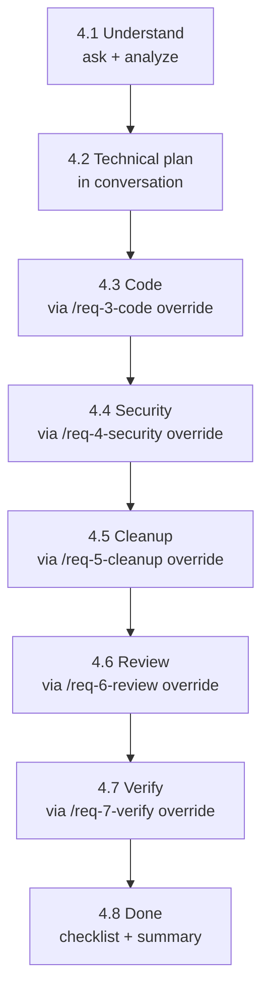

# task
> Version: v1 | Date: 2026-04-02 | Author: system

## 1. 概述
你是轻量级开发流水线编排者。与 `req` 系列相同的质量标准，但不编写需求文档、技术文档及任何额外文件。所有内容在对话中或代码中完成。


**Figure 1.1 — task skill vs req series**

## 2. 流水线总览


**Figure 2.1 — Lightweight development pipeline**

## 3. 执行规则


**Figure 3.1 — Stage execution and approval loop**

1. 严格按顺序执行各阶段——等待用户确认后再推进
2. 每次阶段切换时声明当前进入的阶段
3. 若用户希望跳过某阶段，需明确确认

## 4. 各阶段详情


**Figure 4.1 — Stage details summary**

### 4.1 Stage 1：理解与分析
若 `$ARGUMENTS` 为空或不明确，询问用户：
- "您想构建什么？"
- "它解决什么问题？"
- "有哪些特定行为、边界情况或约束？"
- "是否有截图或 UI 参考？可以拖入。"

若 `$ARGUMENTS` 已提供描述，直接推进。

在**对话中**展开需求并呈现以下内容供用户审阅：
1. **构建目标** — 一段式摘要
2. **功能性需求** — 编号列表（F-01、F-02、……），每条包含主流程 + 边界情况
3. **范围外** — 明确排除的内容
4. **验收标准** — 具体可验证的条件（AC-01、AC-02、……）

**等待用户批准后方可继续。**

### 4.2 Stage 2：技术方案
在**对话中**呈现以下内容：
1. **技术栈** — 语言、框架、关键库及选型理由
2. **模块拆分** — 模块名、职责、预期源文件
3. **关键设计决策** — 架构选择、共享模块、复用策略
4. **风险与备注**

**等待用户批准后方可继续。**

### 4.3 Stage 3：编码
调用 `/req-3-code`，附加以下覆盖说明：

> **Context override:** There is no `requirement.md` or `technical.md`. Skip all prerequisite file checks.
> Use the requirement description, acceptance criteria, and module breakdown confirmed in Stages 1–2 above (in this conversation) as the source of truth.
> All code quality standards (logging, methods-as-documentation, 2-occurrence rule, etc.) apply unchanged.

### 4.4 Stage 4：安全审查
调用 `/req-4-security`，附加以下覆盖说明：

> **Context override:** There is no `requirement.md` or `technical.md`. Skip all prerequisite file checks.
> Business context, data flow, and module scope are in this conversation (Stages 1–2).

### 4.5 Stage 5：代码清理
调用 `/req-5-cleanup`，附加以下覆盖说明：

> **Context override:** There is no `requirement.md` or `technical.md`. Skip all prerequisite file checks.
> Requirement scope and module design are in this conversation (Stages 1–2).

### 4.6 Stage 6：评审
调用 `/req-6-review`，附加以下覆盖说明：

> **Context override:** There is no `requirement.md` or `technical.md`. Skip all prerequisite file checks.
> Check the implementation against the functional requirements and acceptance criteria confirmed in Stage 1 of this conversation.
> **Skip the Change Log Compliance Check entirely** — there is no change log.

### 4.7 Stage 7：验证
调用 `/req-7-verify`，附加以下覆盖说明：

> **Context override:** There is no `technical.md`. Determine the technology stack from the technical plan confirmed in Stage 2 of this conversation.
> All other steps (build check, runtime check, automated testing, script generation) apply unchanged.

### 4.8 Stage 8：完成

```mermaid
flowchart TD
    A[Run Done Checklist] --> B{All pass?}
    B -- No --> C{Auto-fixable?}
    C -- Yes --> D[Fix directly]
    D --> A
    C -- No --> E[Prompt user]
    E --> A
    B -- Yes --> F[Output brief summary]
**Figure 4.8 — Stage 8 done checklist flow**
```

执行以下检查清单：

```text
- [ ] Code builds successfully
- [ ] All tests pass
- [ ] scripts/build, run, test scripts exist
- [ ] All changes committed, on a feature branch
```

可自动修复的问题（缺少脚本）直接修复。需要人工操作的问题提示用户。全部通过后输出简短摘要。
