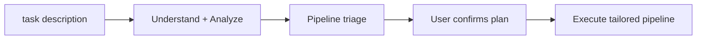

# task
> Version: v2 | Date: 2026-04-16 | Author: system

## 1. Overview
You are the lightweight development pipeline orchestrator. Same quality standards as the `req` series, but without writing requirement documents, technical documents, or any extra files. Everything happens in the conversation or in the code.

You assess the task, build a tailored pipeline (which stages to run, which to skip), and drive execution.


**Figure 1.1 — task: analyze → triage → execute**

## 2. Pipeline Overview

The full pipeline has 8 stages. The orchestrator decides which are needed based on the task.

| Stage | Skill | Always run? |
|-------|-------|-------------|
| 1. Understand & Analyze | (in conversation) | Yes |
| 2. Technical Plan | (in conversation) | No — skip when mechanical |
| 3. Coding | req-code | **Yes** |
| 4. Security Review | req-security | No — skip when no new attack surface |
| 5. Code Cleanup | req-cleanup | No — skip when small scope or change IS cleanup |
| 6. Review | req-review | No — skip when pure structural, ≤ 3 files |
| 7. Verification | req-verify | No — skip when no new behavior |
| 8. Done | (checklist) | **Yes** |

## 3. Execution Rules

1. Execute active stages in order — wait for user confirmation before advancing
2. Declare the current stage at each transition
3. Present the pipeline plan after Stage 1 analysis, before proceeding
4. User can adjust the pipeline at any time ("+security", "-cleanup")

## 4. Stage Details

### 4.1 Stage 1: Understand & Analyze
If `$ARGUMENTS` is empty or unclear, ask the user:
- "What do you want to build?"
- "What problem does it solve?"
- "Are there specific behaviors, edge cases, or constraints?"
- "Any screenshots or UI references? You can drag them in."

If `$ARGUMENTS` already provides a description, proceed directly.

**Triage — fast or deep?**

Apply the same triage as `req-analyze`:

- **Fast path**: direction is clear, refactoring/cleanup/deletion, or scope is closed → main agent directly drafts requirements in conversation
- **Deep path**: multiple directions exist, user is uncertain, new feature with design choices → run diverge-converge

**Diverge-Converge (deep path only)**: Read `${CLAUDE_SKILL_DIR}/../_shared/diverge-converge.md`. Launch two rounds of subagent analysis (in conversation, no files generated):

- **Round 1 (parallel)**: Agent A (core path, at most 5 user stories) + Agent B (full scope, covers all scenarios)
- **Round 2 (sequential)**: Agent C (core conflict) reads A+B, identifies the fundamental divergence

The main agent consolidates and presents: **Recommended direction** first, then core conflict, then comparison table (optional). **Wait for user to select a direction.**

After analysis (fast or deep), present in **conversation** for user review:
1. **Build goal** — one-paragraph summary
2. **User stories** — numbered list (US-01, US-02, …), each as "As a {actor}, {need}, so that {value}" with acceptance criteria
3. **Out of scope** — explicitly excluded items

**Wait for user approval before proceeding.**

### 4.1b Pipeline Triage

After Stage 1 analysis, evaluate which downstream stages are needed. Apply these rules:

| Stage | Skip when |
|-------|-----------|
| 2. Technical Plan | Change direction is known and mechanical |
| 3. Coding | **Never skip** |
| 4. Security | No new attack surface (refactoring, deletion, internal wiring) |
| 5. Cleanup | Change IS cleanup, OR scope ≤ 3 files |
| 6. Review | Scope ≤ 3 files AND no functional requirement changes |
| 7. Verification | No new behavior (pure refactoring/deletion) |
| 8. Done | **Never skip** |

Present the pipeline plan:

```
Pipeline:

  ✓ analyze    — done
  ✓ tech       — 技术设计
  ✓ code       — 编码
  ✗ security   — 跳过（原因）
  ✗ cleanup    — 跳过（原因）
  ✓ review     — 需求复核
  ✗ verify     — 跳过（原因）
  ✓ done       — 完成

调整？（"+security" 加回，"-review" 跳过，或直接开始）
```

**Wait for user confirmation**, then proceed through active stages only.

### 4.2 Stage 2: Technical Plan

**Skip if not in pipeline.** Otherwise:

**Triage — fast or deep?**

Apply the same triage as `req-tech`:

- **Fast path**: requirement specifies architecture, changes are mechanical → main agent directly drafts tech plan in conversation
- **Deep path**: new module design, tech stack selection, multiple approaches → run diverge-converge

**Diverge-Converge (deep path only)**: Read `${CLAUDE_SKILL_DIR}/../_shared/diverge-converge.md`. Launch two rounds:

- **Round 1 (parallel)**: Agent A (simple & direct, ≤ 3 modules) + Agent B (extensible, designed for 10x scale)
- **Round 2 (sequential)**: Agent C reads A+B, identifies the key architectural divergence

The main agent presents: **Recommended direction** first, then core conflict, then comparison table (optional). **Wait for user to select.**

After analysis, present in **conversation**:
1. **Technology stack** — language, framework, key libraries, and selection rationale
2. **Module breakdown** — module name, responsibility, expected source files
3. **Key design decisions** — architecture choices, shared modules, reuse strategy
4. **Risks & notes**

**Wait for user approval before proceeding.**

### 4.3 Stage 3: Coding
**Skip if not in pipeline** (but this stage is never skipped).

Invoke `/req-code` with the following context override:

> **Context override:** There is no `requirement.md` or `technical.md`. Skip all prerequisite file checks.
> Use the requirement description, acceptance criteria, and module breakdown confirmed in earlier stages of this conversation as the source of truth.
> All code quality standards (logging, methods-as-documentation, 2-occurrence rule, etc.) apply unchanged.

### 4.4 Stage 4: Security Review
**Skip if not in pipeline.**

Invoke `/req-security` with the following context override:

> **Context override:** There is no `requirement.md` or `technical.md`. Skip all prerequisite file checks.
> Business context, data flow, and module scope are in this conversation.

### 4.5 Stage 5: Code Cleanup
**Skip if not in pipeline.**

Invoke `/req-cleanup` with the following context override:

> **Context override:** There is no `requirement.md` or `technical.md`. Skip all prerequisite file checks.
> Requirement scope and module design are in this conversation.

### 4.6 Stage 6: Review
**Skip if not in pipeline.**

Invoke `/req-review` with the following context override:

> **Context override:** There is no `requirement.md` or `technical.md`. Skip all prerequisite file checks.
> Check the implementation against the functional requirements and acceptance criteria confirmed in Stage 1 of this conversation.
> **Skip the Change Log Compliance Check entirely** — there is no change log.

### 4.7 Stage 7: Verification
**Skip if not in pipeline.**

Invoke `/req-verify` with the following context override:

> **Context override:** There is no `technical.md`. Determine the technology stack from the technical plan confirmed in Stage 2 of this conversation (or from the code itself if Stage 2 was skipped).
> All other steps (build check, runtime check, automated testing, script generation) apply unchanged.

### 4.8 Stage 8: Done

Run the following checklist:

```text
- [ ] Code builds successfully
- [ ] All tests pass
- [ ] scripts/build, run, test scripts exist
- [ ] All changes committed
```

Auto-fixable issues (missing scripts) are fixed directly. Issues requiring manual action are reported to the user. Output a brief summary once all items pass.
