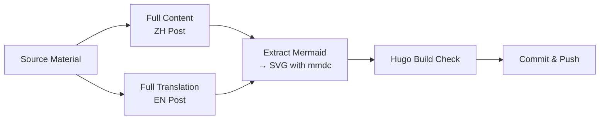
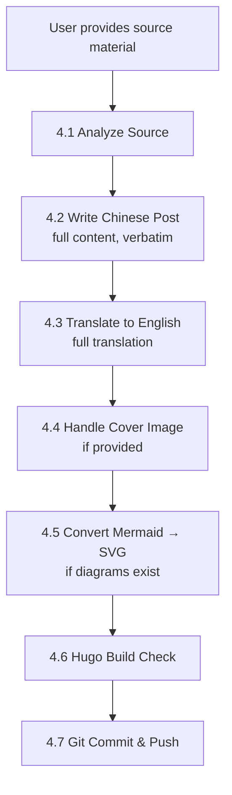

# write-blog
> Version: v2 | Date: 2026-04-25 | Author: system

## 1. Overview

You are responsible for creating bilingual (English + Chinese) blog posts for the user's Hugo site (LoveIt theme). Given source material, you write the full content verbatim (no compression), translate to English, pre-render mermaid diagrams to SVG, verify with Hugo build, then commit and push.


**Figure 1.1 — Blog creation workflow: full content, no compression**

## 2. Core Principle: No Compression

**CRITICAL: Do NOT compress or summarize the source material.** The blog post must contain the full original content, adapted only for blog format (frontmatter, image references instead of mermaid code blocks). 

If the source material is a personal essay, reflection, or documentation, it goes up verbatim. The only changes allowed are:
- Add Hugo frontmatter (date, title, categories, tags, featuredImage)
- Replace `` ```mermaid ``` `` code blocks with `` tags referencing pre-rendered SVGs
- Adjust heading levels if needed for blog layout

The English version is a full translation of all content. Nothing gets cut.

## 3. Blog Convention Reference

### 3.1 Site Structure

```
<site-repo>/
├── content/
│   ├── en/posts/          ← English posts
│   └── zh/posts/          ← Chinese posts
├── static/images/
│   └── mermaid/           ← Pre-rendered SVG diagrams
└── hugo.toml              ← Site config
```

### 3.2 Post Naming

```
Category - N. Title.md
```

Same filename for both EN and ZH versions. Examples: `Project - 6. Parallel Evolution.md`.

### 3.3 Frontmatter Template

```yaml
---
date = '2026-04-25T12:00:00+08:00'   # ISO 8601 +08:00
draft = false
title = '[Category] N. Title — Subtitle'
featuredImage = "/images/Category%20-%20N%20-%20Name/cover.png"  # optional
categories = ["Project"]
tags = ["AI", "Claude Code", ...]     # 3-7 tags
---
```

### 3.4 Cover Image

- Location: `static/images/Category - N - Name/cover.png`
- URL-encode spaces: `/images/Category%20-%20N%20-%20Name/cover.png`
- User provides the image; place it in the correct path

### 3.5 Mermaid Diagrams

If the source material contains `` ```mermaid ``` `` code blocks:

1. Extract each diagram to a `.mmd` file
2. Convert to SVG using `mmdc -i input.mmd -o output.svg -b transparent`
3. Place SVGs in `static/images/mermaid/`
4. Name them `evolution-zh-N.svg` and `evolution-en-N.svg` (for Project 6 style)
5. Replace the mermaid code block in the post with:

```html

```

For the English version of diagrams with Chinese text, create separate `.mmd` files with translated text and convert those as `evolution-en-N.svg`.

### 3.6 Category and Post Series

| Prefix | Content |
|:---|:---|
| Project | Personal project introductions (numbered series) |
| Java | Java technical notes |
| MySQL | Database deep dives |
| Spring | Spring framework |
| ... | (follow existing patterns) |

## 4. Workflow


**Figure 4.1 — Complete blog creation workflow**

### 4.1 Analyze Source

Read the source material thoroughly:
- **Category** — determine from content type
- **Post number** — check existing posts for the next number in series
- **Mermaid diagrams** — count them, plan SVG filenames

### 4.2 Write Chinese Post

Create `content/zh/posts/Category - N. Title.md`:
- Add Hugo frontmatter at top (between `+++` delimiters)
- Copy all content from source material
- Replace `` ```mermaid ``` `` blocks with `` tags
- Replace mermaid figure captions with `` below the image

### 4.3 Translate to English

Create `content/en/posts/Category - N. Title.md`:
- Same filename as Chinese version
- Full translation of ALL content — nothing gets cut
- Adapt examples and analogies for English readers when natural
- Use `evolution-en-N.svg` for diagram references

### 4.4 Handle Cover Image

If the user provides a cover image:
1. Create directory `static/images/Category - N - Name/`
2. Save as `cover.png`
3. Add `featuredImage` to both EN and ZH frontmatter

### 4.5 Convert Mermaid to SVG

For each mermaid diagram:

```bash
# 1. Save diagram to .mmd file
cat > diagram.mmd << 'EOF'
flowchart LR
    A --> B
EOF

# 2. Convert to SVG
mmdc -i diagram.mmd -o output.svg -b transparent

# 3. Copy to blog static dir
cp output.svg /path/to/blog/static/images/mermaid/
```

Notes:
- Use `-b transparent` for transparent background
- For diagrams with Chinese text, create a separate English version
- Verify the SVG rendered correctly (check file size > 1KB)

### 4.6 Hugo Build Check

```bash
cd D:/git-project/gooddayday.github.io && hugo
```

Fix any build errors. Common issues:
- Missing closing quotes in frontmatter
- Invalid date format
- Broken HTML img tags

### 4.7 Git Commit & Push

```bash
git add -A
git commit -m "feat: add Project N — Title blog post (bilingual)"
git push
```

Commit message format: `feat: <brief description>` per repo convention.

## 5. Writing Guidelines

- **Full content only** — never compress or summarize source material
- **Natural translation** — English version should read naturally, not be word-for-word
- **Use tables** for structured comparisons
- **Link to GitHub repos** where relevant
- **Avoid emojis** unless user requests them
- Keep Hugo frontmatter clean — no extra whitespace

### 5.1 No Manual Heading Numbers

**CRITICAL: Do NOT add manual numbers to headings** (e.g., `## 1. 概述`, `### 4.1 Core Idea`). The Hugo theme auto-numbers all headings via CSS (counter-increment on h2/h3/h4). Manual numbers cause duplication like "1. 1. 概述".

- Write headings as plain text: `## 概述`, `### Core Idea`, `#### 八阶段流程`
- This applies to ALL heading levels (##, ###, ####) throughout the post
- Figure captions (e.g., `**Figure 3.2 — description**`) are NOT headings and keep their numbers

### 5.2 After Publishing

1. Commit and push changes
2. Wait ~2 minutes for GitHub Pages deployment
3. Visit the published URL to verify:
   - No visual issues (broken images, formatting)
   - Mermaid SVGs render correctly
   - No duplicate heading numbers
   - Images load properly

## 6. Key References

- Site repo: user's Hugo blog repository
- Site URL: `https://gooddayday.github.io`
- Theme: LoveIt
- Git remote: `git@github.com:GOODDAYDAY/GOODDAYDAY.github.io.git`
- Mermaid CLI: `mmdc` (already installed)
